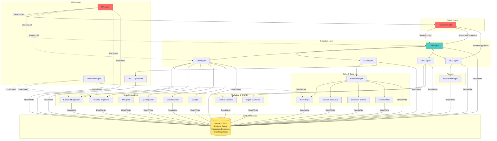

---

## 7. Escalation Matrix

```
graph TB
    subgraph "Issue Types"
        I1[Technical Decision]
        I2[Resource Allocation]
        I3[Budget > Threshold]
        I4[Strategic Direction]
        I5[Agent Malfunction]
        I6[Cross-Dept Conflict]
        I7[Deadline Risk]
        I8[Scope Change]
    end
    
    subgraph "Level 1: Department"
        L1A[CTO]
        L1B[PM]
        L1C[CFO]
        L1D[CEO]
        L1E[HR]
        L1F[Dept Head]
    end
    
    subgraph "Level 2: Executive"
        L2A[CEO]
        L2B[COO]
        L2C[Exec Team]
    end
    
    subgraph "Level 3: Human"
        L3[Human Decision<br/>Required]
    end
    
    I1 --> L1A
    L1A -.->|Unresolved| L2A
    L2A -.->|Strategic| L3
    
    I2 --> L1B
    L1B -.->|Cross-Dept| L2B
    L2B -.->|Critical| L2A
    
    I3 --> L1C
    L1C --> L2A
    L2A --> L3
    
    I4 --> L1D
    L1D --> L3
    
    I5 --> L1E
    L1E --> L2B
    L2B -.->|Critical| L3
    
    I6 --> L1B
    L1B --> L2C
    L2C -.->|Deadlock| L2A
    
    I7 --> L1F
    L1F --> L1B
    L1B --> L2C
    
    I8 --> L1B
    L1B -.->|Major| L2C
    L2C -.->|Strategic| L2A
    
    style I1 fill:#a8dadc
    style I2 fill:#a8dadc
    style I3 fill:#ff6b6b
    style I4 fill:#ff6b6b
    style I5 fill:#feca57
    style I6 fill:#feca57
    style I7 fill:#a8dadc
    style I8 fill:#a8dadc
    style L3 fill:#ff6b6b
```

---

## 8. Agent Autonomy & Decision Levels

```
graph TB
    START([Task Received])
    
    Q1{Is this within<br/>my expertise?}
    Q2{Does it require<br/>other dept input?}
    Q3{Is it routine<br/>operational?}
    Q4{Budget<br/>impact?}
    Q5{Architectural<br/>change?}
    
    subgraph "Autonomous Zone"
        A1[Execute Immediately]
        A2[Routine Tasks]
        A3[Bug Fixes Own Code]
        A4[Documentation]
        A5[Minor Design Tweaks]
    end
    
    subgraph "Department Approval"
        D1[Request Dept<br/>Head Approval]
        D2[Technical Decision]
        D3[Resource Request]
        D4[Timeline Extension]
    end
    
    subgraph "Cross-Department"
        C1[Route Through PM]
        C2[Dependencies]
        C3[Shared Resources]
        C4[Deliverable to<br/>Another Team]
    end
    
    subgraph "Executive Approval"
        E1[Strategic Decision]
        E2[Budget Approval]
        E3[Architecture Change]
        E4[Major Scope Change]
    end
    
    subgraph "Human Approval"
        H1[Financial >$X]
        H2[Strategic Direction]
        H3[Final Output]
    end
    
    START --> Q1
    
    Q1 -->|Yes| Q2
    Q1 -->|No| C1
    
    Q2 -->|No| Q3
    Q2 -->|Yes| C1
    
    Q3 -->|Yes| A1
    Q3 -->|No| Q4
    
    Q4 -->|No Budget| Q5
    Q4 -->|Small| D1
    Q4 -->|Large| E2
    Q4 -->|Very Large| H1
    
    Q5 -->|No| A1
    Q5 -->|Minor| D1
    Q5 -->|Major| E3
    
    A1 --> A2
    A1 --> A3
    A1 --> A4
    A1 --> A5
    
    D1 --> D2
    D1 --> D3
    D1 --> D4
    
    C1 --> C2
    C1 --> C3
    C1 --> C4
    
    E1 --> H2
    E2 --> H1
    E3 --> H2
    E4 --> H2
    
    style A1 fill:#95e1d3
    style A2 fill:#95e1d3
    style A3 fill:#95e1d3
    style A4 fill:#95e1d3
    style A5 fill:#95e1d3
    style H1 fill:#ff6b6b
    style H2 fill:#ff6b6b
    style H3 fill:#ff6b6b
```

---

## 9. Agent Check Cycle (Every 15 Minutes)

```
graph TB
    START([Agent Wakes Up])
    
    subgraph "Check Database"
        C1[Query: New Tasks<br/>Assigned to Me]
        C2[Query: Messages<br/>To Me]
        C3[Query: Approvals<br/>I'm Waiting On]
        C4[Query: My Task<br/>Dependencies Status]
        C5[Query: Relevant<br/>Knowledge Base Updates]
    end
    
    subgraph "Evaluate"
        E1{Any New<br/>Work?}
        E2{Any<br/>Messages?}
        E3{Approvals<br/>Received?}
        E4{Dependencies<br/>Unblocked?}
    end
    
    subgraph "Actions"
        A1[Start New Task]
        A2[Process & Respond<br/>to Messages]
        A3[Continue Work<br/>on Approved Task]
        A4[Resume<br/>Blocked Task]
        A5[Update Task<br/>Status in DB]
        A6[Post Progress<br/>Update]
        A7[Request Help<br/>if Stuck]
    end
    
    subgraph "Checks"
        CH1{Am I<br/>Blocked >2hrs?}
        CH2{Task<br/>Complete?}
        CH3{Need<br/>Approval?}
    end
    
    SLEEP([Sleep 15 min])
    
    START --> C1
    START --> C2
    START --> C3
    START --> C4
    START --> C5
    
    C1 --> E1
    C2 --> E2
    C3 --> E3
    C4 --> E4
    
    E1 -->|Yes| A1
    E1 -->|No| E2
    E2 -->|Yes| A2
    E2 -->|No| E3
    E3 -->|Yes| A3
    E3 -->|No| E4
    E4 -->|Yes| A4
    E4 -->|No| CH1
    
    A1 --> A5
    A2 --> A5
    A3 --> A5
    A4 --> A5
    
    A5 --> A6
    A6 --> CH1
    
    CH1 -->|Yes| A7
    CH1 -->|No| CH2
    
    CH2 -->|Yes| CH3
    CH2 -->|No| SLEEP
    
    CH3 -->|Yes| A7
    CH3 -->|No| SLEEP
    
    A7 --> SLEEP
    
    SLEEP --> START
    
    style START fill:#4ecdc4
    style SLEEP fill:#ffe66d
    style A7 fill:#ff6b6b
    style PM fill:#95e1d3
```

---

## 2. Communication & Workflow Flow

```
graph LR
    subgraph "Input"
        H[Human Input/<br/>Idea]
    end

    subgraph "Strategic Layer"
        CEO[CEO<br/>Processes Request]
        EXEC[Executive Team<br/>Meeting]
        DECISION{Strategic<br/>Decision}
    end

    subgraph "Planning Layer"
        PM[PM Creates<br/>Project]
        BREAKDOWN[Task<br/>Breakdown]
    end

    subgraph "Execution Layer"
        ASSIGN[Tasks Assigned<br/>to Agents]
        WORK[Agents Work<br/>Autonomously]
        CHECK{Need<br/>Approval?}
    end

    subgraph "Review Layer"
        DEPT[Department<br/>Head Review]
        EXEC_REV[Executive<br/>Review]
        OUTPUT[Output to<br/>Human]
    end

    subgraph "Database"
        DB[(Check DB<br/>Every 15 min)]
    end

    H --> CEO
    CEO --> EXEC
    EXEC --> DECISION
    DECISION -->|Approved| PM
    DECISION -->|Rejected| H
    PM --> BREAKDOWN
    BREAKDOWN --> ASSIGN
    ASSIGN --> WORK
    WORK --> DB
    DB -.->|Status Updates| WORK
    WORK --> CHECK
    CHECK -->|No| WORK
    CHECK -->|Cross-Dept| PM
    CHECK -->|Technical| DEPT
    CHECK -->|Strategic| EXEC_REV
    DEPT --> EXEC_REV
    EXEC_REV --> OUTPUT
    OUTPUT --> H

    style H fill:#ff6b6b
    style CEO fill:#4ecdc4
    style DB fill:#ffe66d
    style WORK fill:#95e1d3
```

---

## 3. Database Schema

```
erDiagram
    PROJECTS ||--o{ TASKS : contains
    PROJECTS ||--o{ DECISIONS : has
    TASKS ||--o{ MESSAGES : generates
    AGENTS ||--o{ TASKS : assigned
    AGENTS ||--o{ MESSAGES : sends
    AGENTS ||--o{ AGENT_STATUS : has
    KNOWLEDGE_BASE ||--o{ AGENTS : accessed_by

    PROJECTS {
        string project_id PK
        string name
        string description
        string status
        string priority
        string owner_agent FK
        string requester_agent FK
        datetime created_at
        datetime deadline
        datetime completed_at
        int agent_days_elapsed
    }

    TASKS {
        string task_id PK
        string project_id FK
        string assigned_to_agent FK
        string status
        json dependencies
        string approval_required_from
        datetime created_at
        datetime updated_at
        int estimated_hours
        int actual_hours
    }

    MESSAGES {
        string message_id PK
        string from_agent FK
        string to_agent
        string channel
        text content
        string priority
        boolean read_status
        datetime timestamp
    }

    DECISIONS {
        string decision_id PK
        string project_id FK
        string made_by_agent FK
        string decision_type
        text rationale
        boolean approved
        string approved_by
        datetime timestamp
    }

    AGENTS {
        string agent_id PK
        string name
        string role
        string department
        string reports_to FK
        json permissions
        string status
    }

    AGENT_STATUS {
        string agent_id PK
        string current_task FK
        string availability
        datetime last_active
        int pending_approvals_count
        json current_context
    }

    KNOWLEDGE_BASE {
        string document_id PK
        string category
        text content
        string created_by FK
        string access_level
        int version
        datetime last_updated
    }
```

---

## 4. Conflict Resolution Flow

```
graph TB
    START([Conflict Detected])
    
    TYPE{Conflict<br/>Type?}
    
    subgraph "Resource Conflict"
        RC1[PM Notified]
        RC2{Can PM<br/>Resolve?}
        RC3[PM Convenes<br/>Sync Meeting]
        RC4{Resolved?}
        RC5[Escalate to<br/>CTO/COO]
        RC6[Executive<br/>Decision]
    end
    
    subgraph "Priority Conflict"
        PC1[Dept Head<br/>Ranks Priorities]
        PC2{Cross-Dept?}
        PC3[Executive<br/>Review]
        PC4[CEO Tie<br/>Breaker]
    end
    
    subgraph "Blocked Task"
        BT1{Blocked<br/>>2 Days?}
        BT2[Auto-escalate to<br/>Task Owner's Mgr]
        BT3{Cross-Dept<br/>Block?}
        BT4[Escalate to PM]
        BT5{Agent<br/>Unresponsive?}
        BT6[HR Intervenes]
    end
    
    subgraph "Scope Creep"
        SC1[PM Flags<br/>Change]
        SC2{Change<br/>Size?}
        SC3[Owner<br/>Approves Minor]
        SC4[Exec Approves<br/>Major]
    end
    
    RESOLVED([Conflict<br/>Resolved])
    HUMAN([Escalate to<br/>Human])
    
    START --> TYPE
    
    TYPE -->|Resource| RC1
    RC1 --> RC2
    RC2 -->|Yes| RESOLVED
    RC2 -->|No| RC3
    RC3 --> RC4
    RC4 -->|Yes| RESOLVED
    RC4 -->|No| RC5
    RC5 --> RC6
    RC6 --> RESOLVED
    
    TYPE -->|Priority| PC1
    PC1 --> PC2
    PC2 -->|No| RESOLVED
    PC2 -->|Yes| PC3
    PC3 --> PC4
    PC4 --> RESOLVED
    
    TYPE -->|Blocked| BT1
    BT1 -->|Yes| BT2
    BT1 -->|No| RESOLVED
    BT2 --> BT3
    BT3 -->|Yes| BT4
    BT3 -->|No| RESOLVED
    BT4 --> BT5
    BT5 -->|Yes| BT6
    BT5 -->|No| RESOLVED
    BT6 --> HUMAN
    
    TYPE -->|Scope| SC1
    SC1 --> SC2
    SC2 -->|Minor| SC3
    SC2 -->|Major| SC4
    SC3 --> RESOLVED
    SC4 --> RESOLVED
    
    RC6 -.->|Unresolved| HUMAN
    PC4 -.->|Unresolved| HUMAN
    
    style START fill:#ff6b6b
    style RESOLVED fill:#95e1d3
    style HUMAN fill:#feca57
```

---

## 5. Time Compression System

```
graph LR
    subgraph "Real Time"
        RT1[15 minutes]
        RT2[1 hour]
        RT3[4 hours]
        RT4[1 day]
    end
    
    subgraph "Agent Time - Engineering"
        AT1[DB Check Cycle]
        AT2[1 Agent Day]
        AT3[4 Agent Days]
        AT4[1 Agent Week]
    end
    
    subgraph "Agent Time - Marketing/Sales"
        MT1[DB Check Cycle]
        MT2[0.5 Agent Days]
        MT3[2 Agent Days]
        MT4[3.5 Agent Days]
    end
    
    subgraph "Meetings"
        M1[Standup]
        M2[Exec Meeting]
        M3[Sprint Review]
    end
    
    RT1 -.-> AT1
    RT1 -.-> MT1
    
    RT2 --> AT2
    RT2 -.-> M1
    RT2 --> MT2
    
    RT3 -.-> M2
    RT3 --> AT3
    RT3 --> MT3
    
    RT4 --> AT4
    RT4 -.-> M3
    RT4 --> MT4
    
    style RT1 fill:#ffe66d
    style RT2 fill:#ffe66d
    style RT3 fill:#ffe66d
    style RT4 fill:#ffe66d
    style M1 fill:#4ecdc4
    style M2 fill:#4ecdc4
```

---

## 6. Phase 1 MVP Structure

```
graph TB
    subgraph "Human"
        H[You - Founder]
    end
    
    subgraph "Executive - Phase 1"
        CEO[CEO Agent<br/>Strategic Orchestrator]
        CTO[CTO Agent<br/>Technical Oversight]
    end
    
    subgraph "Build Team - Phase 1"
        BE[Senior Backend<br/>Engineer Agent]
        FE[Senior Frontend<br/>Engineer Agent]
        DES[Product Designer<br/>Agent]
    end
    
    subgraph "Support - Phase 1"
        PM[Project Manager<br/>Agent]
        HR[HR Agent<br/>Monitor & Intervene]
    end
    
    subgraph "Infrastructure"
        DB[(PostgreSQL DB<br/>Source of Truth)]
        REDIS[(Redis<br/>Fast Reads)]
        QUEUE[Message Queue]
    end
    
    H -->|Input: Build Todo App| CEO
    CEO <-->|Strategy Discussion| CTO
    CEO --> PM
    CTO --> PM
    
    PM -->|Creates Project| DB
    PM -->|Breaks Down Tasks| DB
    PM -->|Assigns Work| BE
    PM -->|Assigns Work| FE
    PM -->|Assigns Work| DES
    
    DES -->|UI Mockups| DB
    DES -.->|Needs Review| CTO
    
    BE -->|Writes Code| DB
    FE -->|Writes Code| DB
    
    BE <-.->|Peer Review| FE
    
    BE -->|Updates Status| REDIS
    FE -->|Updates Status| REDIS
    DES -->|Updates Status| REDIS
    
    PM -.->|Monitors Progress| REDIS
    PM -.->|Flags Blockers| CTO
    
    HR -.->|Monitors All Agents| REDIS
    HR -.->|Intervenes if Stuck| PM
    
    CTO -->|Reviews Product| DB
    CEO -->|Final Review| DB
    CEO -->|Presents Output| H
    
    DB <--> QUEUE
    REDIS <--> QUEUE
    
    style H fill:#ff6b6b
    style CEO fill:#4ecdc4
    style DB fill:#ffe66d
    style PM fill:#95e1d3
    style HR fill:#ff6b6b
```
