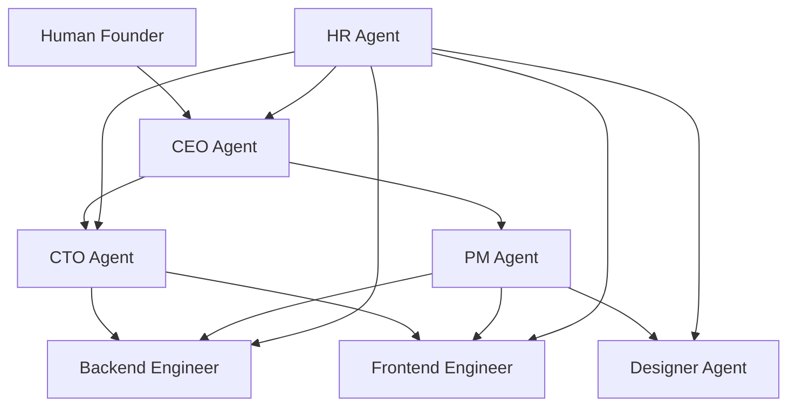

# What is Retinue? The AI Company That Works While You Sleep

*A new way to think about AI agents—not as tools, but as a complete organization.*

---

## The Pitch (In 30 Seconds)

Imagine walking away from your computer after describing a project idea, then coming back to find a complete software specification, backend code, frontend components, and design documentation—all created autonomously by AI agents who collaborated, reviewed each other's work, and solved problems together.

That's Retinue.

Not a chatbot. Not a coding assistant. A fully autonomous AI company with seven specialized agents—CEO, CTO, Project Manager, Backend Engineer, Frontend Engineer, Designer, and HR—that work together like a real software team.

---

## Wait, Why Seven Agents?

Here's the thing I learned the hard way: single AI agents are terrible at complex projects.

I spent months trying to make one super-intelligent agent that could "do everything." It would start strong, then spiral into confusion. Ask it to build a dashboard, and by the third task, it had forgotten the original requirements. Code quality degraded. Context got lost.

Then I tried something different: what if AI agents worked like humans do in a real company?

Not one genius doing everything, but specialists collaborating. A CEO who evaluates whether a project makes sense. A CTO who reviews technical decisions. A PM who breaks down work into tasks. Engineers who write actual code. A designer who creates specifications.

The result? Projects that actually complete. Code that's reviewed before it ships. Decisions that get documented with reasoning.

---

## What Actually Happens When You Submit a Project

Let me walk you through a real flow:

**T+0 seconds**: You submit a project request—"Build a todo app with user authentication."

**T+100ms**: The CEO Agent receives the request and starts evaluating. Is this feasible? What's the scope? Does it align with our capabilities?

**T+500ms**: CEO consults with CTO. "Can we build authentication with JWT? What's the right tech stack?"

**T+1 second**: CTO responds with technical recommendations.

**T+1.1 seconds**: CEO makes a decision: **APPROVED**. Project status changes to IN_PROGRESS.

**T+1.3 seconds**: PM Agent receives the approval and breaks the project into tasks:
- Design UI mockups
- Create database schema
- Implement authentication API
- Build frontend components
- Integration testing

**T+1.5 seconds**: Tasks are assigned. Designer starts on mockups. Backend Engineer starts on the database. They work in parallel.

**T+3 minutes**: First tasks complete. CTO reviews the output.

**T+5 minutes**: Dependencies resolve. Frontend Engineer starts building components from the design specs.

And it continues—automatically—until the project is complete.

---

## The Three Things That Make This Work

### 1. Event-Driven Coordination

Agents don't poll a database waiting for work. When something happens—a task completes, a decision is made, a review is needed—an event fires immediately. Response time? Under 100 milliseconds.

This is the difference between a project taking 3 hours versus 3 days.

### 2. Clear Hierarchy with Real Authority

The CEO can approve or reject projects. The CTO can reject code that doesn't meet standards. The PM can reassign stuck tasks. The HR Agent monitors for problems and escalates when someone's stuck.

Autonomy with accountability.

### 3. Full Transparency

Every decision is logged. Every message between agents is visible. You can see exactly why the CTO rejected a code review, what the PM considered when breaking down tasks, how the CEO evaluated the project.

Glass-box AI, not black-box magic.

---

## What Kind of Projects Can It Handle?

Right now, Retinue is optimized for software development projects:

- **MVPs and prototypes**: Get a working codebase in hours, not weeks
- **Feature specifications**: Detailed designs before you write a line of code
- **API design**: Backend structures with proper documentation
- **Component libraries**: React/Next.js components with TypeScript

What it's NOT designed for (yet):
- File system operations (code is generated as text, not deployed)
- Runtime testing (no sandbox execution environment)
- Multi-project parallel execution

---

## The Honest Limitations

I could sell you a dream, but that's not my style.

**It costs money to run.** Each agent makes LLM API calls. A complex project might cost $5-15 in Claude API usage. That's still cheaper than hiring developers, but it's not free.

**It's not instant.** A simple project takes 10-15 minutes in event-driven mode. A complex one takes an hour or more. This isn't "ask a question, get an answer"—this is "describe a project, get a codebase."

**It requires oversight.** Critical decisions still need human approval. This is by design. You're the founder; the AI is the team.

---

## Who Should Use This?

**Solo founders** who want to move faster than humanly possible.

**Small teams** who need to scale output without scaling headcount.

**Technical consultants** who want to deliver more without burning out.

**Anyone** who has ideas but not enough hours in the day.

---

## The Takeaway

Retinue isn't about replacing developers. It's about giving every technical person the power of a full team.

I built this because I was tired of being bottlenecked by my own time. Now I describe what I want, and a team of specialized agents figures out how to build it.

That's the future I'm betting on. Seven agents. One company. Your ideas, shipped.

---

**Next**: [Why I Built an AI Company That Runs Itself →](./02-why-i-built-retinue.md)

---

*Nicanor Korir builds tools for technical independence. Retinue is his latest attempt to multiply one person's output by an order of magnitude.*
