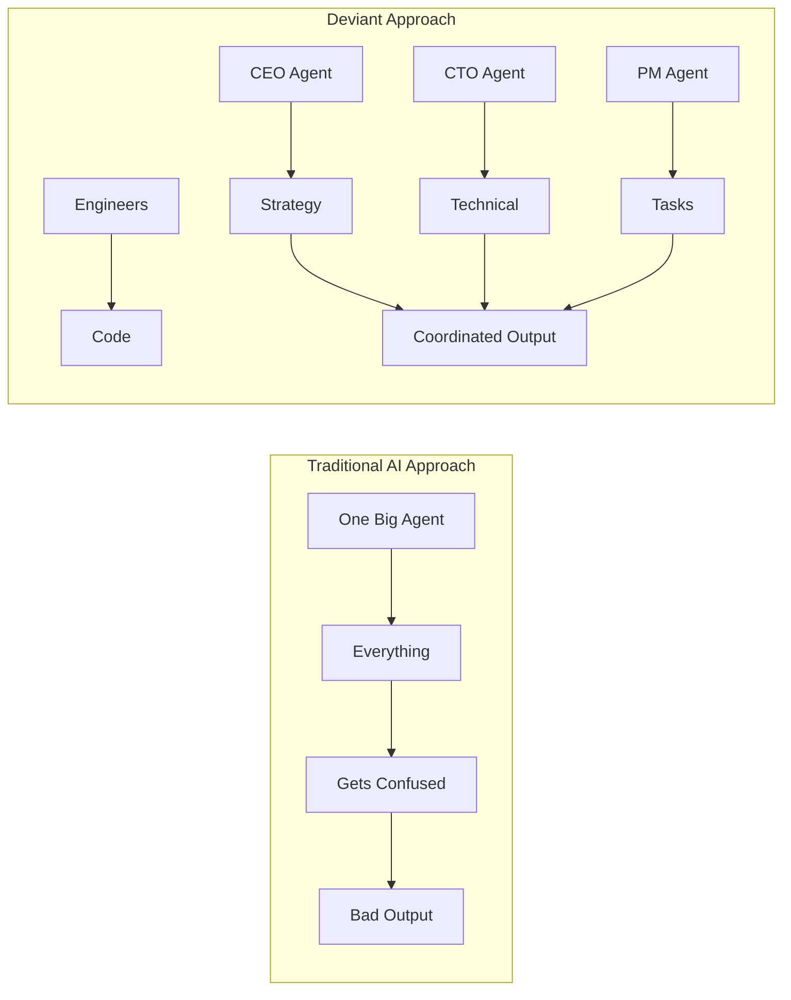
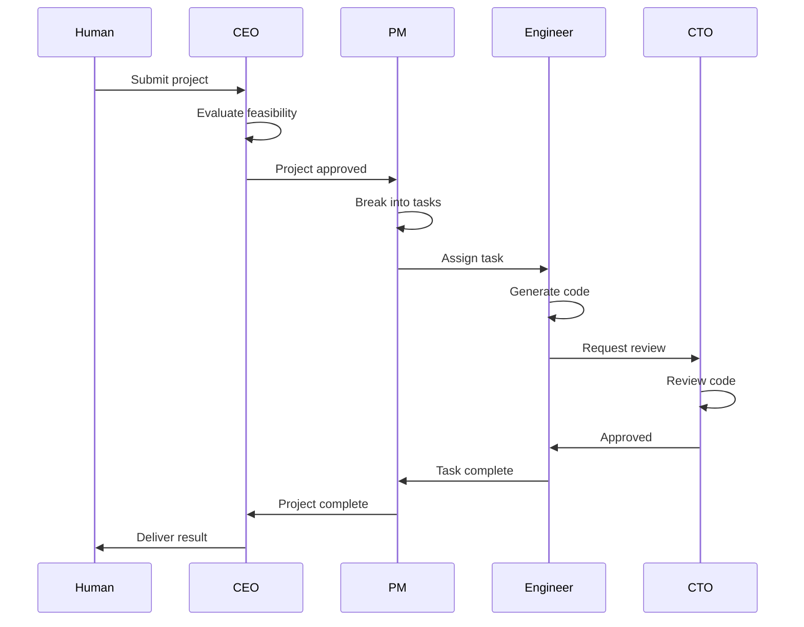

# Why I Built an AI Company That Runs Itself

*The real reason behind Deviant—and why the future belongs to tiny teams with massive leverage.*

---

## The 3 AM Realization

I was debugging a production issue at 3 AM—again—when it hit me: I'm the bottleneck.

I had a consulting business. Clients loved the work. But I couldn't scale. Every project depended on me personally. I was the CEO, the architect, the engineer, the project manager, and the support team. All at once.

I tried hiring. Contractors cost money I didn't always have. Training took time. Quality control meant I was still reviewing everything anyway. The math didn't work.

I tried automation. Wrote scripts. Built templates. Set up processes. It helped at the margins, but the core work—the thinking, deciding, creating—still required my brain.

Then ChatGPT came out. And everything changed.

---

## The First Attempt (That Failed)

Like everyone else, I threw ChatGPT at my work. "Write me an API for user authentication." And it did. Sort of.

The code was okay. But it didn't know about my existing database structure. It didn't understand my coding standards. It generated something that *looked* right but needed hours of modification to actually work.

Then I discovered Claude. Better reasoning. Longer context. I could give it more information and get more coherent output. Progress.

But still—one agent, one conversation, one context. For a complex project, I was managing 17 different chat threads, copy-pasting context between them, losing track of decisions made three conversations ago.

The AI was smart. The workflow was dumb.

---

## The Insight That Changed Everything

Real companies don't work like that.

At a real software company, the CEO doesn't write code. The engineer doesn't make business decisions. The designer doesn't manage project timelines.

Each person has:
- A **specific role** with clear responsibilities
- **Limited scope** so they can go deep, not wide
- **Communication channels** to coordinate with others
- **Authority** to make decisions in their domain

What if AI agents worked the same way?

Not one superintelligent agent trying to be everything. Multiple specialized agents, each optimized for their role, working together through structured communication.

That insight became Deviant.

---

## What I Actually Built

Seven agents, each with a specific job:

**CEO Agent**: Evaluates projects, makes strategic decisions, interfaces with the human founder (me). Asks: *Should we build this? Does it make sense?*

**CTO Agent**: Technical authority. Reviews architecture, code quality, security. Asks: *Is this well-built? Does it follow best practices?*

**PM Agent**: Breaks projects into tasks, manages dependencies, tracks progress. Asks: *What needs to happen? In what order? Who should do it?*

**Backend Engineer**: Writes Python, FastAPI, database code. Focuses on server-side logic.

**Frontend Engineer**: Writes React, Next.js, TypeScript. Focuses on user interfaces.

**Designer**: Creates UI/UX specifications, design systems, accessibility guidelines.

**HR Agent**: Monitors agent health. Detects when someone is stuck. Escalates problems before they become crises.

Each agent has:
- A specialized system prompt tuned for their role
- Access only to information relevant to their job
- Authority to make decisions in their domain
- Communication channels to coordinate with others

---

## The Real Magic: Coordination

Here's what surprised me: the hard part wasn't making individual agents smart. It was making them work *together*.

My first attempt at multi-agent coordination was chaos. Agents talking over each other. Contradictory decisions. Infinite loops of one agent assigning work that another agent rejected.

The solution was structure:

**Clear authority**: CEO approves projects. CTO approves code. PM assigns tasks. No ambiguity about who decides what.

**Event-driven communication**: When the Backend Engineer finishes a task, an event fires immediately. The CTO gets notified in <100ms to review. No polling. No delays.

**Explicit dependencies**: Task B can't start until Task A completes. The system tracks this automatically and unblocks work the moment dependencies resolve.

**Escalation paths**: If an agent is stuck for too long, HR notices and escalates. Problems don't sit unaddressed for hours.

---

## Why "Deviant"?

The name isn't random.

Deviant: *departing from usual or accepted standards*.

That's the point. The usual standard is to hire people. The accepted wisdom is that AI can't replace teams. The conventional approach is to use AI as a tool, not as an organization.

Deviant says: what if we built companies differently?

Not human employees replaced by AI. But solo founders empowered by AI teams. Small groups accomplishing what used to require large organizations.

The deviation is structural, not just technological.

---

## What This Means for You

I didn't build Deviant to create a cool demo. I built it because I needed it.

Every technical person I know has the same problem: more ideas than time. More capabilities than hours. More ambition than bandwidth.

Deviant is the leverage I wished I had three years ago.

Now I can:
- Describe a project idea in the morning
- Have a complete specification, codebase, and design by lunch
- Focus my human hours on the work that actually requires human judgment

That's not a productivity hack. That's a fundamentally different way to work.

---

## The Honest Truth

Building this took months. It's not perfect. The agents sometimes make mistakes. Complex projects still need human oversight. LLM costs add up.

But here's what I know for certain:

The future doesn't belong to huge teams. It belongs to tiny teams with massive leverage. One person with the right AI infrastructure can outproduce organizations ten times their size.

Deviant is my bet on that future.

---

## Your Turn

If you're reading this, you're probably like me. Technical. Ambitious. Frustrated by the limits of what one person can accomplish.

Deviant is open source. You can run it yourself. You can modify it for your needs. You can build your own AI company.

The technology exists. The question is: what will you build with it?

---

**Next**: [The Problem with Current AI Agents →](./03-problem-with-current-ai-agents.md)

---

*Nicanor Korir is a developer, consultant, and builder of things that scale. Deviant is his attempt to solve his own bottleneck problem—and maybe yours too.*
