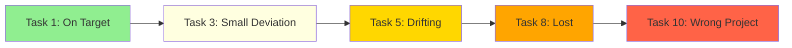
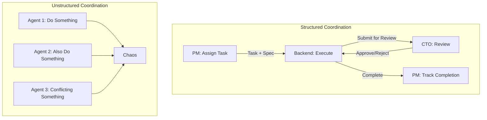

# The Problem with Current AI Agents (And Why Most Fail at Real Work)

*Why single-agent systems hit a wall—and what the solution actually looks like.*

---

## The Dirty Secret of AI Agents

Everyone's building AI agents right now. AutoGPT. BabyAGI. CrewAI. LangChain agents. Hundreds of projects, all promising autonomous AI that can complete complex tasks.

Here's what they don't tell you: most of them fall apart on anything beyond simple, well-defined problems.

I know because I built them. I tried them all. And I kept hitting the same wall.

---

## The Three Fatal Flaws

### 1. Context Collapse

AI models have a context window. Even with Claude's 100K+ tokens, there's a limit. And here's the problem: complex projects require more context than any model can hold at once.

Your project needs to track:
- The original requirements
- Current task state
- Code already generated
- Decisions already made
- Communication history
- Technical constraints
- Design specifications

Dump all of that into a single prompt, and you hit limits. Summarize it, and you lose critical details. The model starts making decisions that contradict earlier choices. Code references functions that don't exist. The project spirals.

**The Deviant solution**: Specialized agents with scoped context.

The Backend Engineer doesn't need to know about the UI color palette. The Designer doesn't need the database schema. Each agent maintains only the context relevant to their role—and a coordination layer ensures they're aligned without context overload.

### 2. Decision Drift

Watch a single AI agent work on a complex project. At task 1, it's following your requirements closely. By task 5, it's made independent decisions that seem reasonable in isolation. By task 10, it's building something you never asked for.

I call this "decision drift." Without checks, without review, without someone saying "wait, that's not what we agreed"—the agent optimizes for local coherence and loses the big picture.

**The Deviant solution**: Built-in review and approval.

The CTO Agent reviews all code before it's accepted. The CEO Agent evaluates projects against original requirements. The PM Agent checks that completed tasks actually satisfy their specifications. Multiple checkpoints prevent drift.

### 3. The Single Point of Failure

When you have one agent doing everything, and it gets confused—you're stuck. There's no fallback. No alternative perspective. No colleague to say "hey, I think you're approaching this wrong."

Autonomous systems need redundancy. They need peer review. They need the ability to catch and correct mistakes before they compound.

**The Deviant solution**: Distributed intelligence with oversight.

If the Backend Engineer generates broken code, the CTO catches it in review. If a project is unclear, the CEO asks clarifying questions before approving. If an agent gets stuck, HR detects it and escalates. No single point of failure.

---

## What "Coordination" Actually Means

Here's where most multi-agent frameworks miss the point.

It's not enough to have multiple agents. You need structured coordination. Real communication. Clear authority.

### Bad Coordination

Agent A: "I'll work on the database."
Agent B: "I'll also work on the database."
Agent C: "Here's my database design."
**Result**: Three incompatible implementations. Chaos.

### Good Coordination

PM: "Backend Engineer, implement the user table. Here's the spec."
Backend: "Done. Submitting for review."
CTO: "Schema looks good. One change—add an index on email."
Backend: "Fixed. Ready for approval."
CTO: "Approved."
PM: "Task complete. Updating dependencies."
**Result**: One coherent implementation. Clear ownership.

---

## The Speed Problem

Most multi-agent systems use polling. Every X minutes, each agent checks: "Do I have work to do?"

If X is 15 minutes and you have 5 agents in a chain, a simple handoff takes over an hour of wall-clock time. Not because the work is slow—because the *coordination* is slow.

Event-driven systems are different. When something happens, interested parties are notified immediately. No waiting. No polling loops. No wasted time.

| Approach | Handoff Time | Project Time (10 tasks) |
|----------|--------------|------------------------|
| 15-min polling | ~15 min | 4-5 hours |
| 5-min polling | ~5 min | 1-2 hours |
| Event-driven | <100ms | 10-30 minutes |

Deviant uses event-driven coordination. When the Backend Engineer finishes a task, the CTO is notified in milliseconds. Review starts immediately. Dependencies unblock instantly.

---

## Why Frameworks Like CrewAI Aren't Enough

Don't get me wrong—CrewAI is useful. LangGraph is powerful. These are good tools.

But they're frameworks, not solutions. They give you building blocks for multi-agent systems. They don't give you:

- A tested organizational structure
- Pre-configured agent roles and responsibilities
- Event-driven coordination infrastructure
- Built-in review and approval workflows
- Escalation and health monitoring
- Complete audit trails

Building a real AI company on CrewAI is like building a real software company on "a programming language." The tool matters, but the architecture matters more.

---

## The Architecture That Works

After months of trial and error, here's what actually works for complex, autonomous AI execution:

### 1. Clear Hierarchy
Someone is in charge. Decisions have final authority. No design-by-committee paralysis.

### 2. Specialized Roles
Each agent is an expert in their domain. Narrow scope means deep capability.

### 3. Structured Communication
Messages have types: REQUEST, INFO, APPROVAL, ALERT. Recipients are explicit. Context is preserved.

### 4. Real-Time Coordination
Events fire immediately. No polling delays. Sub-second handoffs.

### 5. Built-In Review
Code gets reviewed. Decisions get validated. Mistakes get caught before they compound.

### 6. Health Monitoring
A dedicated agent watches for problems. Stuck tasks get escalated. Silent failures get detected.

### 7. Complete Transparency
Every decision logged. Every message visible. Full audit trail for debugging and improvement.

---

## The Takeaway

Current AI agents fail at complex work because they're trying to be one superintelligent entity. That's not how humans work. That's not how companies work. That's not how intelligence scales.

The solution isn't smarter models (though those help). The solution is smarter organization. Multiple agents. Clear roles. Structured coordination. Built-in oversight.

That's what Deviant provides. Not just agents—but a complete system for autonomous, coordinated AI work.

---

**Next**: [From Solo Developer to AI-Powered Company →](./04-solo-to-ai-company.md)

---

*Nicanor Korir has broken every AI agent framework he's touched. Deviant is what emerged from the wreckage.*
