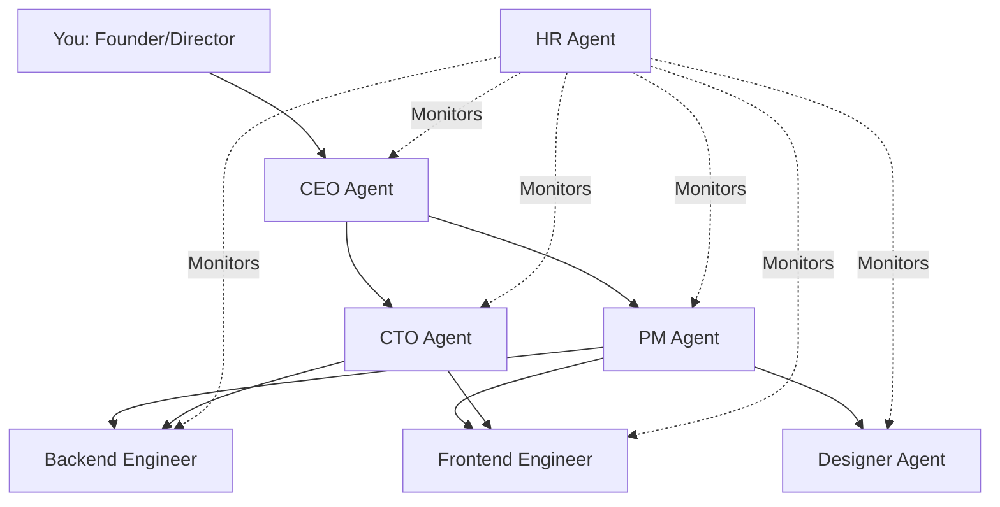
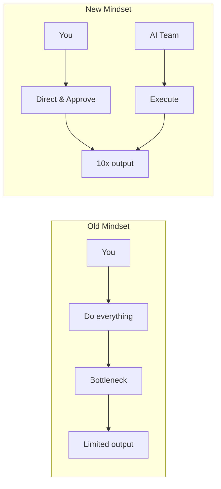

# From Solo Developer to AI-Powered Company: How One Person Can Build Like a Team of Ten

*The playbook for multiplying your output without multiplying your headcount.*

---

## The Solo Developer's Dilemma

You know the math doesn't work.

You have 40-60 productive hours per week. Maybe 80 if you're pushing it (and burning out). That's your ceiling.

But your ambitions? They need 200 hours per week. 500 hours. More.

Every project has a frontend. A backend. A database. Design work. Testing. Documentation. Deployment. Marketing. Support.

Pick any two to do well. The rest suffers.

I lived this for years. I watched opportunities pass because I didn't have bandwidth. I said "no" to projects I could have crushed if I had a team. I compromised on quality because I was spread too thin.

Then I built Deviant, and the math changed.

---

## The New Equation

What if you could spin up a team of specialists whenever you needed them?

Not freelancers (expensive, slow to onboard). Not AI chatbots (helpful for questions, useless for projects). An actual organized team that coordinates, collaborates, and delivers.

Here's what that looks like:

**Your role**: Strategic direction. Final approval. The ideas.

**Their role**: Everything else.

---

## A Day in the Life

Let me show you how this actually works.

### Morning (1 hour of your time)

**8:00 AM** - You write a project brief:
> "Build a habit tracking app. Users can create habits, mark daily completion, see streaks. Simple dashboard showing progress. No auth for MVP—just local storage."

**8:10 AM** - You submit to Deviant.

**8:11 AM** - CEO Agent receives it, starts evaluation.

**8:12 AM** - CEO consults CTO about technical approach.

**8:15 AM** - Project approved. PM starts task breakdown.

You close the laptop. Go to the gym. Have breakfast.

### Midday (30 minutes of your time)

**12:00 PM** - You check the dashboard.

Project status: 60% complete.
Tasks done: Design specs, database schema, API structure.
In progress: Frontend components.
Pending: Integration, polish.

You see the Designer's UI specification. Clean. Minimal. Good.

You see the Backend Engineer's code. Python, FastAPI. Proper type hints. Makes sense.

You leave a note for the Frontend Engineer: "Use Tailwind, not plain CSS."

Back to your other work.

### Evening (30 minutes of your time)

**5:00 PM** - Project complete notification.

You review:
- UI/UX specification with component layouts
- Backend API code with endpoints documented
- Frontend React components with TypeScript
- Integration notes

CTO has already reviewed everything. No critical issues flagged.

You approve. Export the deliverables. Ready to build.

**Total your time**: 2 hours.
**Equivalent work delivered**: 20-40 hours.

---

## The Leverage Effect

Let's be real about the numbers.

A traditional approach to that habit tracker MVP:
- 4-6 hours designing UI
- 4-6 hours on backend API
- 8-12 hours on frontend
- 2-4 hours on integration and debugging

**Total**: 20-30 hours minimum. A week of full-time work.

With Deviant:
- 1 hour writing the project brief
- 30 minutes reviewing midday
- 30 minutes reviewing final output

**Total**: 2 hours of active work.

That's **10-15x leverage**. Not by working harder. By working differently.

---

## What This Enables

### Build Multiple Projects Simultaneously

You're not doing the work. You're directing it.

Monday: Spin up the habit tracker.
Tuesday: Start a landing page generator.
Wednesday: Begin a internal dashboard tool.

Each project runs autonomously. You check in daily. They make progress while you're focused elsewhere.

### Prototype Fast, Decide Faster

Got an idea? Throw it at Deviant. Get a complete specification and codebase in hours.

Idea doesn't work? You learned that in an afternoon, not a month.

Idea has legs? You have a real starting point, not a sketch on a napkin.

### Maintain Quality Without Micromanagement

The CTO Agent reviews everything. Code standards are enforced. Architectural decisions are documented.

You're not the quality gatekeeper anymore. The system is.

### Scale Client Work

Consulting? Agency? Freelance?

Now you can take on more projects without drowning. Each client project gets a dedicated AI team. You focus on client relationships and high-level direction.

---

## The Mindset Shift

This is the hard part: letting go.

I'm a control freak. I want to touch every line of code. Review every decision. Know every detail.

Working with Deviant meant learning to trust the system. To accept that the AI's output might be different from what I would write—but still correct. To focus on outcomes, not process.

The shift is from **doer** to **director**.

You're still essential. The ideas are yours. The strategy is yours. The final approval is yours. But the execution? That's delegated.

---

## What You Still Do

Let's be clear about what doesn't change:

**Vision and strategy**: The AI doesn't know what to build or why. That's you.

**Domain expertise**: The AI doesn't know your industry, your users, your specific constraints. You provide that context.

**Final judgment**: The AI proposes. You approve. Human oversight remains essential.

**Client relationships**: If you're doing client work, the human connection matters. AI handles the work; you handle the people.

**Complex problem-solving**: Novel problems, edge cases, creative breakthroughs—this is where human intelligence still leads.

---

## Getting Started

If you're a solo developer considering this approach, here's how to start:

### Week 1: Observer Mode
Run Deviant on a project you've already built. See what it generates. Compare to your original. Understand its strengths and limitations.

### Week 2: Assistant Mode
Use Deviant for the parts you hate. Database schemas. Boilerplate. Documentation. Take its output as a starting point, refine yourself.

### Week 3: Delegation Mode
Submit a real project. Let it run. Review with fresh eyes. Resist the urge to intervene unless necessary.

### Week 4: Production Mode
Build your workflow around AI-generated work. Focus your human hours on high-judgment tasks. Let the AI handle high-volume execution.

---

## The Future You're Betting On

Here's the uncomfortable truth: this is where work is going.

Not "AI replacing developers." That's too simplistic.

**AI amplifying developers**. One person accomplishing what used to require a team. Small teams competing with large organizations. Individuals building at unprecedented scale.

The developers who figure this out first have an advantage. The ones who refuse to adapt will be working 10x harder for the same output.

I'd rather be in the first group.

---

## The Takeaway

You don't need a bigger team. You need better leverage.

Deviant gives you seven specialized agents working autonomously on your projects. They coordinate. They review. They deliver. You direct.

The math changes from "I have 60 hours" to "I have 60 hours of direction plus hundreds of hours of execution."

That's how a solo developer builds like a company.

---

**Next**: [Deviant vs The World: How We're Different →](./05-deviant-vs-world.md)

---

*Nicanor Korir spent years hitting the ceiling of solo output. Deviant is his ladder over that wall.*
