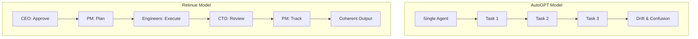
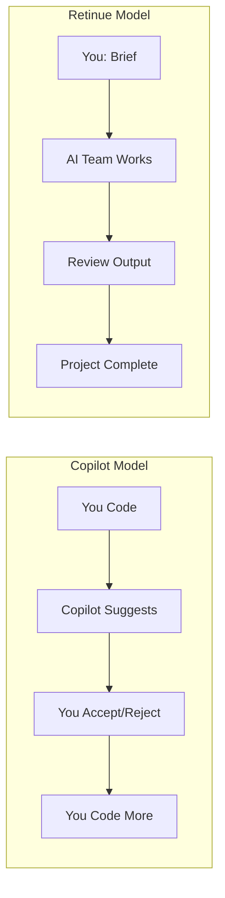

# Retinue vs The World: What Makes This Different

*A straight-up comparison with other AI agent solutions—strengths, weaknesses, and honest trade-offs.*

---

## The AI Agent Landscape

Everyone's building AI agents. Let me map the territory:

**General autonomous agents**: AutoGPT, BabyAGI, AgentGPT
**Framework-based systems**: LangChain Agents, CrewAI, AutoGen
**Coding assistants**: GitHub Copilot, Cursor, Cody, Aider
**Vertical solutions**: Devin, SWE-Agent, OpenHands

Where does Retinue fit? And why would you choose it over these alternatives?

---

## The Honest Comparison

### vs. AutoGPT / BabyAGI

**What they do**: Single-agent autonomous systems that recursively break down goals and execute tasks.

**Their strength**: Conceptually simple. One agent, one goal, recursive execution.

**Their weakness**: No organizational structure. No review process. Context collapse on complex projects. Unpredictable outputs.

**Retinue's approach**:

**Bottom line**: Retinue trades simplicity for reliability. Multiple agents with clear roles produce more predictable, higher-quality output than a single agent trying to do everything.

---

### vs. CrewAI

**What they do**: Framework for building multi-agent systems with role-based agents and task orchestration.

**Their strength**: Flexible framework. Good abstraction for agent cooperation. Active community.

**Their weakness**: It's a framework, not a solution. You still need to design your organizational structure, communication patterns, review workflows, and coordination logic.

**Retinue's approach**:

| Feature | CrewAI | Retinue |
|---------|--------|---------|
| Agent roles | Define yourself | 7 pre-configured |
| Organizational hierarchy | Build it | Built-in |
| Review workflows | Implement yourself | Native |
| Event-driven coordination | Not default | Native |
| Health monitoring | Not included | HR Agent |
| Task dependencies | Basic | Automatic resolution |

**Bottom line**: CrewAI is like getting a programming language. Retinue is like getting a working application. If you want to build custom agent systems, CrewAI is great. If you want a working AI company now, Retinue delivers.

---

### vs. GitHub Copilot / Cursor

**What they do**: AI-powered code completion and generation inside your editor.

**Their strength**: Seamless integration. Real-time suggestions. Great for incremental coding.

**Their weakness**: Single-file focus. No project-level understanding. No autonomous execution. You're still the driver.

**Retinue's approach**:

**Bottom line**: Copilot makes you faster. Retinue makes you unnecessary (for execution). They solve different problems—Copilot for tactical coding, Retinue for strategic delivery.

---

### vs. Devin

**What they do**: AI software engineer that can autonomously complete tasks in a real development environment.

**Their strength**: Full execution environment. Can actually run code, use git, interact with real systems.

**Their weakness**: Single-agent model. Limited availability. Black-box execution. No organizational structure.

**Retinue's approach**:

| Aspect | Devin | Retinue |
|--------|-------|---------|
| Model | Single AI engineer | 7-agent company |
| Execution | Real environment | Code generation |
| Transparency | Limited | Full audit trail |
| Review | Self-review | CTO review |
| Availability | Waitlist | Open source |
| Cost | Subscription | Your API costs |

**Bottom line**: Devin can execute in a real environment (huge advantage). Retinue provides organizational structure and review workflows (different advantage). They're complementary visions of autonomous AI development.

---

### vs. LangChain Agents

**What they do**: Framework for building LLM applications with tool use and agent capabilities.

**Their strength**: Incredibly flexible. Rich ecosystem. Well-documented.

**Their weakness**: Low-level tooling. Requires significant development to build a working multi-agent system. No out-of-box organizational structure.

**Retinue's approach**:

Building a Retinue-equivalent on LangChain would require:
- Defining 7 agent roles and prompts
- Building coordination infrastructure
- Implementing event-driven communication
- Creating review and approval workflows
- Adding health monitoring
- Building dependency resolution
- Creating audit logging

That's 4-6 months of development. Retinue ships ready.

**Bottom line**: LangChain is great if you want to build your own agent system. Retinue is great if you want an agent system that works.

---

## Where Retinue Wins

### 1. Organizational Structure

Real companies have hierarchy for a reason. It works. Retinue applies the same principle to AI agents.

- Clear authority and accountability
- Decisions made by appropriate agents
- Escalation paths for problems
- No design-by-committee paralysis

### 2. Built-In Review

Every piece of code gets reviewed by the CTO Agent. Every project gets evaluated by the CEO Agent. Quality gates are native, not bolted on.

### 3. Event-Driven Speed

Sub-100ms handoffs between agents. A project that would take 4 hours with polling completes in 30 minutes with events.

```mermaid
gantt
    title Task Completion Timeline
    dateFormat  HH:mm
    axisFormat %H:%M

    section Polling (15min)
    Task 1          :a1, 00:00, 15m
    Wait            :a2, after a1, 15m
    Task 2          :a3, after a2, 15m
    Wait            :a4, after a3, 15m
    Task 3          :a5, after a4, 15m

    section Event-Driven
    Task 1          :b1, 00:00, 5m
    Task 2          :b2, after b1, 5m
    Task 3          :b3, after b2, 5m
```

### 4. Full Transparency

Every decision logged. Every message visible. Every agent's reasoning available for inspection. Debug problems, understand choices, improve over time.

### 5. Health Monitoring

HR Agent watches for stuck tasks, unresponsive agents, review timeouts. Problems get escalated before they become crises.

---

## Where Retinue Loses (Honestly)

### 1. No Real Execution Environment

Retinue generates code as text. It doesn't run it. No sandboxed testing. No automated deployment. That's a limitation.

**Workaround**: Use the generated code as a high-quality starting point. Run and test yourself.

### 2. LLM Cost Dependency

Every agent action involves an API call. Complex projects with many tasks can cost $10-20+ in Claude API fees.

**Workaround**: Use cost monitoring. Batch simple decisions. Optimize prompts for efficiency.

### 3. Not Instant

Even with event-driven coordination, a project takes 15-60 minutes, not seconds. This is "autonomous execution" not "instant generation."

**Workaround**: Plan for async workflows. Submit projects, check back later.

### 4. Optimized for Software Projects

The agent roles are designed for software development. Marketing, sales, legal work—not the current focus.

**Workaround**: Use for software projects. Use other tools for other domains.

---

## The Competitive Moat

What's defensible about Retinue?

**1. Organizational Design**

The agent structure, communication patterns, and coordination logic took months to develop. It's not just "add more agents"—it's carefully designed authority, responsibility, and information flow.

**2. Event-Driven Architecture**

Real-time coordination is technically hard. The infrastructure for <100ms handoffs across multiple agents is significant engineering.

**3. Integrated Review Workflows**

Review isn't separate from execution. It's built into the task lifecycle. This integration is non-trivial.

**4. Accumulated Patterns**

As Retinue runs more projects, we learn what works. The agent prompts improve. The coordination logic refines. The system gets better.

---

## Who Should Use What

| You Should Use | If You Need |
|---------------|-------------|
| **Retinue** | Complete autonomous project execution, organizational structure, built-in review |
| **CrewAI** | Custom multi-agent architectures, maximum flexibility |
| **Copilot/Cursor** | Real-time coding assistance while you drive |
| **Devin** | Real execution environment, single-engineer model |
| **LangChain** | Maximum control, building custom LLM applications |
| **AutoGPT** | Simple autonomous tasks, experimentation |

---

## The Future Convergence

Here's my prediction: these approaches will merge.

Future systems will have:
- Retinue's organizational structure
- Devin's execution environment
- Copilot's real-time integration
- CrewAI's flexibility

Retinue is a bet on organizational structure being the key differentiator. Time will tell.

---

## The Takeaway

Retinue isn't the only option. But it is a unique approach: a complete AI company with organizational structure, review workflows, and event-driven coordination.

If you want to build custom agent systems from scratch—use frameworks.
If you want AI assistance while you code—use Copilot.
If you want an autonomous team delivering complete projects—try Retinue.

Different tools for different jobs.

---

*This completes the Urgent Introduction series. Ready for deeper dives into architecture, use cases, and the technical details? Check the other article categories.*

---

*Nicanor Korir has tried every AI agent solution he could find. Retinue is what emerged when none of them quite worked.*
