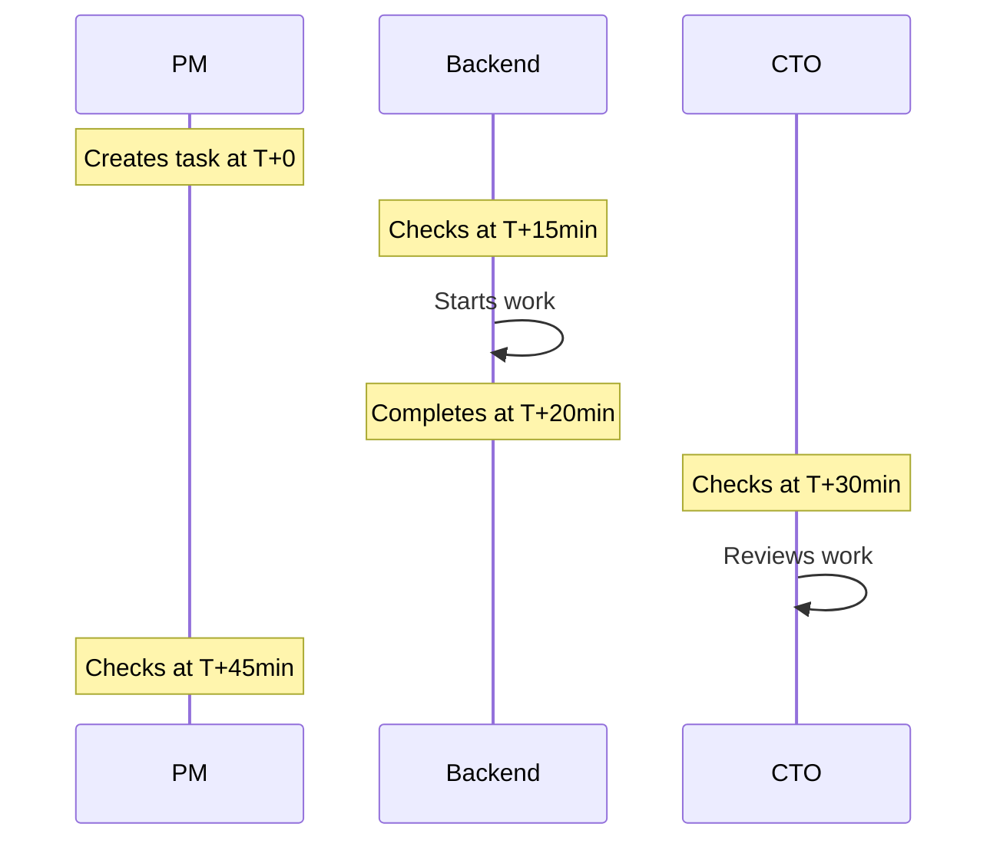
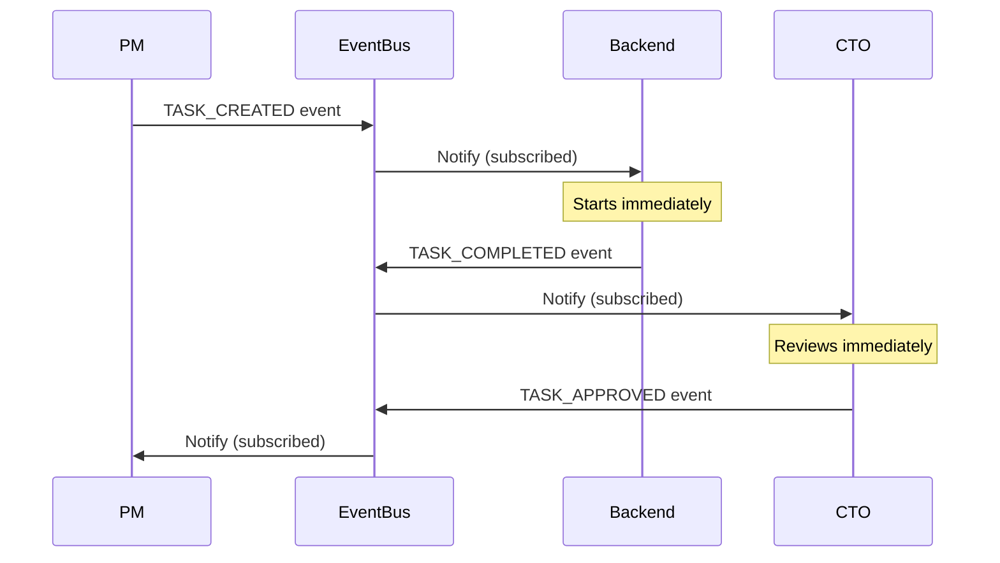
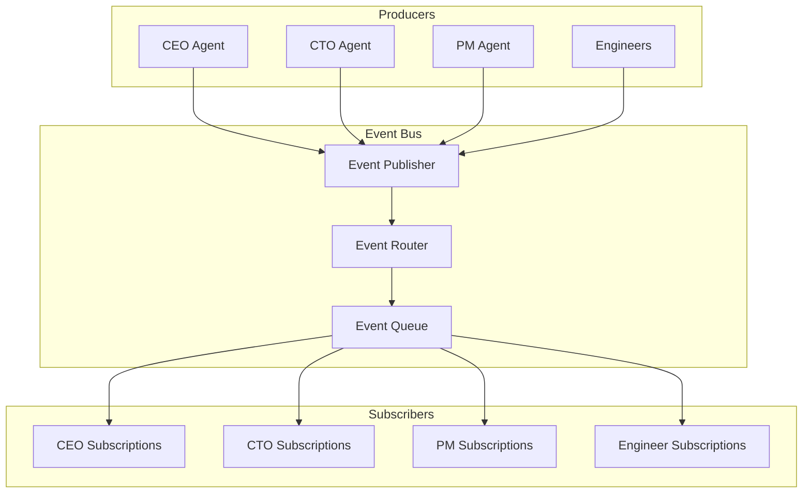
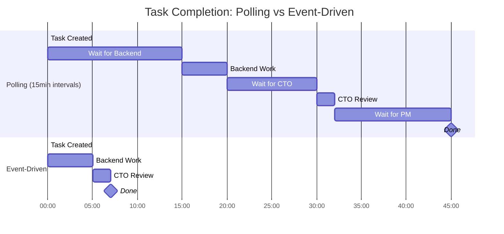
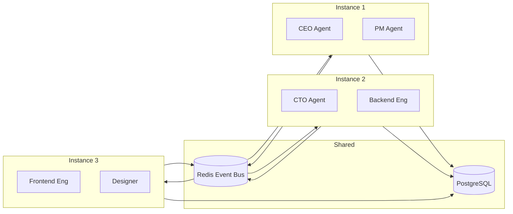

# Building Event-Driven Multi-Agent Systems: The Architecture Behind Deviant

*How to make AI agents collaborate in real-time without stepping on each other's toes.*

---

## The Fundamental Problem

When you have multiple AI agents working on the same project, you face a coordination nightmare:

- How does Agent A know when Agent B is done?
- How do you prevent conflicting decisions?
- How do you ensure work flows in the right order?
- How do you handle failures without corrupting state?

The naive approach: polling. Every agent periodically asks "do I have work to do?"

The problem with polling:



A simple handoff that should take seconds takes 45 minutes. Multiply this across a project with 20 tasks, and you're looking at days of wall-clock time for hours of actual work.

---

## The Event-Driven Alternative

Instead of agents asking "is there work?", we flip the model: the system *tells* agents when there's work.



Same workflow. Sub-second handoffs. The difference is **push vs pull**.

---

## How Deviant's Event System Works

### The Event Bus

At the core is an event bus—a message broker that routes events to interested parties.



### Event Types

Deviant defines 30+ event types. Here are the critical ones:

**Project Events**
- `PROJECT_CREATED`: Human submits a new project
- `PROJECT_APPROVED`: CEO approves the project
- `PROJECT_COMPLETED`: All work finished

**Task Events**
- `TASK_CREATED`: PM creates a new task
- `TASK_ASSIGNED`: Task assigned to an agent
- `TASK_STARTED`: Agent begins work
- `TASK_COMPLETED`: Agent finishes work
- `TASK_APPROVED`: Reviewer approves output

**Agent Events**
- `AGENT_AVAILABLE`: Agent ready for work
- `AGENT_BUSY`: Agent currently working
- `AGENT_STUCK`: Agent hasn't progressed (HR monitoring)

### Subscription Model

Each agent subscribes to relevant events:

| Agent | Subscribes To |
|-------|---------------|
| CEO | PROJECT_CREATED, PROJECT_COMPLETED, ESCALATION_CREATED |
| CTO | TASK_OUTPUT_READY (for review), TECHNICAL_QUESTION |
| PM | PROJECT_APPROVED, TASK_COMPLETED, TASK_BLOCKED |
| Backend Engineer | TASK_ASSIGNED (role=backend), TASK_DEPENDENCY_RESOLVED |
| Frontend Engineer | TASK_ASSIGNED (role=frontend), TASK_DEPENDENCY_RESOLVED |
| Designer | TASK_ASSIGNED (role=design), PROJECT_STARTED |
| HR | AGENT_STUCK, TASK_TIMEOUT, AGENT_HEALTH_ALERT |

---

## Event Flow: A Real Example

Let's trace a complete task through the system:

### 1. Task Creation

```python
# PM Agent creates a task
task = Task(
    title="Implement user authentication API",
    assigned_to=backend_engineer_id,
    depends_on=[database_schema_task_id]
)
await db.add(task)

# Event automatically published
await event_bus.publish(Event(
    type="TASK_CREATED",
    data={"task_id": task.id, "assigned_to": task.assigned_to}
))
```

### 2. Dependency Check

The Backend Engineer receives TASK_CREATED but can't start yet—there's a dependency.

```python
# Backend Engineer's event handler
async def on_task_created(event):
    task = await get_task(event.data["task_id"])

    if task.has_unresolved_dependencies():
        # Register interest, but don't start
        await register_dependency_wait(task.id)
        return

    # No dependencies, start immediately
    await start_task(task)
```

### 3. Dependency Resolution

When the database schema task completes:

```python
# Automatic dependency resolution
async def on_task_completed(event):
    completed_task = event.data["task_id"]

    # Find all tasks waiting on this one
    waiting_tasks = await find_tasks_depending_on(completed_task)

    for task in waiting_tasks:
        if task.all_dependencies_resolved():
            # Fire event to unblock
            await event_bus.publish(Event(
                type="TASK_DEPENDENCY_RESOLVED",
                data={"task_id": task.id}
            ))
```

### 4. Work Execution

```python
# Backend Engineer receives TASK_DEPENDENCY_RESOLVED
async def on_dependency_resolved(event):
    task = await get_task(event.data["task_id"])

    # Update status
    task.status = "IN_PROGRESS"
    await db.save(task)

    # Do the work
    output = await llm.generate(
        system_prompt=backend_engineer_prompt,
        context=build_task_context(task)
    )

    task.output = output
    task.status = "REVIEW"
    await db.save(task)

    # Request review
    await event_bus.publish(Event(
        type="TASK_OUTPUT_READY",
        data={"task_id": task.id, "reviewer": cto_agent_id}
    ))
```

### 5. Review and Approval

```python
# CTO receives TASK_OUTPUT_READY
async def on_output_ready(event):
    task = await get_task(event.data["task_id"])

    # Review the work
    review_result = await llm.generate(
        system_prompt=cto_review_prompt,
        context={"task": task, "output": task.output}
    )

    if review_result.approved:
        task.status = "COMPLETED"
        await db.save(task)

        await event_bus.publish(Event(
            type="TASK_APPROVED",
            data={"task_id": task.id}
        ))
    else:
        # Request revisions
        await event_bus.publish(Event(
            type="TASK_REVISION_REQUESTED",
            data={"task_id": task.id, "feedback": review_result.feedback}
        ))
```

---

## The Timing Advantage

Let's quantify the difference:



**Polling total**: ~45 minutes
**Event-driven total**: ~7 minutes

That's a **6x speedup** on a single task. Across a project with 15-20 tasks, the difference is hours vs days.

---

## Error Handling in Event Systems

Events can fail. Messages can get lost. Agents can crash. How does Deviant handle this?

### 1. Event Persistence

Every event is logged to the database before being processed:

```python
async def publish(event: Event):
    # 1. Persist first
    await db.insert("event_log", event)

    # 2. Then broadcast
    await broadcast_to_subscribers(event)
```

If the system crashes, unprocessed events can be replayed.

### 2. Idempotent Handlers

Event handlers are designed to be called multiple times safely:

```python
async def on_task_assigned(event):
    task = await get_task(event.data["task_id"])

    # Check if already started (idempotency)
    if task.status != "PENDING":
        return  # Already handled

    # Process...
```

### 3. Dead Letter Queue

Events that fail repeatedly go to a dead letter queue for manual investigation:

```python
async def process_event(event):
    for attempt in range(MAX_RETRIES):
        try:
            await handle_event(event)
            return
        except Exception as e:
            await log_error(event, e)
            await asyncio.sleep(RETRY_DELAY * attempt)

    # Max retries exceeded
    await move_to_dead_letter_queue(event)
    await alert_hr_agent(event)
```

### 4. Health Monitoring

The HR Agent monitors for stale events—events that fired but never completed:

```python
async def hr_monitoring_loop():
    while True:
        # Find events older than threshold without completion
        stale = await find_stale_events(threshold=STALE_THRESHOLD)

        for event in stale:
            await create_escalation(
                title=f"Stale event: {event.type}",
                severity="HIGH"
            )

        await asyncio.sleep(HR_CHECK_INTERVAL)
```

---

## Scaling Considerations

### Horizontal Scaling

Because agents communicate through events, not direct calls, you can run multiple instances:



Redis Pub/Sub ensures all instances receive events. PostgreSQL provides consistent state.

### Backpressure

When events come faster than agents can process, we need backpressure:

```python
async def event_consumer(agent):
    while True:
        # Pull events with rate limiting
        events = await event_queue.get(max_batch=10)

        for event in events:
            if agent.is_busy():
                # Requeue for later
                await event_queue.requeue(event, delay=5)
            else:
                await agent.process(event)
```

### Event Ordering

Some events must be processed in order (task completion before project completion). Deviant uses:

1. **Sequence numbers** per entity
2. **Causal ordering** for related events
3. **Buffer and reorder** for out-of-sequence arrivals

---

## Key Design Decisions

### Why Not gRPC/Direct Calls?

We could have agents call each other directly. Why events instead?

1. **Decoupling**: Agents don't need to know about each other. Add a new agent, it just subscribes to events.

2. **Resilience**: If the CTO Agent is down, events queue up. When it's back, processing continues.

3. **Observability**: Every interaction is logged. Debug by replaying events.

4. **Flexibility**: Change how agents respond without changing who sends events.

### Why Redis for Event Bus?

1. **Speed**: In-memory operations, sub-millisecond latency
2. **Pub/Sub**: Native support for event broadcasting
3. **Persistence**: Redis Streams for durability
4. **Simplicity**: Well-understood, battle-tested

Alternatives considered: RabbitMQ (more complex), Kafka (overkill for this scale), in-memory (not distributed).

---

## The Takeaway

Event-driven architecture is what makes real-time multi-agent coordination possible. The key principles:

1. **Push, don't poll**: Notify agents when there's work
2. **Subscribe by interest**: Agents receive only relevant events
3. **Persist first**: Log events before processing for durability
4. **Idempotent handlers**: Safe to process events multiple times
5. **Monitor for failures**: HR Agent catches stale or stuck events

The result: sub-100ms coordination latency, 6x+ speedup versus polling, and a system that scales horizontally.

---

**Next**: [The 7-Agent Organization: Roles, Hierarchy, and Authority →](./02-seven-agent-organization.md)

---

*Nicanor Korir has debugged more event systems than he'd like to admit. Deviant is what happens when you finally get it right.*
