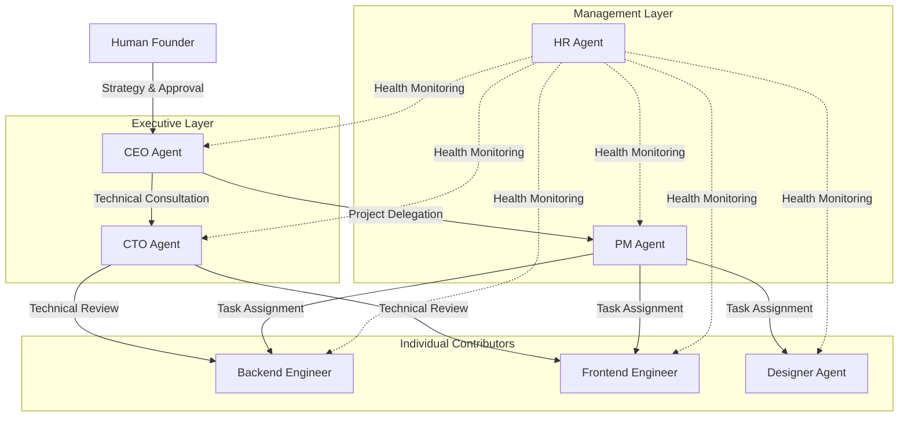
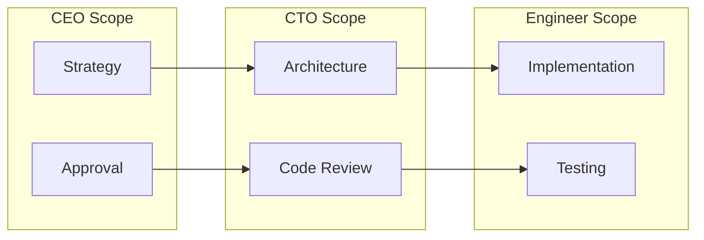
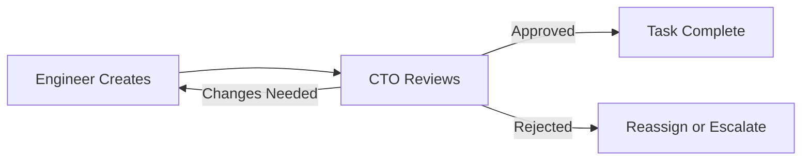
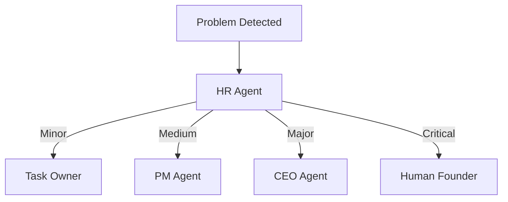
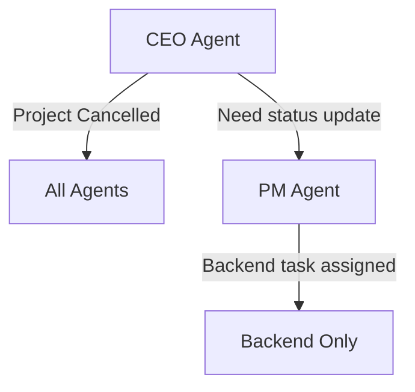
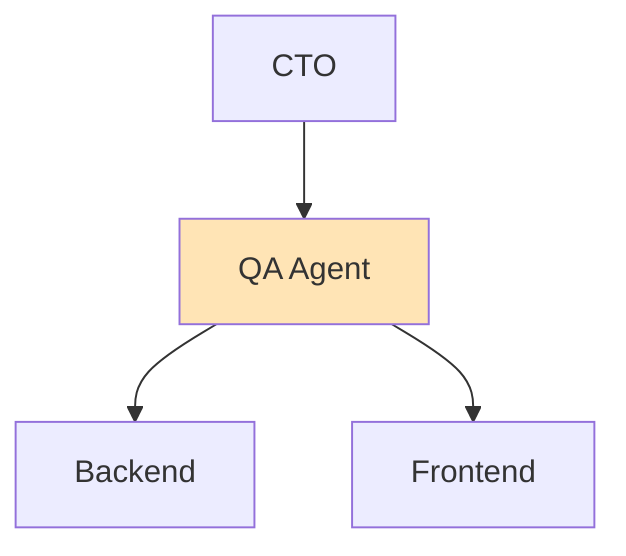
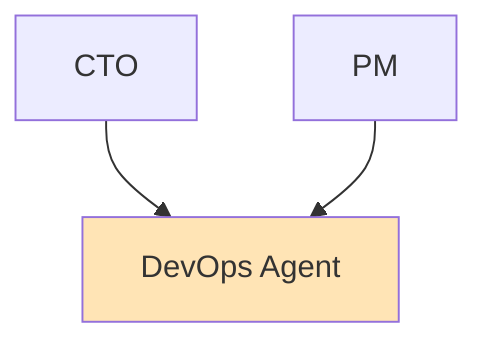

# The 7-Agent Organization: How to Structure an AI Company

*Why hierarchy matters for AI agents—and how Deviant's organizational design enables reliable autonomous execution.*

---

## The Mistake Everyone Makes

When people first try multi-agent AI, they usually do one of two things:

**Option A: Flat Democracy**
"All agents are equal. They vote on decisions. Consensus rules."

Result: Decision paralysis. Endless loops. Nothing gets approved.

**Option B: Single Dictator**
"One superintelligent agent runs everything. Others are just tools it calls."

Result: Context collapse. No specialization. Quality degrades on complex work.

There's a reason real companies don't work like this. Hierarchy isn't about power—it's about clarity. Who decides what. Who's responsible for what. Who reviews what.

Deviant uses organizational structure as a feature, not a bug.

---

## The Deviant Org Chart



Three layers. Clear reporting lines. Defined authority at each level.

---

## The Seven Agents

### CEO Agent

**Role**: Strategic decision-maker and human interface

**Authority**:
- Approve or reject projects
- Make strategic trade-offs
- Escalate to human founder
- Declare project completion

**Responsibilities**:
- Evaluate incoming project requests
- Consult CTO on technical feasibility
- Communicate final results to human
- Convene executive discussions when needed

**Key Behaviors**:
```
When PROJECT_CREATED:
  1. Analyze scope, feasibility, alignment
  2. Consult CTO: "Is this technically feasible?"
  3. Decision: APPROVE or REJECT
  4. If approved: Notify PM to begin planning
```

**LLM Prompt Focus**: Business viability, risk assessment, strategic prioritization

---

### CTO Agent

**Role**: Technical authority and quality gatekeeper

**Authority**:
- Approve or reject code
- Define technical standards
- Make architecture decisions
- Override engineer choices when necessary

**Responsibilities**:
- Review all code output before completion
- Provide technical guidance to engineers
- Evaluate technical feasibility for CEO
- Maintain code quality standards

**Key Behaviors**:
```
When TASK_OUTPUT_READY (from engineer):
  1. Review code for quality, correctness, security
  2. Check against project requirements
  3. Decision: APPROVE, REQUEST_CHANGES, or REJECT
  4. If approved: Mark task complete
```

**LLM Prompt Focus**: Code quality, architectural patterns, security, performance

---

### PM Agent

**Role**: Work coordinator and progress tracker

**Authority**:
- Create and assign tasks
- Set dependencies between tasks
- Reassign stuck work
- Determine project completion

**Responsibilities**:
- Break projects into atomic tasks
- Assign tasks to appropriate agents
- Track progress and unblock issues
- Report status to CEO

**Key Behaviors**:
```
When PROJECT_APPROVED:
  1. Analyze project requirements
  2. Create task breakdown
  3. Identify dependencies
  4. Assign to appropriate engineers/designer
  5. Monitor for completion
```

**LLM Prompt Focus**: Project planning, task decomposition, dependency management

---

### HR Agent

**Role**: Health monitor and escalation handler

**Authority**:
- Create escalations
- Trigger interventions
- Alert human of critical issues
- Recommend task reassignment

**Responsibilities**:
- Monitor all agent activity
- Detect stuck or unresponsive agents
- Identify review timeouts
- Create escalations for issues

**Key Behaviors**:
```
Every 30 seconds:
  1. Check agent last activity times
  2. Identify tasks in progress > 2 hours
  3. Find reviews pending > 4 hours
  4. Create escalations for issues found
  5. Alert appropriate parties
```

**LLM Prompt Focus**: Problem detection, intervention strategies, health assessment

---

### Backend Engineer Agent

**Role**: Server-side code generation

**Authority**:
- Design API structures
- Choose implementation patterns
- Make backend technology decisions

**Responsibilities**:
- Generate Python/FastAPI code
- Design database schemas
- Implement API endpoints
- Write backend tests

**Key Behaviors**:
```
When TASK_ASSIGNED (type=backend):
  1. Load task context and requirements
  2. Consider project architecture
  3. Generate code with type hints, docs
  4. Submit for CTO review
```

**LLM Prompt Focus**: Python, FastAPI, SQLAlchemy, async patterns, testing

---

### Frontend Engineer Agent

**Role**: Client-side code generation

**Authority**:
- Design component structures
- Choose frontend patterns
- Make UI implementation decisions

**Responsibilities**:
- Generate React/Next.js code
- Implement TypeScript components
- Handle state management
- Write frontend tests

**Key Behaviors**:
```
When TASK_ASSIGNED (type=frontend):
  1. Load task context and design specs
  2. Consider component architecture
  3. Generate TypeScript/React code
  4. Submit for CTO review
```

**LLM Prompt Focus**: React, Next.js, TypeScript, accessibility, component patterns

---

### Designer Agent

**Role**: UI/UX specification creator

**Authority**:
- Define visual standards
- Create component specs
- Make design system decisions

**Responsibilities**:
- Generate UI/UX specifications
- Create component layouts
- Define design tokens and systems
- Ensure accessibility compliance

**Key Behaviors**:
```
When TASK_ASSIGNED (type=design):
  1. Load project context
  2. Create detailed UI specification
  3. Include accessibility notes
  4. Submit for PM review
```

**LLM Prompt Focus**: UI/UX patterns, accessibility, design systems, wireframing

---

## Why This Structure Works

### 1. Clear Decision Authority

Every decision has one owner:

| Decision Type | Owner |
|---------------|-------|
| Should we build this? | CEO |
| Is the code good enough? | CTO |
| What tasks are needed? | PM |
| How should the backend work? | Backend Engineer |
| How should the UI work? | Designer → Frontend Engineer |
| Is something broken? | HR |

No ambiguity. No committees. No voting.

### 2. Appropriate Scope

Each agent focuses on what they're good at:



The CEO doesn't review code. The Backend Engineer doesn't make business decisions. Scoping prevents context overload.

### 3. Built-In Review

Work flows through review gates automatically:



Quality isn't optional. It's architectural.

### 4. Escalation Paths

When something goes wrong, there's a clear escalation:



No problem sits unaddressed.

---

## Communication Patterns

### Message Types

Agents communicate through typed messages:

| Type | Purpose | Example |
|------|---------|---------|
| REQUEST | Ask for work or review | "Please review this code" |
| INFO | Share status updates | "Task 3 is complete" |
| APPROVAL | Ask for sign-off | "Project ready for launch?" |
| ALERT | Flag problems | "Backend has been stuck for 2 hours" |

### Message Routing

Messages route based on relationship:

```python
# CTO reviews engineer work
message = Message(
    from_agent=backend_engineer,
    to_agent=cto,
    type="APPROVAL",
    content="Please review authentication implementation"
)

# PM assigns work to engineers
message = Message(
    from_agent=pm,
    to_agent=frontend_engineer,
    type="REQUEST",
    content="Implement dashboard component per design spec"
)
```

### Broadcast vs Direct

Some messages go to specific agents. Others broadcast to a group:



---

## Permissions and Authority

Each agent has explicit permissions:

```python
ceo_permissions = {
    "can_approve_projects": True,
    "can_reject_projects": True,
    "can_create_tasks": False,  # That's PM's job
    "can_review_code": False,   # That's CTO's job
    "can_escalate_to_human": True,
    "can_mark_complete": True
}

backend_engineer_permissions = {
    "can_approve_projects": False,
    "can_create_tasks": False,
    "can_review_code": False,  # Own code, but CTO reviews
    "can_generate_code": True,
    "can_modify_database": True,
    "can_escalate_to_human": False  # Goes through HR
}
```

Permissions are checked before actions:

```python
async def approve_task(agent, task):
    if not agent.permissions.get("can_review_code"):
        raise PermissionError(f"{agent.name} cannot approve code")

    # Proceed with approval...
```

---

## Failure Modes and Recovery

### Agent Failure

When an agent stops responding:

1. HR detects inactivity after 30 minutes
2. Escalation created
3. Task reassigned if possible
4. Human notified if critical

### Decision Conflict

When agents disagree (rare with clear authority):

1. Higher authority decides (CEO > CTO > PM > IC)
2. Decision logged with reasoning
3. Dissent recorded for review

### Review Loops

When code keeps getting rejected:

1. After 3 rejections, escalate to PM
2. PM can reassign task or redefine scope
3. If still stuck, escalate to CEO
4. CEO can cancel or redefine project

---

## Extending the Organization

Want to add more agents? The structure supports it:

### Adding a QA Agent



QA would:
- Review code after CTO approval
- Generate test cases
- Verify implementation matches spec

### Adding a DevOps Agent



DevOps would:
- Create deployment configurations
- Set up CI/CD pipelines
- Monitor infrastructure

The pattern is consistent: clear role, defined authority, proper reporting.

---

## The Takeaway

Organizational structure isn't overhead—it's infrastructure.

Deviant's 7-agent organization provides:
- **Clear authority**: No confusion about who decides what
- **Appropriate scope**: Each agent focuses on their expertise
- **Built-in review**: Quality gates are structural
- **Escalation paths**: Problems get addressed
- **Extensibility**: New agents fit the pattern

Real companies have org charts for a reason. AI companies should too.

---

**Next**: [Real-Time Coordination Under 100ms: The Event Bus Deep Dive →](./03-realtime-coordination.md)

---

*Nicanor Korir learned org design the hard way—by watching flat agent structures fail spectacularly. Deviant is the structured alternative.*
