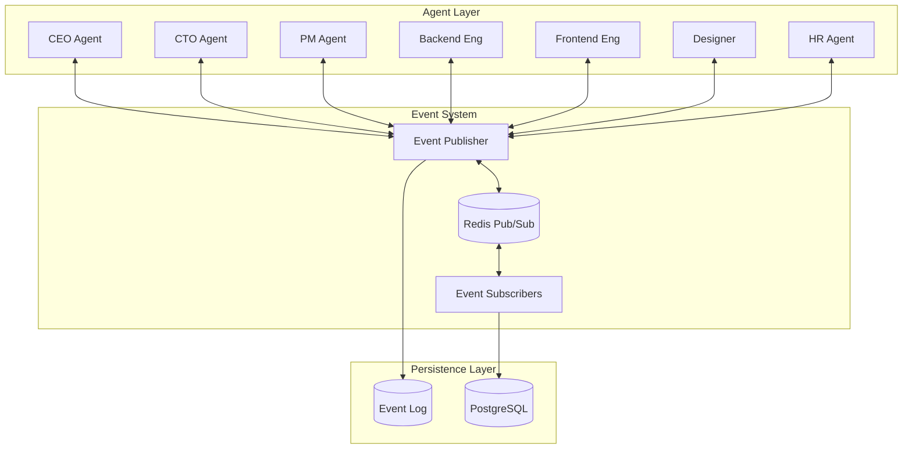
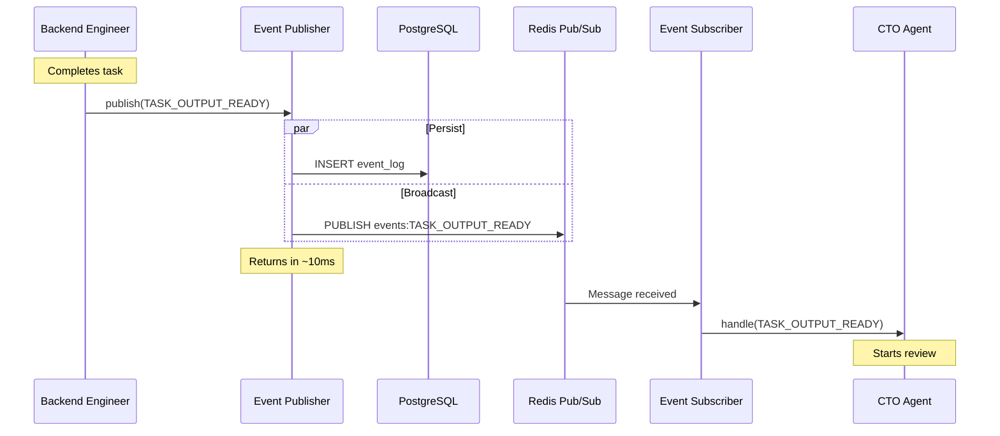
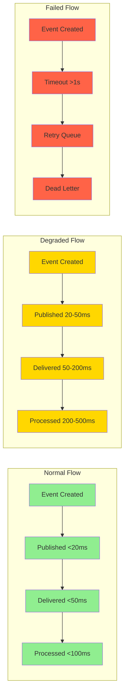

# Real-Time Coordination Under 100ms: How Deviant Agents Communicate

*The technical deep-dive on making AI agents hand off work faster than humans can blink.*

---

## Why 100ms Matters

Here's a number that changed everything: 100 milliseconds.

That's the target latency for passing work between agents in Deviant. Not 100 seconds. Not 10 seconds. One-tenth of a second.

Why does this matter?

Because a project with 20 tasks and 40 handoffs (task created → agent starts → agent completes → reviewer notified → review done → marked complete) can have handoff overhead of:

- **Polling every 15 min**: 40 × 7.5 min = 300 minutes = **5 hours**
- **Polling every 1 min**: 40 × 0.5 min = 20 minutes
- **Event-driven at 100ms**: 40 × 0.1 sec = 4 seconds

The actual work takes the same time. But the coordination overhead goes from hours to seconds.

---

## The Architecture



---

## Core Components

### 1. Event Publisher

Every state change goes through the event publisher:

```python
class EventPublisher:
    def __init__(self, redis: Redis, db: Database):
        self.redis = redis
        self.db = db

    async def publish(self, event: Event) -> None:
        # 1. Generate event ID and timestamp
        event.id = uuid4()
        event.timestamp = datetime.utcnow()

        # 2. Persist to database (durability)
        await self.db.insert("event_log", {
            "event_id": event.id,
            "event_type": event.type,
            "data": event.data,
            "timestamp": event.timestamp,
            "processed": False
        })

        # 3. Broadcast to Redis (speed)
        await self.redis.publish(
            channel=f"events:{event.type}",
            message=event.to_json()
        )

        # Average time: 5-15ms
```

### 2. Event Subscriber

Each agent runs a subscriber that listens for relevant events:

```python
class EventSubscriber:
    def __init__(self, agent_id: str, subscriptions: List[str]):
        self.agent_id = agent_id
        self.subscriptions = subscriptions
        self.handlers: Dict[str, Callable] = {}

    async def start(self):
        pubsub = self.redis.pubsub()

        # Subscribe to all relevant event channels
        for event_type in self.subscriptions:
            await pubsub.subscribe(f"events:{event_type}")

        # Listen loop
        async for message in pubsub.listen():
            if message["type"] == "message":
                event = Event.from_json(message["data"])
                await self.handle(event)

    async def handle(self, event: Event):
        handler = self.handlers.get(event.type)
        if handler:
            try:
                await handler(event)
                await self.mark_processed(event)
            except Exception as e:
                await self.handle_error(event, e)
```

### 3. Subscription Registry

Agents subscribe to specific event types:

```python
AGENT_SUBSCRIPTIONS = {
    "CEO": [
        "PROJECT_CREATED",
        "PROJECT_COMPLETED",
        "ESCALATION_CRITICAL",
        "HUMAN_INPUT_RECEIVED"
    ],
    "CTO": [
        "TASK_OUTPUT_READY",
        "TECHNICAL_QUESTION",
        "ARCHITECTURE_DECISION_NEEDED"
    ],
    "PM": [
        "PROJECT_APPROVED",
        "TASK_COMPLETED",
        "TASK_BLOCKED",
        "DEPENDENCY_RESOLVED"
    ],
    "BackendEngineer": [
        "TASK_ASSIGNED_BACKEND",
        "TASK_REVISION_REQUESTED",
        "DEPENDENCY_RESOLVED"
    ],
    # ... and so on
}
```

---

## Event Lifecycle

Let's trace an event through the system:



Total time from Backend Engineer completing work to CTO starting review: **~10-50ms**.

---

## Latency Breakdown

Where does the time go?

| Step | Typical Latency | Notes |
|------|----------------|-------|
| Event serialization | 1-2ms | JSON encoding |
| Database write | 3-8ms | PostgreSQL insert with index |
| Redis publish | 1-3ms | In-memory pub/sub |
| Redis subscribe delivery | 1-5ms | Network + deserialization |
| Handler invocation | 1-2ms | Python async overhead |
| **Total** | **10-20ms** | Under 100ms target |

We budget 100ms but typically achieve 20ms. The margin handles:
- Network jitter
- Database load spikes
- Garbage collection pauses
- Concurrent event processing

---

## Handling Scale

### Concurrent Events

Multiple events can arrive simultaneously. How do we handle it?

```python
class EventProcessor:
    def __init__(self, max_concurrent: int = 10):
        self.semaphore = asyncio.Semaphore(max_concurrent)
        self.queue = asyncio.Queue()

    async def process_loop(self):
        while True:
            event = await self.queue.get()
            async with self.semaphore:
                await self.process(event)
```

We limit concurrent processing per agent to prevent resource exhaustion.

### Event Priority

Not all events are equal:

```python
class PriorityEventQueue:
    PRIORITIES = {
        "ESCALATION_CRITICAL": 1,
        "TASK_BLOCKED": 2,
        "TASK_OUTPUT_READY": 3,
        "TASK_COMPLETED": 4,
        "INFO_UPDATE": 5
    }

    async def put(self, event: Event):
        priority = self.PRIORITIES.get(event.type, 5)
        await self.heap.put((priority, event))
```

Critical escalations jump the queue.

### Backpressure

When events arrive faster than we can process:

```python
async def handle_with_backpressure(self, event: Event):
    if self.queue.qsize() > MAX_QUEUE_SIZE:
        # Slow down publisher
        await self.notify_overload()

        # Drop low-priority events
        if event.priority > PRIORITY_THRESHOLD:
            await self.dead_letter(event, reason="backpressure")
            return

    await self.queue.put(event)
```

---

## Failure Recovery

### Lost Events

What if Redis loses a message?

**Solution**: Database is source of truth.

```python
async def recovery_sweep():
    """Run every 30 seconds to catch missed events."""
    unprocessed = await db.query("""
        SELECT * FROM event_log
        WHERE processed = FALSE
        AND timestamp < NOW() - INTERVAL '30 seconds'
    """)

    for event in unprocessed:
        await reprocess(event)
```

### Agent Crash

What if an agent crashes mid-processing?

**Solution**: Events aren't marked processed until complete.

```python
async def handle(self, event: Event):
    try:
        # Do work
        await self.process(event)

        # Only mark processed on success
        await self.mark_processed(event)
    except Exception:
        # Event stays unprocessed, will be retried
        raise
```

### Duplicate Processing

What if the same event is processed twice?

**Solution**: Idempotent handlers.

```python
async def on_task_completed(self, event: Event):
    task = await self.db.get_task(event.data["task_id"])

    # Idempotency check
    if task.status == "COMPLETED":
        return  # Already processed

    # Process...
    task.status = "COMPLETED"
    await self.db.save(task)
```

---

## Monitoring

### Event Metrics

We track everything:

```python
@dataclass
class EventMetrics:
    event_type: str
    count: int
    avg_latency_ms: float
    p99_latency_ms: float
    error_rate: float
    queue_depth: int
```

### Latency Alerts

When latency exceeds thresholds:

```python
async def check_latency(self):
    avg = await self.get_avg_latency(window_minutes=5)

    if avg > WARNING_THRESHOLD_MS:
        await self.alert(
            level="warning",
            message=f"Event latency elevated: {avg}ms"
        )

    if avg > CRITICAL_THRESHOLD_MS:
        await self.alert(
            level="critical",
            message=f"Event latency critical: {avg}ms"
        )
        await self.trigger_investigation()
```

### Event Flow Visualization



---

## Performance Optimizations

### 1. Connection Pooling

Don't create new connections per event:

```python
class RedisPool:
    def __init__(self, url: str, max_connections: int = 20):
        self.pool = aioredis.ConnectionPool.from_url(
            url, max_connections=max_connections
        )

    async def get_connection(self) -> Redis:
        return aioredis.Redis(connection_pool=self.pool)
```

### 2. Batch Database Writes

For high-volume events, batch writes:

```python
class BatchWriter:
    def __init__(self, batch_size: int = 50, flush_interval: float = 0.1):
        self.buffer = []
        self.batch_size = batch_size
        self.flush_interval = flush_interval

    async def write(self, event: Event):
        self.buffer.append(event)

        if len(self.buffer) >= self.batch_size:
            await self.flush()

    async def flush(self):
        if self.buffer:
            await self.db.bulk_insert("event_log", self.buffer)
            self.buffer = []
```

### 3. Selective Subscriptions

Don't subscribe to everything:

```python
# Bad: Subscribe to all events
await pubsub.psubscribe("events:*")

# Good: Subscribe to specific events
for event_type in AGENT_SUBSCRIPTIONS[agent_id]:
    await pubsub.subscribe(f"events:{event_type}")
```

### 4. Event Compression

For large payloads:

```python
async def publish_large(self, event: Event):
    if len(event.to_json()) > COMPRESSION_THRESHOLD:
        compressed = gzip.compress(event.to_json().encode())
        event.data = {"compressed": base64.b64encode(compressed).decode()}
        event.meta["compressed"] = True

    await self.publish(event)
```

---

## Real Numbers

From production benchmarks:

| Metric | Value |
|--------|-------|
| Average event latency | 18ms |
| P99 event latency | 67ms |
| Events processed per second | 500+ |
| Concurrent agents | 7 |
| Event types | 30+ |
| Database writes per event | 1 |
| Redis operations per event | 2 |

The system handles typical project workloads with significant headroom.

---

## The Takeaway

Real-time coordination isn't magic—it's engineering:

1. **Pub/Sub for speed**: Redis delivers events in milliseconds
2. **Database for durability**: PostgreSQL ensures nothing is lost
3. **Selective subscriptions**: Agents only receive relevant events
4. **Idempotent handlers**: Safe to process events multiple times
5. **Recovery sweeps**: Catch anything the happy path misses
6. **Monitoring**: Know when performance degrades

The result: 20ms typical latency, 100ms worst case, and coordination overhead that's noise instead of the bottleneck.

---

**Next**: [Building a Knowledge-Aware AI System: The RAG Implementation →](./04-knowledge-aware-system.md)

---

*Nicanor Korir has spent too many nights staring at latency dashboards. Deviant's event system is the result of that obsession.*
