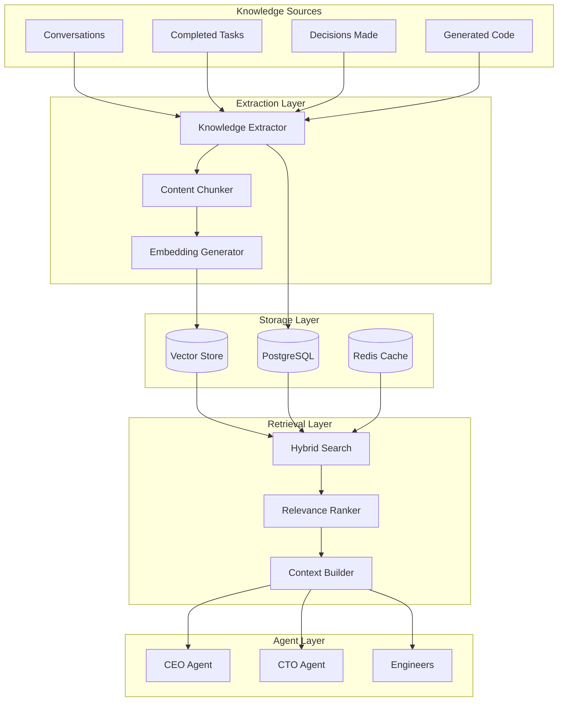
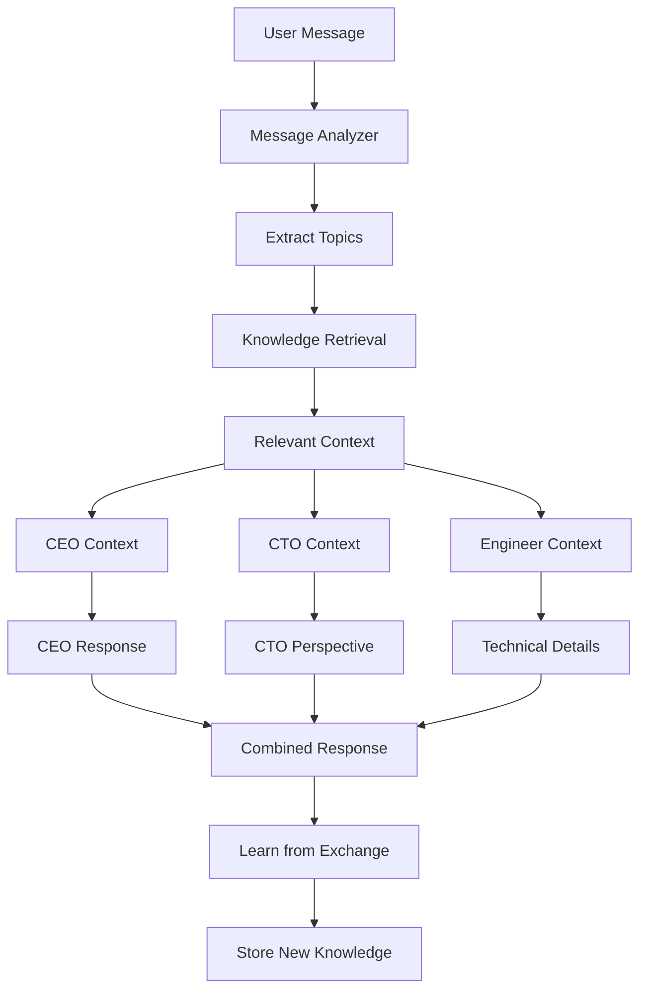
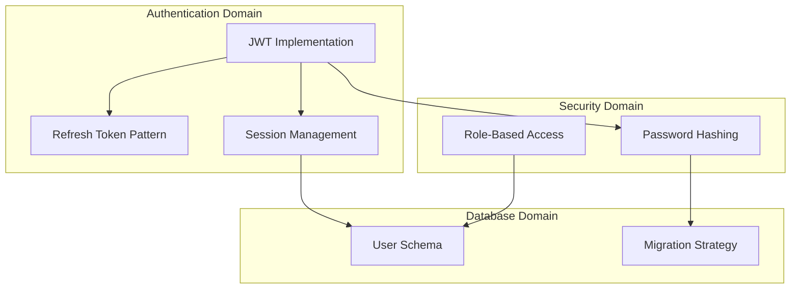

# Building a Knowledge-Aware AI System: How Deviant Learns and Remembers

*From stateless LLM calls to agents that actually remember what they've learned.*

---

## The Amnesia Problem

Here's a frustrating truth about LLMs: every conversation starts from zero.

Ask Claude to write an authentication system. Great output. Ask it again tomorrow, and it has no idea it ever did that before. No memory of patterns that worked. No recall of decisions made. No learning from past projects.

In Deviant, the Backend Engineer might build user authentication five times. Without knowledge management, each time is like the first time. Same mistakes. Same exploration. Same wasted tokens.

The solution: build a knowledge system that lets agents remember, learn, and apply past experience.

---

## The Knowledge Architecture



---

## Knowledge Extraction

### What Gets Extracted

Every meaningful interaction creates knowledge:

```python
class KnowledgeExtractor:
    async def extract_from_task(self, task: Task) -> List[KnowledgeEntry]:
        entries = []

        # Pattern: How we solved this type of problem
        if task.status == "COMPLETED" and task.output:
            entries.append(KnowledgeEntry(
                type="SOLUTION_PATTERN",
                title=f"Solution: {task.title}",
                content=task.output,
                tags=self.extract_tags(task),
                source_task_id=task.id,
                agent_id=task.assigned_to
            ))

        # Decision: Choices made during execution
        decisions = await self.get_task_decisions(task.id)
        for decision in decisions:
            entries.append(KnowledgeEntry(
                type="DECISION",
                title=decision.question,
                content=decision.rationale,
                tags=["decision", decision.decision_type],
                source_task_id=task.id
            ))

        return entries
```

### Knowledge Types

| Type | Description | Example |
|------|-------------|---------|
| SOLUTION_PATTERN | How we solved a problem | "JWT auth implementation with refresh tokens" |
| DECISION | Choice made with rationale | "Chose PostgreSQL over MongoDB for ACID compliance" |
| ARCHITECTURE | System design pattern | "Event-driven coordination between agents" |
| ERROR_RESOLUTION | How we fixed a problem | "Resolved circular import by lazy loading" |
| CODE_PATTERN | Reusable code structures | "FastAPI endpoint with validation and error handling" |
| PREFERENCE | User/project preferences | "Client prefers minimal dependencies" |

### Automatic Extraction

Extraction happens automatically when tasks complete:

```python
class TaskCompletionHandler:
    async def on_task_completed(self, event: TaskCompletedEvent):
        task = await self.get_task(event.task_id)

        # Extract knowledge
        entries = await self.extractor.extract_from_task(task)

        # Store with embeddings
        for entry in entries:
            embedding = await self.embedder.embed(entry.content)
            entry.embedding = embedding
            await self.knowledge_store.save(entry)

        # Update agent's knowledge index
        await self.update_agent_knowledge_index(
            task.assigned_to,
            entries
        )
```

---

## Hybrid Search

Finding relevant knowledge isn't simple keyword matching. Deviant uses three search strategies combined:

### 1. Vector Similarity Search

For semantic matching—finding knowledge that *means* similar things:

```python
async def vector_search(
    self,
    query: str,
    limit: int = 10
) -> List[KnowledgeEntry]:
    # Embed the query
    query_embedding = await self.embedder.embed(query)

    # Search vector store
    results = await self.vector_store.search(
        embedding=query_embedding,
        limit=limit * 2  # Get more, filter later
    )

    return results
```

### 2. Full-Text Search

For exact phrase matching—finding specific terms or names:

```python
async def fulltext_search(
    self,
    query: str,
    limit: int = 10
) -> List[KnowledgeEntry]:
    # PostgreSQL full-text search
    results = await self.db.query("""
        SELECT * FROM knowledge_entries
        WHERE to_tsvector('english', content || ' ' || title)
            @@ plainto_tsquery('english', $1)
        ORDER BY ts_rank(
            to_tsvector('english', content || ' ' || title),
            plainto_tsquery('english', $1)
        ) DESC
        LIMIT $2
    """, query, limit)

    return results
```

### 3. Metadata Filtering

For structured queries—finding by type, agent, or tags:

```python
async def filtered_search(
    self,
    filters: SearchFilters
) -> List[KnowledgeEntry]:
    query = "SELECT * FROM knowledge_entries WHERE 1=1"
    params = []

    if filters.types:
        query += " AND type = ANY($1)"
        params.append(filters.types)

    if filters.agent_id:
        query += f" AND agent_id = ${len(params)+1}"
        params.append(filters.agent_id)

    if filters.tags:
        query += f" AND tags && ${len(params)+1}"
        params.append(filters.tags)

    return await self.db.query(query, *params)
```

### Combined Hybrid Search

The magic is combining all three:

```python
async def hybrid_search(
    self,
    query: str,
    filters: SearchFilters = None,
    limit: int = 10
) -> List[KnowledgeEntry]:
    # Run searches in parallel
    vector_results, text_results = await asyncio.gather(
        self.vector_search(query, limit=limit*2),
        self.fulltext_search(query, limit=limit*2)
    )

    # Apply metadata filters
    if filters:
        vector_results = self.apply_filters(vector_results, filters)
        text_results = self.apply_filters(text_results, filters)

    # Merge and rank
    combined = self.merge_results(
        vector_results,
        text_results,
        weights={"vector": 0.6, "text": 0.4}
    )

    # Re-rank for relevance
    ranked = await self.reranker.rerank(query, combined)

    return ranked[:limit]
```

```mermaid
flowchart LR
    Query[Query: "JWT authentication"]

    subgraph "Search Strategies"
        VS[Vector Search]
        TS[Text Search]
        FS[Filter Search]
    end

    subgraph "Results"
        VR[Semantic Matches]
        TR[Exact Matches]
        FR[Filtered Set]
    end

    Merge[Merge & Rank]
    Final[Top K Results]

    Query --> VS --> VR --> Merge
    Query --> TS --> TR --> Merge
    Query --> FS --> FR --> Merge
    Merge --> Final
```

---

## Agent-Specific Knowledge

Different agents need different knowledge. The Backend Engineer needs code patterns; the CEO needs strategic decisions.

### Knowledge Profiles

```python
AGENT_KNOWLEDGE_PROFILES = {
    "CEO": {
        "types": ["DECISION", "ARCHITECTURE", "PREFERENCE"],
        "tags": ["strategy", "business", "approval"],
        "weight_factors": {
            "recency": 0.3,
            "relevance": 0.5,
            "importance": 0.2
        }
    },
    "CTO": {
        "types": ["ARCHITECTURE", "CODE_PATTERN", "ERROR_RESOLUTION"],
        "tags": ["technical", "security", "performance"],
        "weight_factors": {
            "recency": 0.2,
            "relevance": 0.6,
            "quality_score": 0.2
        }
    },
    "BackendEngineer": {
        "types": ["CODE_PATTERN", "SOLUTION_PATTERN", "ERROR_RESOLUTION"],
        "tags": ["python", "fastapi", "database"],
        "weight_factors": {
            "recency": 0.3,
            "relevance": 0.5,
            "reuse_count": 0.2
        }
    }
}
```

### Context-Aware Retrieval

When an agent starts a task, relevant knowledge is automatically retrieved:

```python
async def build_agent_context(
    self,
    agent: Agent,
    task: Task
) -> AgentContext:
    profile = AGENT_KNOWLEDGE_PROFILES[agent.role]

    # Search for relevant knowledge
    knowledge = await self.hybrid_search(
        query=f"{task.title} {task.description}",
        filters=SearchFilters(
            types=profile["types"],
            tags=profile["tags"]
        ),
        limit=5
    )

    # Build context
    return AgentContext(
        task=task,
        knowledge=knowledge,
        project_info=await self.get_project_info(task.project_id),
        agent_history=await self.get_agent_recent_work(agent.id)
    )
```

---

## Knowledge Quality

Not all knowledge is equal. We track and improve quality over time.

### Quality Signals

```python
class KnowledgeQuality:
    def calculate_score(self, entry: KnowledgeEntry) -> float:
        scores = []

        # How often was this knowledge used?
        usage_score = min(entry.usage_count / 10, 1.0)
        scores.append(("usage", usage_score, 0.3))

        # Was it helpful when used?
        if entry.feedback_count > 0:
            helpfulness = entry.positive_feedback / entry.feedback_count
            scores.append(("helpfulness", helpfulness, 0.3))

        # How recent is it?
        age_days = (datetime.now() - entry.created_at).days
        recency = max(0, 1 - (age_days / 365))
        scores.append(("recency", recency, 0.2))

        # Is it well-structured?
        completeness = self.assess_completeness(entry)
        scores.append(("completeness", completeness, 0.2))

        return sum(score * weight for _, score, weight in scores)
```

### Feedback Loop

Agents can rate knowledge usefulness:

```python
async def record_knowledge_feedback(
    self,
    entry_id: str,
    agent_id: str,
    helpful: bool,
    notes: Optional[str] = None
):
    await self.db.insert("knowledge_feedback", {
        "entry_id": entry_id,
        "agent_id": agent_id,
        "helpful": helpful,
        "notes": notes,
        "timestamp": datetime.now()
    })

    # Update entry statistics
    if helpful:
        await self.db.execute("""
            UPDATE knowledge_entries
            SET positive_feedback = positive_feedback + 1,
                feedback_count = feedback_count + 1
            WHERE id = $1
        """, entry_id)
    else:
        await self.db.execute("""
            UPDATE knowledge_entries
            SET feedback_count = feedback_count + 1
            WHERE id = $1
        """, entry_id)
```

### Decay and Cleanup

Old, unused knowledge gets deprioritized:

```python
async def knowledge_maintenance():
    """Run weekly to maintain knowledge quality."""

    # Decay scores of unused entries
    await db.execute("""
        UPDATE knowledge_entries
        SET quality_score = quality_score * 0.95
        WHERE last_accessed < NOW() - INTERVAL '30 days'
    """)

    # Archive very low quality entries
    await db.execute("""
        UPDATE knowledge_entries
        SET status = 'archived'
        WHERE quality_score < 0.2
        AND feedback_count > 5
        AND positive_feedback / feedback_count < 0.3
    """)
```

---

## Multi-Agent Chat Integration

The knowledge system integrates with multi-agent chat for real-time collaboration:



When multiple agents discuss a problem, the knowledge system:

1. Provides relevant context to each agent
2. Captures the collaborative insights
3. Stores new patterns that emerge from discussion

---

## Predictive Agent Involvement

The knowledge system can predict which agents should be involved based on content:

```python
async def predict_agent_involvement(
    self,
    content: str
) -> List[AgentPrediction]:
    # Find similar past conversations
    similar = await self.hybrid_search(
        query=content,
        filters=SearchFilters(types=["CONVERSATION", "SOLUTION_PATTERN"]),
        limit=20
    )

    # Analyze which agents were helpful in similar contexts
    agent_scores = {}
    for entry in similar:
        if entry.helpful_agents:
            for agent_id in entry.helpful_agents:
                if agent_id not in agent_scores:
                    agent_scores[agent_id] = []
                agent_scores[agent_id].append(entry.quality_score)

    # Calculate predictions
    predictions = []
    for agent_id, scores in agent_scores.items():
        avg_score = sum(scores) / len(scores)
        confidence = min(len(scores) / 10, 1.0)  # More data = more confident

        predictions.append(AgentPrediction(
            agent_id=agent_id,
            relevance_score=avg_score * confidence,
            confidence=confidence,
            reason=f"Helpful in {len(scores)} similar conversations"
        ))

    return sorted(predictions, key=lambda p: -p.relevance_score)
```

---

## The Knowledge Graph

Beyond flat entries, we track relationships between knowledge:



```python
class KnowledgeGraph:
    async def add_relationship(
        self,
        source_id: str,
        target_id: str,
        relationship_type: str
    ):
        await self.db.insert("knowledge_relationships", {
            "source_id": source_id,
            "target_id": target_id,
            "relationship_type": relationship_type
        })

    async def get_related(
        self,
        entry_id: str,
        depth: int = 2
    ) -> List[KnowledgeEntry]:
        """Get related knowledge up to N hops away."""
        related = await self.db.query("""
            WITH RECURSIVE related AS (
                SELECT target_id, 1 as depth
                FROM knowledge_relationships
                WHERE source_id = $1

                UNION

                SELECT kr.target_id, r.depth + 1
                FROM knowledge_relationships kr
                JOIN related r ON kr.source_id = r.target_id
                WHERE r.depth < $2
            )
            SELECT ke.* FROM knowledge_entries ke
            JOIN related r ON ke.id = r.target_id
        """, entry_id, depth)

        return related
```

---

## The Takeaway

A knowledge-aware AI system transforms agents from stateless workers into learning collaborators:

1. **Extract automatically**: Every completed task creates knowledge
2. **Search intelligently**: Hybrid search finds semantically relevant content
3. **Personalize by role**: Agents get role-specific knowledge
4. **Track quality**: Feedback loops improve knowledge over time
5. **Connect relationships**: Knowledge graph surfaces related insights

The result: agents that get smarter with every project, remember what works, and apply past learning to new challenges.

---

*This completes the Architecture series. Check out Use Cases for real-world applications, or Design Patterns for deeper technical dives.*

---

*Nicanor Korir believes the future of AI is agents that remember and learn—not stateless APIs called repeatedly. Deviant's knowledge system is the implementation of that belief.*
