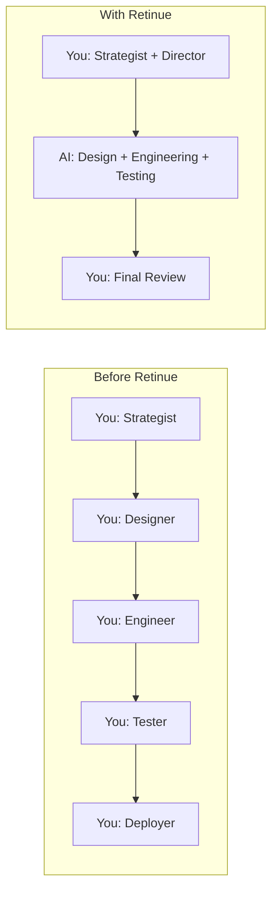

# Retinue for Solo Founders: Build Products at Enterprise Speed

*How one person can ship like a team of ten—without burning out.*

---

## The Solo Founder Reality

You know the drill.

You wake up with five ideas. You can maybe execute one. The other four die in your Notes app, waiting for "someday."

You're the strategist and the engineer. The designer and the PM. The support team and the marketer. Every hat, all the time.

The math is brutal. You have maybe 40 hours of deep work per week. A real product needs 200+ hours just to get to MVP. You can either:
- Spend 5 weeks on one idea (and watch the market move)
- Rush and ship something broken
- Never ship at all

I lived this for years. Great ideas. No bandwidth.

Then I built Retinue, and the math changed.

---

## What Changes with Retinue

Here's a real example from my own workflow:

**Before Retinue:**
I wanted to build a client portal for my consulting work. Estimated effort: 3-4 weeks of focused work.
- Week 1: Design and architecture
- Week 2: Backend API
- Week 3: Frontend
- Week 4: Testing and polish

I never started. Too much other work. The idea sat for 8 months.

**With Retinue:**
I wrote a one-page brief on Monday morning. By Monday afternoon, I had:
- Complete UI/UX specifications from the Designer
- Database schema from the Backend Engineer
- API structure with endpoint documentation
- React component designs from the Frontend Engineer
- Everything reviewed by the CTO for architectural sanity

Total time I spent: 2 hours writing the brief, 1 hour reviewing output.

```mermaid
gantt
    title Client Portal Project Timeline
    dateFormat  HH:mm
    axisFormat %H:%M

    section Traditional (3 weeks)
    Design          :a1, 00:00, 40h
    Backend         :a2, after a1, 40h
    Frontend        :a3, after a2, 40h
    Polish          :a4, after a3, 20h

    section With Retinue (1 day)
    Brief Writing   :b1, 00:00, 2h
    AI Execution    :b2, after b1, 4h
    Review          :b3, after b2, 1h
```



---

## The Solo Founder Workflow

Here's how I use Retinue day-to-day:

### Morning: Strategy Mode

I spend 1-2 hours on high-value thinking:
- What should we build?
- What's the priority?
- What problems am I solving?

This is work no AI can replace. It requires my understanding of the market, my customers, my vision.

### Submit and Forget

I write briefs for projects and submit them to Retinue.

```
Project: Customer Feedback Widget
Description: Embeddable widget for collecting NPS scores and comments.
Should work on any website with a simple script tag. Store responses
in PostgreSQL, show dashboard for viewing results.
Priority: High
```

The CEO Agent evaluates it. Consults the CTO on technical approach. Approves and hands off to the PM.

I don't touch it again until it's done.

### Afternoon: Human Work

While agents work, I focus on things that need human presence:
- Customer calls
- Strategic partnerships
- Content creation
- Community building

The stuff that makes a business, not just a product.

### Evening: Review and Refine

Retinue notifies me when work is ready. I review:
- Does the design spec match my vision?
- Is the code architecture sound?
- Are there any gaps?

I leave comments. The agents iterate. Usually one round of feedback gets it production-ready.

---

## Real Examples

### Example 1: Landing Page Generator

**Brief:**
> Build a landing page generator. User inputs business name, tagline, and key features. AI generates complete HTML/CSS for a professional landing page. Should have 3-4 different templates.

**Retinue output in 3 hours:**
- Template system design (Designer)
- Generation API with OpenAI integration (Backend)
- Preview interface with live editing (Frontend)
- Database for saving pages (Backend)
- All reviewed and approved (CTO)

**My effort:** 45 minutes of review

### Example 2: Invoice Automation

**Brief:**
> Create invoice generator from project data. Pull project info from database, generate professional PDF invoices, email to clients. Track payment status.

**Retinue output in 4 hours:**
- Database schema for invoices and payments (Backend)
- PDF generation service (Backend)
- Email integration spec (Backend)
- Invoice dashboard UI (Frontend)
- Clean visual design (Designer)

**My effort:** 1 hour of review, some refinement requests

### Example 3: API Documentation Portal

**Brief:**
> Build an interactive API documentation site. Should read OpenAPI specs and generate browsable documentation with try-it-out functionality.

**Retinue output in 2 hours:**
- OpenAPI parser implementation (Backend)
- Documentation templates (Designer)
- Interactive request builder (Frontend)
- Authentication handling for test requests (Backend)

**My effort:** 30 minutes review

---

## The ROI Math

Let's be honest about costs and benefits.

### Costs

| Item | Cost |
|------|------|
| Claude API usage per project | $5-15 |
| Infrastructure (if self-hosting) | $50-100/month |
| Your time reviewing | 1-2 hours/project |

### Benefits

| Item | Value |
|------|-------|
| Developer time saved per project | 20-40 hours |
| Hourly developer rate | $50-150/hour |
| **Value per project** | **$1,000-6,000** |

The math is absurd. $15 in API costs for $3,000 in development value.

Even if Retinue only works 50% as well as the examples above, you're still getting 10x+ ROI.

---

## When It Works Best

Retinue shines for:

**Standard MVPs**
Todo apps, dashboards, CRUD interfaces, landing pages. Common patterns that AI knows well.

**Internal Tools**
Admin panels, reporting dashboards, data entry forms. Stuff that needs to work, not be revolutionary.

**Prototypes**
Quick proof-of-concepts to validate ideas before investing real engineering time.

**Specifications**
Even if you write the code yourself, having detailed specs and designs saves hours of planning.

---

## When to Be Careful

Retinue struggles with:

**Novel Algorithms**
If you're inventing new approaches, AI doesn't have training data to draw from.

**Complex Integrations**
Third-party APIs with quirky behavior, edge cases, and incomplete documentation.

**Performance-Critical Code**
Where every millisecond matters and micro-optimizations are needed.

**Highly Regulated Domains**
Healthcare, finance, legal—where domain expertise is legally required.

For these, use Retinue for the 80% that's standard, then apply human expertise to the 20% that's special.

---

## Getting Started as a Solo Founder

### Week 1: Observe

Run Retinue on a project you've already completed. Compare its output to yours. Understand how it thinks, where it's strong, where it needs guidance.

### Week 2: Delegate Simple Work

Give it your internal tools. Admin panels. Documentation. Things that need to exist but aren't your core product.

### Week 3: Prototype Ideas

Got a backlog of "someday" ideas? Run them through Retinue. Get full specs and code in hours. Decide which are worth pursuing.

### Week 4: Production Integration

Build your workflow around AI-generated foundations. Your job becomes refinement and judgment, not implementation from scratch.

---

## The Mindset Shift

Here's what took me longest to learn:

**You're not the engineer anymore. You're the director.**

Your value isn't in writing code. It's in knowing what to build. In understanding your users. In making strategic decisions.

The code is a commodity. Your judgment is the differentiator.

Retinue doesn't replace you. It frees you to do the work that actually matters.



---

## The Takeaway

As a solo founder, your scarcest resource is your attention. Every hour spent on implementation is an hour not spent on strategy, customers, or growth.

Retinue lets you reclaim that time. Not by cutting corners—by delegating to a competent AI team.

The result: more ideas explored, faster validation, quicker shipping, and the mental space to actually grow a business instead of just building features.

---

**Next**: [Retinue for Agencies: Scale Your Delivery Capacity →](./02-for-agencies.md)

---

*Nicanor Korir has been a solo founder longer than he'd like to admit. Retinue is the team he wished he'd had from the start.*
