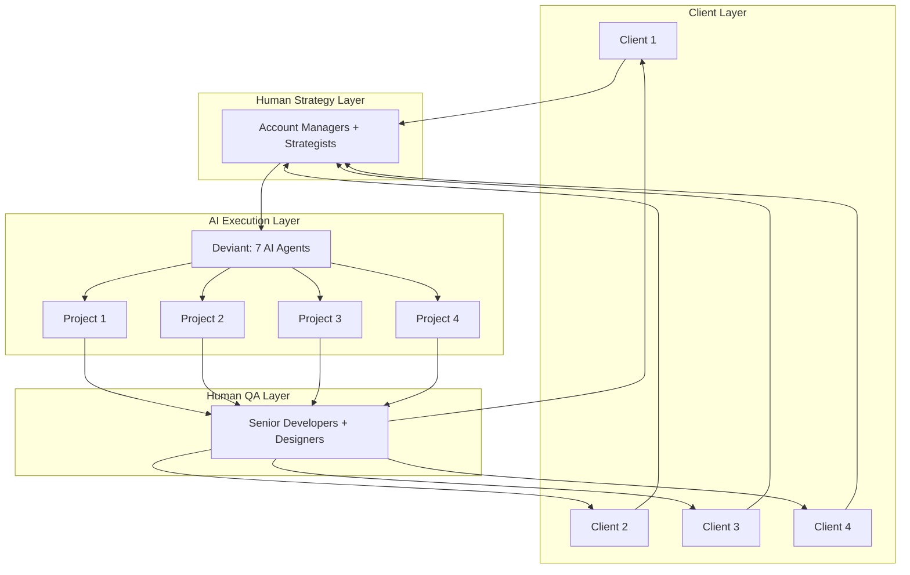
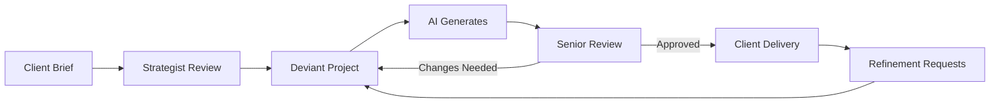

# Deviant for Agencies: Scale Delivery Without Scaling Headcount

*How agencies and consultancies can 10x capacity without 10x costs.*

---

## The Agency Trap

I've talked to dozens of agency owners. They all hit the same ceiling.

Clients want more projects. You want to grow revenue. But adding headcount means:
- Recruiting (expensive and slow)
- Training (weeks before they're productive)
- Overhead (salaries, benefits, management time)
- Risk (what if the work dries up?)

So you stay small. Turn down clients. Cap your growth.

Or you take on too much. Quality drops. Clients leave. Team burns out.

There's supposed to be a middle path: automation and tooling. But most agency work is custom. Each client has unique needs. Template-based automation only goes so far.

Until now.

---

## The AI-Augmented Agency

Imagine a different model:

**Senior strategists and client leads** (humans)
↓ Define requirements, manage relationships, make judgment calls

**AI development team** (Deviant)
↓ Execute standard development work at scale

**Senior reviewers** (humans)
↓ Quality assurance, client presentation, refinement

This model scales differently. You add capacity without adding headcount proportionally.

---

## Real Agency Scenarios

### Scenario 1: The Landing Page Factory

**Before:**
Agency builds 4-5 landing pages per month. Each takes a designer 2-3 days plus developer 2-3 days. Capacity is capped by team size.

**After:**
Account manager writes brief. Deviant generates complete designs and code in hours. Senior designer reviews and refines. Developer makes final adjustments.

**Result:**
- Same 2-person team produces 15-20 pages per month
- Quality maintained through human review
- Revenue triples with minimal cost increase

### Scenario 2: The Dashboard Shop

**Before:**
Boutique agency builds analytics dashboards. Each project takes 2-4 weeks with a team of 3.

**After:**
Strategist defines requirements with client. Deviant generates:
- Database schema
- API endpoints
- React dashboard components
- Data visualization specs

Humans handle: Client customization, data integration, deployment.

**Result:**
- Project time drops from 3 weeks to 1 week
- Can take on 3x more projects
- Focus human expertise on client-specific complexity

### Scenario 3: The MVP Rapid Fire

**Before:**
Startup studio takes 6-8 weeks to build client MVPs. Can handle 2-3 concurrent projects.

**After:**
Brief submitted Monday. Deviant generates comprehensive specifications and code structure by Tuesday. Team spends rest of week refining and deploying.

**Result:**
- MVP timeline drops to 2 weeks
- Can handle 8-10 concurrent projects
- Better client satisfaction (faster results)

---

## The Economics

Let's run the numbers on a typical web development agency:

### Before Deviant

| Metric | Value |
|--------|-------|
| Team size | 5 developers + 2 designers |
| Avg project revenue | $15,000 |
| Projects per month | 4 |
| Monthly revenue | $60,000 |
| Salaries + overhead | $45,000 |
| **Profit margin** | **25%** |

### After Deviant

| Metric | Value |
|--------|-------|
| Team size | 2 senior devs + 1 designer + 1 PM |
| Avg project revenue | $15,000 |
| Projects per month | 10 |
| Monthly revenue | $150,000 |
| Salaries + overhead | $35,000 |
| Deviant costs | $3,000 |
| **Profit margin** | **75%** |

The leverage is dramatic:
- 2.5x revenue
- 30% lower costs
- 3x profit margin

Even if these numbers are optimistic by half, it's still transformational.

---

## Implementation Playbook

### Phase 1: Internal Tooling (Weeks 1-2)

Don't start with client work. Start with your own needs.

Use Deviant to build:
- Internal dashboards
- Project templates
- Documentation generators
- Proposal automation

Learn how it works. Understand the output quality. Build confidence.

### Phase 2: Pilot Projects (Weeks 3-6)

Select 2-3 low-risk client projects:
- Fixed scope (clear requirements)
- Standard deliverables (not novel technology)
- Tolerant client (willing to experiment)

Use Deviant as a first-pass generator. Human team refines and delivers.

Measure:
- Time to first draft
- Refinement time required
- Client satisfaction

### Phase 3: Process Integration (Weeks 7-10)

Based on pilots, build your AI-augmented workflow:

Create templates for common project types:
- Landing pages
- Admin dashboards
- API backends
- Marketing sites

### Phase 4: Scale (Weeks 11+)

Gradually increase AI-generated projects:
- Week 11: 20% of new projects
- Week 15: 40% of new projects
- Week 20: 60%+ of new projects

Reallocate human time:
- More client interaction
- Complex/novel work
- Quality assurance
- Business development

---

## Quality Control

This is the critical question: **Does AI-generated work meet agency quality standards?**

The honest answer: sometimes yes, sometimes no. That's why human review is essential.

### The Review Framework

| Checkpoint | Reviewer | Focus |
|------------|----------|-------|
| Initial output | PM | Completeness, scope alignment |
| Design review | Senior designer | Visual quality, UX, consistency |
| Code review | Senior developer | Architecture, security, performance |
| Client review | Account manager | Requirements match, presentation |

### Common Issues and Solutions

**Issue: Generic-looking designs**
Solution: Provide brand guidelines in project brief. Review and request more personality.

**Issue: Over-engineered code**
Solution: Specify simplicity in requirements. CTO Agent usually catches this, but double-check.

**Issue: Missing edge cases**
Solution: Include edge cases in brief explicitly. Add to review checklist.

**Issue: Inconsistent coding style**
Solution: Provide code samples from past projects. Request style matching.

---

## Client Communication

How do you tell clients about AI involvement?

### Option 1: Don't Mention It

AI is a tool, like IDEs or design software. You don't list every tool you use.

The deliverable is what matters. If quality is there, the how is irrelevant.

### Option 2: Competitive Advantage

"We use AI augmentation to deliver faster and at lower cost than traditional agencies."

Position it as innovation. Some clients will love this.

### Option 3: Full Transparency

"First drafts are AI-generated, then refined by our senior team."

Works for sophisticated clients who understand the technology.

Choose based on your client base and positioning.

---

## Pricing Implications

If your costs drop 50% and speed increases 3x, how should pricing change?

### Option A: Keep Prices, Increase Margins

Same pricing. Triple the profit margin. Use excess profit to grow, invest, or pocket.

### Option B: Lower Prices, Win More Clients

Undercut competitors. Win on price. Make up margin on volume.

### Option C: Add Services

Keep development pricing. Add new offerings:
- Maintenance retainers
- Analytics and optimization
- Additional phases/features

Use saved time to deliver more value per client.

Most successful agencies I've talked to do a mix: slightly lower prices than traditional competitors + more included in the base package.

---

## Common Concerns

**"What if the AI makes mistakes?"**
That's what the review layer is for. Humans catch errors before delivery. This isn't different from reviewing junior developer work.

**"Will this devalue our expertise?"**
The opposite. Your expertise becomes the differentiator. AI handles the commodity work; you handle the judgment calls.

**"What about complex projects?"**
Use Deviant for the 80% that's standard. Apply human expertise to the 20% that's unique. Net result: faster overall with better quality where it matters.

**"What about confidentiality?"**
Self-host Deviant. Your data stays on your infrastructure. Or use Anthropic's enterprise agreements for API usage.

---

## The Takeaway

Agencies are constrained by human capacity. AI removes that constraint—not by replacing humans, but by multiplying them.

The winning agencies of the next decade will be small, senior teams leveraging AI for execution while focusing human expertise on strategy, relationships, and quality.

Deviant is one way to build that model.

---

**Next**: [Deviant for Startups: Your AI Development Team →](./03-for-startups.md)

---

*Nicanor Korir has consulted for agencies stuck at the capacity ceiling. Deviant is the breakthrough they've been waiting for.*
