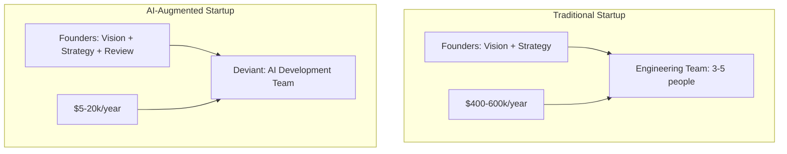

# Deviant for Startups: Your AI Development Team

*How early-stage companies can move fast without breaking the bank on engineering.*

---

## The Startup Engineering Problem

You just raised your seed round. Or maybe you're bootstrapping with runway that needs to last 18 months.

Either way, the math is brutal:

- Senior engineers: $150-250k/year
- Each hire: 2-4 months to recruit, 1-3 months to onboard
- Minimum viable team: 2-3 engineers = $400k-600k/year

That's most of your seed round going to salaries before you've validated product-market fit.

So you compromise:
- Hire junior devs (cheaper but slower)
- Use no-code tools (faster but limited)
- Outsource offshore (cheaper but coordination hell)
- Do it all yourself (possible but unsustainable)

None of these are great options.

---

## The Alternative Model

What if you could have senior-level engineering output without senior-level costs?

This isn't about replacing engineers entirely. It's about getting 80% of the output at 5% of the cost—then hiring strategically for the 20% that needs human expertise.

---

## What Deviant Handles for Startups

### MVP Development

The classic startup challenge: build something to validate an idea without over-investing.

**Traditional approach:**
- 3 engineers × 8 weeks = 960 hours of development
- Cost: $60-100k (salaries, time, opportunity cost)

**Deviant approach:**
- 1 founder × 2 weeks of direction and review
- Deviant generates complete MVP specifications and code
- Cost: $500-2,000 (API costs + founder time)

The output isn't production-ready without review, but it's 80% of the way there.

### Prototype Iterations

Startups pivot. A lot.

Every pivot traditionally means rebuilding. With Deviant:

Monday: "Let's try a different approach to onboarding."
Tuesday: Deviant generates new onboarding flow specs and code.
Wednesday: Review and refine.
Thursday: Testing with users.

Iteration cycles drop from weeks to days.

### Internal Tools

Every startup needs internal tooling:
- Admin dashboards
- Analytics viewers
- Content management
- Customer support interfaces

These are necessary but not differentiating. Perfect for AI generation.

### Technical Documentation

Investors, partners, and future hires need to understand your system.

Deviant can generate:
- API documentation
- Architecture diagrams
- Onboarding guides
- Technical specifications

Documentation that would take days takes hours.

---

## The Staged Approach

### Stage 1: Pre-Product (Idea Validation)

You have an idea but no code yet. Use Deviant to:

1. Generate comprehensive product specifications
2. Create technical architecture documents
3. Build landing pages to test interest
4. Create demo interfaces for user feedback

**Cost:** $200-500
**Value:** Validated idea + detailed specs before writing production code

### Stage 2: MVP Development

You've validated interest. Time to build.

1. Submit detailed product brief to Deviant
2. Generate database schemas, APIs, frontend components
3. Review and refine with human judgment
4. Deploy and iterate

**Cost:** $1,000-3,000
**Value:** Working MVP in weeks instead of months

### Stage 3: Early Growth

You have users. Need to move fast while maintaining quality.

1. Use Deviant for new feature prototypes
2. Human review and production hardening
3. Hire 1-2 senior engineers for complex work
4. AI handles the volume; humans handle the judgment

**Cost:** $2,000-5,000/month (AI) + 1-2 engineers
**Value:** 3-5x development velocity vs traditional team

### Stage 4: Scaling

You've found product-market fit. Time to professionalize.

1. Build full engineering team for core product
2. Use Deviant for internal tools, prototypes, documentation
3. AI augments the team rather than replaces

**Cost:** Hybrid model—engineers for core, AI for adjacent
**Value:** Engineering team focused on what matters most

---

## Real Startup Examples

### Example 1: SaaS Analytics Platform

**Situation:** 2 founders, one technical, post-seed funding.

**Challenge:** Build analytics dashboard quickly to demonstrate to customers.

**Deviant usage:**
- Generated complete dashboard React components
- Created data visualization specifications
- Built API structure for data endpoints
- Produced admin interface for user management

**Result:** Demo-ready in 2 weeks. Technical founder focused on data pipeline (the hard part). AI handled the "normal" parts.

### Example 2: Marketplace MVP

**Situation:** Non-technical founder with $50k budget.

**Challenge:** Build two-sided marketplace to test business model.

**Deviant usage:**
- Full marketplace specification (buyer and seller flows)
- Database schema for listings, users, transactions
- React components for browsing, posting, purchasing
- Admin dashboard for marketplace management

**Result:** Functional MVP for $8k (contractor for deployment + API costs). Tested with real users within 6 weeks of starting.

### Example 3: Developer Tool

**Situation:** Solo technical founder, bootstrapping.

**Challenge:** Build and launch without external funding.

**Deviant usage:**
- API design and implementation specs
- CLI tool structure
- Documentation site
- Landing page and marketing site

**Result:** Launched in 4 weeks while maintaining day job. AI handled 70% of development work.

---

## The Economics for Different Stages

### Pre-Seed / Bootstrapping

| Traditional | AI-Augmented |
|-------------|--------------|
| $50-100k for MVP | $2-5k for MVP |
| 3-4 months timeline | 3-4 weeks timeline |
| Need co-founder or contractor | Solo founder can execute |

**Verdict:** AI-augmented dramatically extends runway and speed.

### Seed Stage

| Traditional | AI-Augmented |
|-------------|--------------|
| 3-5 engineers ($400-600k/year) | 1-2 engineers + AI ($150-250k/year) |
| 6-12 month runway | 18-24 month runway |
| Fixed capacity | Elastic capacity |

**Verdict:** AI-augmented means more runway, faster iteration, lower risk.

### Series A+

| Traditional | AI-Augmented |
|-------------|--------------|
| Scale engineering team | Scale strategically |
| 10-20 engineers | 5-10 engineers + AI |
| $1.5-3M/year eng cost | $750k-1.5M/year + AI |

**Verdict:** Even at scale, AI augmentation provides leverage.

---

## Hiring Strategy

The goal isn't to never hire. It's to hire strategically.

### Who to Hire

**Technical Lead / Architect**
Someone who can review AI output, make architectural decisions, and handle novel problems. This person is essential.

**Full-Stack Senior**
For the complex integrations, performance optimization, and production hardening that AI doesn't do well.

**Domain Expert**
If your product requires specific expertise (ML, security, data), hire for that. Let AI handle the commodity work.

### Who Not to Hire (Yet)

**Junior Developers**
AI can generate what juniors would write. Save the budget.

**Documentation Writers**
AI generates documentation. Human review is enough.

**Boilerplate Coders**
CRUD operations, admin panels, standard APIs—AI territory.

---

## Risk Mitigation

### Technical Debt

**Risk:** AI-generated code becomes unmaintainable.

**Mitigation:**
- CTO Agent reviews for architecture
- Human architect reviews critical paths
- Refactor as you learn

### Scaling Issues

**Risk:** AI-generated systems don't scale.

**Mitigation:**
- Start with simple architecture
- Monitor performance early
- Hire for scaling when needed

### Security Vulnerabilities

**Risk:** AI misses security issues.

**Mitigation:**
- Include security requirements in briefs
- Use automated security scanning
- Security audit before production

### Dependency on AI

**Risk:** Over-reliance on AI systems.

**Mitigation:**
- Document everything
- Build human expertise alongside AI
- Have fallback development processes

---

## When to Move Beyond Deviant

AI augmentation is powerful early. At some point, you may need to transition:

**Signs you need more human engineers:**
- Core product requires novel algorithms
- Performance becomes critical differentiator
- Security requirements are extremely high
- Integration complexity exceeds AI capability
- Regulatory requirements demand human oversight

**The transition:**
1. Hire senior engineers for core systems
2. Keep using AI for internal tools, prototypes
3. Build team knowledge while maintaining velocity

---

## The Takeaway

Early-stage startups are resource-constrained by definition. Every dollar and hour matters.

Deviant lets you:
- Move faster with less money
- Extend runway dramatically
- Iterate rapidly on ideas
- Hire strategically instead of desperately

The startups that figure out AI augmentation early will have a structural advantage over those that don't.

---

**Next**: [Deviant for Enterprise Innovation Labs →](./04-for-enterprise.md)

---

*Nicanor Korir has bootstrapped companies and burned VC money. Deviant is the approach he wishes he'd had both times.*
