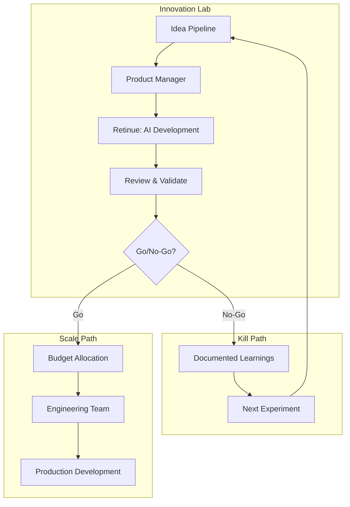
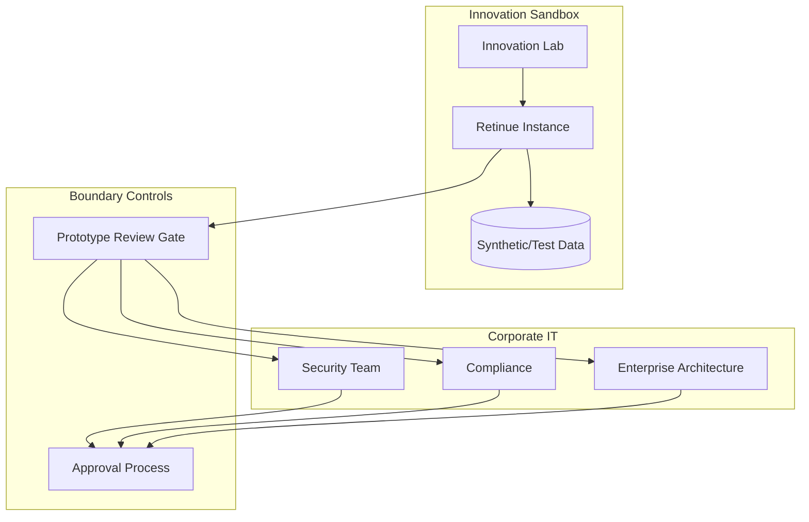

# Retinue for Enterprise Innovation Labs: Prototype at Lightning Speed

*How large organizations can move like startups without startup risk.*

---

## The Enterprise Innovation Paradox

Big companies have resources startups dream of. Capital. Talent. Distribution. Brand.

Yet startups consistently out-innovate them. Why?

**The enterprise problem:**
- 6 months to get budget approval
- 3 months to hire a team
- 4 months to build an MVP
- 2 months for security review
- 2 months for compliance approval

By the time you launch, the startup that had the same idea 18 months ago has already won the market.

Innovation labs were supposed to fix this. Move fast in a sandbox. Prove concepts before involving the mothership.

But even innovation labs hit friction:
- Limited headcount allocation
- Shared developer resources
- Budget constraints on exploratory work
- Internal process requirements

Retinue offers a different approach: **AI-powered rapid prototyping** that validates ideas before consuming real resources.

---

## The Prototype Factory Model



The key insight: **most experiments should fail fast**. Retinue makes "fast" actually fast.

---

## What This Enables

### 10x Experiment Velocity

**Traditional innovation lab:**
- 4-6 experiments per year
- 3-6 months each
- High cost per experiment
- Pressure to succeed (sunk cost)

**AI-augmented innovation lab:**
- 40-60 experiments per year
- 1-2 weeks each
- Low cost per experiment
- Easy to kill (no sunk cost)

More experiments = more chances to find winners.

### Risk-Free Exploration

When an experiment costs $100k and 6 months, failure is painful. Teams become conservative. Safe bets get funded.

When an experiment costs $2k and 2 weeks, failure is learning. Teams become bold. Breakthrough ideas get tested.

### Real Prototypes, Not Slide Decks

Innovation labs often produce concepts, not working software. Stakeholders evaluate PowerPoints, not products.

Retinue produces functional prototypes:
- Working interfaces
- Real data flows
- Interactive demonstrations
- Technical specifications

Decision-makers can try the product before approving resources.

---

## Use Cases in Enterprise Innovation

### Use Case 1: New Product Exploration

**Scenario:** Bank wants to explore embedded finance offerings.

**Traditional approach:**
- 6-month study by strategy consultants
- Another 6 months for pilot development
- $2M budget before any user feedback

**Retinue approach:**
- Week 1: Product manager defines 5 embedded finance concepts
- Week 2: Retinue generates prototypes for each
- Week 3: User testing with mock interfaces
- Week 4: Decision on which to pursue further

**Result:** 12 months and $2M saved. Better data for decisions.

### Use Case 2: Internal Tool Modernization

**Scenario:** Insurance company has 50 legacy internal tools. Needs to identify modernization priorities.

**Traditional approach:**
- Consultants assess each tool
- Engineers estimate rebuild effort
- Committee decides priorities
- 12-18 months before any new tools

**Retinue approach:**
- Month 1: Generate modern mockups for top 10 tools
- Month 2: User test with actual employees
- Month 3: Generate detailed specs for top 3
- Month 4: Decision with real prototypes

**Result:** Data-driven prioritization. Employees see options before committing.

### Use Case 3: Market Response Testing

**Scenario:** Competitor launches new feature. Executive asks "how quickly can we respond?"

**Traditional approach:**
- 3 weeks to assess and spec
- 8-12 weeks to develop
- 4 weeks to test and deploy
- Competitor has 6-month head start

**Retinue approach:**
- Day 1: Define competitive response concept
- Day 2-3: Retinue generates prototype
- Day 4-5: Internal review and refinement
- Week 2: Decision to fast-track or deprioritize

**Result:** Rapid market intelligence. Informed decision on response.

### Use Case 4: Acquisition Evaluation

**Scenario:** M&A team evaluating startup acquisition. Need technical due diligence.

**Traditional approach:**
- External technical consultants
- 4-6 weeks of evaluation
- $200-500k cost
- Static reports

**Retinue approach:**
- Week 1: Analyze target's public APIs and documentation
- Week 2: Generate integration prototypes
- Week 3: Identify technical gaps and risks
- Deliverable: Working integration demo + risk assessment

**Result:** Faster, cheaper, more tangible due diligence.

---

## Implementation in Enterprise Context

### Governance Model

Enterprises need controls. Here's how Retinue fits:



- Sandbox environment: No production data, isolated network
- Gate reviews: Security, compliance, architecture approval before production
- Audit trail: Every AI decision logged

### Data Isolation

**Critical requirement:** Enterprise data cannot flow to external AI APIs.

**Solution options:**

1. **Self-hosted Retinue:** Run on enterprise infrastructure
2. **Synthetic data only:** Prototypes use fake data
3. **Enterprise AI agreements:** Anthropic enterprise contracts with data protections

### Integration with Enterprise Tools

Retinue can generate artifacts compatible with:
- JIRA (stories and requirements)
- Confluence (documentation)
- GitHub Enterprise (code repositories)
- Figma (design handoff)

Output formats configurable to match existing workflows.

---

## Measuring Innovation Lab ROI

### Traditional Metrics (Problematic)

- Revenue from new products (lagging)
- Patents filed (not correlated with value)
- Projects completed (quantity ≠ quality)

### Better Metrics with AI Augmentation

| Metric | Target | Why It Matters |
|--------|--------|----------------|
| Experiments per quarter | 10-15 | Volume of exploration |
| Time to first prototype | <2 weeks | Speed of learning |
| Cost per experiment | <$5k | Efficiency of exploration |
| Kill rate | 80%+ | Discipline in stopping bad ideas |
| Promotion rate | 10-20% | Quality of winners |
| Time to production (for winners) | <3 months | Speed to market |

### Sample Dashboard

```
Q3 Innovation Lab Performance
─────────────────────────────
Experiments Run:          12
Average Time to Prototype: 8 days
Average Cost:             $3,200
Killed:                   9 (75%)
Promoted to Production:   3 (25%)
Est. Value of Promoted:   $2.4M
ROI:                      6,150%
```

---

## Organizational Change

### Who Should Lead

**Innovation Lab Director**
Owns the process, advocates for AI augmentation, reports on outcomes.

**Technical Product Managers**
Write briefs for Retinue, review output, make go/no-go recommendations.

**Senior Architect (Part-time)**
Reviews promoted prototypes, ensures production-readiness, advises on integration.

### Who Doesn't Need to Change

**Executive Sponsors**
Same approval process, better information.

**Core Engineering Teams**
Only engage when ideas are validated and promoted.

**Security and Compliance**
Same review gates, just earlier in process.

---

## Common Enterprise Objections

**"We can't use external AI for proprietary work."**
Self-host. Run on your infrastructure with your data controls.

**"What about audit requirements?"**
Complete audit trail. Every decision logged. Exportable reports.

**"How do we ensure quality?"**
Human review gates. AI generates; humans approve.

**"Security can't approve this quickly."**
Sandbox environment. No production data. Isolated by design.

**"Our developers will resist."**
Developers do the interesting work. AI does the boilerplate. Most prefer this.

---

## Getting Started in Enterprise

### Phase 1: Pilot (2-3 months)

1. Select innovation lab or R&D team
2. Choose low-risk experiment domain
3. Run 5-10 prototypes
4. Measure time and cost savings
5. Document security and compliance approach

### Phase 2: Expand (3-6 months)

1. Extend to additional innovation teams
2. Integrate with enterprise tools
3. Build internal expertise
4. Develop governance model

### Phase 3: Institutionalize (6-12 months)

1. Standard process for AI-augmented prototyping
2. Training for product managers
3. Metrics and reporting dashboard
4. Executive sponsorship

---

## The Takeaway

Enterprise innovation labs exist to derisk new ideas. But traditional approaches carry their own risks: high cost, slow speed, commitment to specific approaches too early.

Retinue enables a different model:
- Fast, cheap prototypes
- Data-driven kill decisions
- Working software, not slide decks
- 10x more experiments at lower cost

The enterprises that prototype quickly will out-innovate those that don't—regardless of size.

---

*This completes the Use Cases series. Check out Design Patterns for technical implementation guidance, or Challenges for honest reflections on difficulties.*

---

*Nicanor Korir has worked inside enterprises that move like molasses. Retinue is his attempt to help them move like water.*
