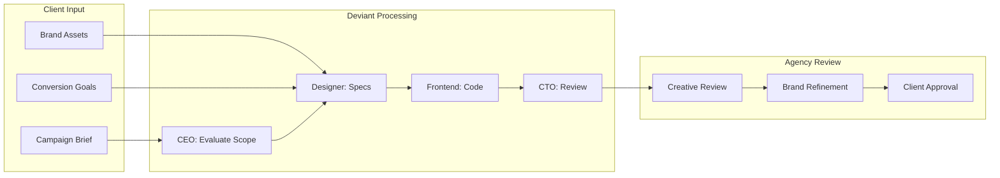
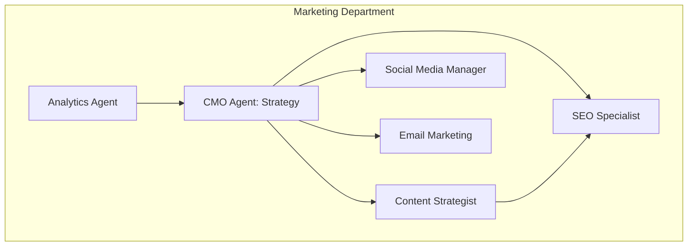

# Deviant for Marketing Agencies: From 3 Weeks to 8 Hours

*How digital agencies are delivering 15 landing pages in the time it used to take to build one.*

---

## The Agency Bottleneck

Every marketing agency knows this pain:

Client wants a campaign. Needs landing pages. Yesterday.

Your team is already stretched across five other clients. The designer has a 2-week backlog. The developer is mid-sprint on something else.

So you either:
- Miss the deadline and frustrate the client
- Rush it and deliver something mediocre
- Work overtime and burn out your team

None of these build a sustainable agency.

---

## The Real Numbers

Here's what a typical landing page project looks like:

### Traditional Approach

| Phase | Time | Cost (at $150/hr) |
|-------|------|-------------------|
| Discovery & brief | 4 hours | $600 |
| Design mockups | 8 hours | $1,200 |
| Revisions | 4 hours | $600 |
| Development | 12 hours | $1,800 |
| Testing & QA | 4 hours | $600 |
| Deployment | 2 hours | $300 |
| **Total per page** | **34 hours** | **$5,100** |

For 15 client landing pages:
- **Time:** 3+ weeks (with parallel work)
- **Cost:** $76,500 in labor

### With Deviant

| Phase | Time | Cost |
|-------|------|------|
| Brief creation | 30 min/page | Your time |
| AI generation | 25 min/page | ~$50 API |
| Human review & refinement | 30 min/page | Your time |
| **Total for 15 pages** | **~8 hours** | **~$800** |

**Savings:**
- Time: 3 weeks → 1 day
- Cost: $76,500 → $800 (API) + your review time

---

## What Deviant Generates for Landing Pages

When you submit a landing page project, here's what you get:

### From the Designer Agent

```markdown
## Landing Page Specification: "Growth Pro" SaaS

### Hero Section
- Headline: "Scale Your Business 10x Without 10x the Team"
- Subheadline: "AI-powered growth tools used by 500+ companies"
- CTA: "Start Free Trial" (primary) | "Watch Demo" (secondary)
- Hero image: Dashboard mockup showing key metrics

### Social Proof Bar
- Logo strip: 6 client logos
- Stats: "500+ companies" | "$50M+ managed" | "4.9★ rating"

### Features Section (3-column grid)
1. Automated Outreach
   - Icon: Mail/automation
   - Copy: "Set it and forget it..."

2. Smart Analytics
   - Icon: Chart/graph
   - Copy: "Know what's working..."

3. Team Collaboration
   - Icon: People/sync
   - Copy: "Everyone on the same page..."

### Testimonial Section
- Carousel with 3 customer quotes
- Photo, name, title, company
- Star rating display

### Pricing Section
- 3-tier pricing table
- Feature comparison
- Highlighted "Most Popular" tier

### Final CTA
- Headline: "Ready to grow?"
- Email capture form
- "Start Free Trial" button

### Footer
- Standard links, social icons, copyright
```

### From the Frontend Engineer

```typescript
// components/LandingPage/Hero.tsx
import { Button } from '@/components/ui/button'
import { motion } from 'framer-motion'

export function Hero() {
  return (
    <section className="relative overflow-hidden bg-gradient-to-br from-slate-900 to-slate-800 py-20">
      <div className="container mx-auto px-4">
        <motion.div
          initial={{ opacity: 0, y: 20 }}
          animate={{ opacity: 1, y: 0 }}
          className="max-w-3xl mx-auto text-center"
        >
          <h1 className="text-5xl font-bold text-white mb-6">
            Scale Your Business 10x Without 10x the Team
          </h1>
          <p className="text-xl text-slate-300 mb-8">
            AI-powered growth tools used by 500+ companies
          </p>
          <div className="flex justify-center gap-4">
            <Button size="lg" className="bg-blue-600 hover:bg-blue-700">
              Start Free Trial
            </Button>
            <Button size="lg" variant="outline" className="text-white border-white">
              Watch Demo
            </Button>
          </div>
        </motion.div>
      </div>
    </section>
  )
}
```

---

## The Agency Workflow



### Step 1: Brief Creation (5 minutes per page)

Your strategist creates structured briefs:

```yaml
project: Landing Page - Growth Pro Campaign
client: TechCorp Inc
brand_guidelines: [link to assets]

pages:
  - name: Main Landing Page
    goal: Free trial signups
    target_audience: B2B SaaS founders
    key_message: Scale without scaling team
    required_sections:
      - Hero with demo video
      - 3 features
      - Testimonials
      - Pricing
      - FAQ
    tone: Professional but approachable

  - name: Demo Request Page
    goal: Demo bookings
    target_audience: Enterprise decision makers
    key_message: See it in action
    required_sections:
      - Short hero
      - Demo form
      - What to expect
      - Calendly embed
```

### Step 2: AI Generation (25 minutes per page)

Deviant's agents collaborate:

1. **CEO** evaluates feasibility and scope
2. **Designer** creates detailed specifications matching brand
3. **Frontend Engineer** generates React/Next.js code
4. **CTO** reviews for quality and best practices

### Step 3: Agency Review (30 minutes per page)

Your creative director reviews output:
- Brand consistency check
- Copy refinement
- Animation adjustments
- Conversion optimization tweaks

### Step 4: Client Delivery

Present polished landing pages. Client sees:
- Professional designs
- Working code
- Fast turnaround
- Agency pricing (with healthy margins)

---

## Beyond Landing Pages

The same workflow applies to everything marketing agencies deliver:

### Email Sequences

```
Project: Welcome Email Sequence
Emails: 5-part onboarding series
Goal: Activation within 7 days

Deviant output:
- Email copy for all 5 emails
- Subject lines with A/B variants
- HTML email templates
- Send timing recommendations
```

### Content Calendars

```
Project: Q1 Content Calendar
Channels: Blog, LinkedIn, Twitter, Email
Frequency: 3 blog posts/week, daily social

Deviant output:
- 36 blog post outlines with SEO keywords
- 90 LinkedIn post drafts
- 90 Twitter threads
- 12 email newsletter drafts
- Publishing schedule with optimal timing
```

### Campaign Assets

```
Project: Product Launch Campaign
Components: Landing page, email sequence, social posts, ad copy

Deviant output (in one project):
- Landing page design + code
- 5-email announcement sequence
- 20 social media posts
- 10 ad copy variants
- UTM tracking structure
```

---

## Pricing Your AI-Augmented Services

### Option 1: Keep Your Rates, Increase Margins

**Current pricing:** $5,000 per landing page
**Current cost:** $4,000 (labor + overhead)
**Current margin:** 20%

**With Deviant:**
**Same pricing:** $5,000 per landing page
**New cost:** $500 (review time + API)
**New margin:** 90%

### Option 2: Win on Speed and Volume

**New pricing:** $2,500 per landing page (50% discount)
**New cost:** $500
**New margin:** 80%

Take on 3x the clients at half the price with 4x the margin.

### Option 3: Premium Positioning

**New pricing:** $7,500 per landing page
**New promise:** "48-hour turnaround guaranteed"
**New cost:** $600 (rush review + API)
**New margin:** 92%

Charge premium for speed no competitor can match.

---

## Marketing Department Agents

Deviant includes pre-built marketing-focused agents:



**CMO Agent**: Develops comprehensive marketing strategies
**Content Strategist**: Creates content calendars and outlines
**SEO Specialist**: Optimizes content for search
**Social Media Manager**: Generates social content
**Email Marketing**: Writes sequences and campaigns
**Analytics Agent**: Tracks and reports performance

---

## Real Agency Example

**Agency:** Digital growth agency, 8 people
**Before Deviant:** 4 clients/month capacity
**Challenge:** Turning down good clients due to bandwidth

**Implementation:**
- Week 1: Tested on internal projects
- Week 2: Used for one client's landing pages
- Week 3: Expanded to content and email work
- Week 4: Full workflow integration

**After 3 months:**
- Clients per month: 4 → 11
- Team size: 8 → 8 (no new hires)
- Revenue: $80k → $190k/month
- Profit margin: 22% → 61%

**Team feedback:**
- Designers focus on creative direction, not production
- Developers handle complex integrations, not page builds
- Strategists spend time with clients, not in production queues

---

## Getting Started for Agencies

### Phase 1: Internal Test (Week 1)
Build your agency's own marketing assets with Deviant. Learn the system. Build confidence.

### Phase 2: Low-Risk Client Work (Week 2-3)
Use for one client's project. Compare quality and speed to traditional approach. Measure savings.

### Phase 3: Workflow Integration (Week 4+)
Build Deviant into your standard workflow. Train team on brief creation. Establish review processes.

### Phase 4: Scale (Month 2+)
Take on more clients. Expand service offerings. Raise margins or lower prices. Grow.

---

## The Takeaway

Marketing agencies live and die by margins and capacity. Deviant transforms both:

- **Capacity:** 3-5x more output from same team
- **Speed:** Days instead of weeks
- **Margins:** 60-90% instead of 20-30%
- **Quality:** Consistent, reviewed, professional

The agencies that figure this out first capture the clients that others can't serve.

---

**Next**: [Deviant for Financial Services →](./06-for-finance.md)

---

*Nicanor Korir has worked with agencies stuck in the capacity trap. Deviant is the way out.*
