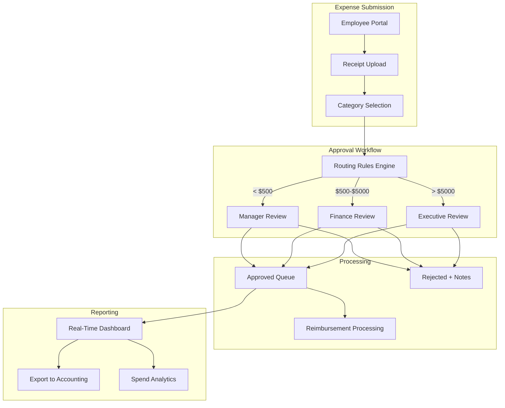

# Deviant for Financial Services: Custom Systems in Hours, Not Months

*How finance teams are building expense management, approval workflows, and reporting dashboards at a fraction of traditional cost.*

---

## The Finance Software Problem

Every finance team I've talked to has the same complaint:

"Off-the-shelf software is 80% features we don't need and missing the 20% we do."

So they either:
- **Buy enterprise software:** $50k+ licensing, 6-month implementation, features you'll never use
- **Build custom:** $200k+ development, 12+ months, ongoing maintenance costs
- **Use spreadsheets:** Free, immediate, but unscalable and error-prone

None of these are great options for a mid-sized company that just needs something that works their way.

---

## The Real Example: Expense Management

A client came to me with this problem:

> "We have 200 employees. QuickBooks doesn't handle our approval workflow. SAP wants $80k/year. We just need expenses to route to the right manager based on department and amount."

### Traditional Approach

| Phase | Timeline | Cost |
|-------|----------|------|
| Requirements gathering | 2 weeks | $8,000 |
| Vendor selection | 3 weeks | $5,000 |
| Customization | 6 weeks | $25,000 |
| Integration | 4 weeks | $15,000 |
| Training & rollout | 2 weeks | $5,000 |
| **Total** | **4+ months** | **$58,000+** |

Plus ongoing: $12,000/year licensing.

### With Deviant

| Phase | Timeline | Cost |
|-------|----------|------|
| Brief creation | 2 hours | Your time |
| AI generation | 8 hours | ~$800 API |
| Review & refinement | 4 hours | Your time |
| Testing | 2 hours | Your time |
| **Total** | **~16 hours** | **~$1,200** |

No ongoing licensing. You own the code.

---

## What Deviant Builds for Finance

### Expense Management System



### The Generated Components

**Backend (Python/FastAPI):**
```python
# Expense routing logic
class ExpenseRouter:
    async def route_expense(self, expense: Expense) -> ApprovalChain:
        """Route expense to appropriate approvers based on rules."""
        chain = ApprovalChain()

        # Amount-based routing
        if expense.amount < 500:
            chain.add_approver(
                await self.get_manager(expense.submitter_id)
            )
        elif expense.amount < 5000:
            chain.add_approver(
                await self.get_manager(expense.submitter_id)
            )
            chain.add_approver(
                await self.get_finance_reviewer()
            )
        else:
            chain.add_approver(
                await self.get_manager(expense.submitter_id)
            )
            chain.add_approver(
                await self.get_finance_reviewer()
            )
            chain.add_approver(
                await self.get_executive_approver()
            )

        # Department-specific rules
        if expense.category == "travel":
            chain.add_approver(
                await self.get_travel_coordinator()
            )

        return chain
```

**Frontend (React/TypeScript):**
```typescript
// Real-time dashboard component
export function FinanceDashboard() {
  const { data: metrics } = useFinanceMetrics()
  const { data: pendingApprovals } = usePendingApprovals()

  return (
    <div className="grid grid-cols-4 gap-6">
      <MetricCard
        title="Pending Approval"
        value={metrics?.pendingCount}
        trend={metrics?.pendingTrend}
        icon={<Clock />}
      />
      <MetricCard
        title="This Month Spend"
        value={formatCurrency(metrics?.monthlySpend)}
        trend={metrics?.spendTrend}
        icon={<DollarSign />}
      />
      <MetricCard
        title="Avg Approval Time"
        value={`${metrics?.avgApprovalHours}h`}
        trend={metrics?.approvalTrend}
        icon={<Timer />}
      />
      <MetricCard
        title="Budget Remaining"
        value={formatCurrency(metrics?.budgetRemaining)}
        progress={metrics?.budgetUsedPercent}
        icon={<PiggyBank />}
      />

      <div className="col-span-4">
        <ApprovalQueue items={pendingApprovals} />
      </div>
    </div>
  )
}
```

---

## More Finance Use Cases

### 1. Invoice Processing Automation

**Problem:** Manual invoice entry, lost invoices, missed payments

**Deviant Solution (10 hours, ~$1,000):**
- Invoice upload with OCR extraction
- Automatic vendor matching
- Approval routing based on vendor/amount
- Integration export to QuickBooks/Xero
- Payment tracking dashboard

### 2. Budget Tracking & Alerts

**Problem:** Departments overspend before anyone notices

**Deviant Solution (8 hours, ~$800):**
- Department budget setup
- Real-time spend tracking
- Automatic alerts at 75%, 90%, 100%
- Manager visibility dashboard
- Monthly trend reporting

### 3. Financial Reporting Dashboard

**Problem:** Reports take days to compile, data is stale

**Deviant Solution (12 hours, ~$1,200):**
- Real-time P&L dashboard
- Cash flow visualization
- Department cost breakdowns
- Custom date range reporting
- Scheduled email reports

### 4. Vendor Payment Portal

**Problem:** Vendors calling to check payment status

**Deviant Solution (8 hours, ~$800):**
- Vendor self-service portal
- Invoice submission
- Payment status tracking
- Document download (receipts, 1099s)
- Secure authentication

---

## Compliance and Security

Finance software has special requirements. Here's how Deviant addresses them:

### Data Security

```python
# Generated with security best practices
class ExpenseService:
    async def create_expense(
        self,
        expense: ExpenseCreate,
        current_user: User
    ) -> Expense:
        # Audit logging
        await self.audit_log.record(
            action="expense_created",
            user_id=current_user.id,
            data=expense.dict(exclude={'receipt_data'})
        )

        # Encrypt sensitive data
        expense.receipt_data = await self.encryption.encrypt(
            expense.receipt_data
        )

        # Store with row-level security
        return await self.repository.create(
            expense,
            owner_id=current_user.id
        )
```

### Audit Trails

Every action is logged:

```typescript
interface AuditEntry {
  id: string
  timestamp: Date
  userId: string
  action: 'created' | 'approved' | 'rejected' | 'modified'
  entityType: 'expense' | 'invoice' | 'payment'
  entityId: string
  previousState: Record<string, any>
  newState: Record<string, any>
  ipAddress: string
}
```

### Role-Based Access

```python
# Permission system
FINANCE_ROLES = {
    "employee": ["submit_expense", "view_own_expenses"],
    "manager": ["approve_team_expenses", "view_team_expenses"],
    "finance": ["approve_all_expenses", "view_all_expenses", "export_data"],
    "executive": ["approve_high_value", "view_dashboards"],
    "admin": ["manage_users", "configure_rules", "access_audit_logs"]
}
```

---

## Integration with Existing Systems

Deviant generates code that integrates with your stack:

### QuickBooks Integration

```python
class QuickBooksSync:
    async def sync_approved_expenses(self):
        """Push approved expenses to QuickBooks."""
        expenses = await self.get_unsync_expenses()

        for expense in expenses:
            qb_expense = QuickBooksExpense(
                vendor_id=expense.vendor_qb_id,
                amount=expense.amount,
                account=self.map_category_to_account(expense.category),
                date=expense.date,
                memo=expense.description
            )
            await self.quickbooks.create_expense(qb_expense)
            await self.mark_synced(expense.id)
```

### Bank Feed Integration

```python
class BankFeedMatcher:
    async def match_transactions(self):
        """Match bank transactions to expenses."""
        unmatched = await self.get_unmatched_transactions()

        for transaction in unmatched:
            # Find matching expense by amount and date
            candidates = await self.find_expense_candidates(
                amount=transaction.amount,
                date_range=(transaction.date - 3, transaction.date + 3)
            )

            if len(candidates) == 1:
                await self.auto_match(transaction, candidates[0])
            elif len(candidates) > 1:
                await self.queue_for_manual_review(transaction, candidates)
```

---

## The ROI Calculation

### Initial Investment

| Item | Traditional | Deviant |
|------|-------------|---------|
| Development | $50,000+ | ~$1,200 |
| Implementation | $15,000 | Your time |
| Training | $5,000 | Self-explanatory UI |
| **Total Year 1** | **$70,000+** | **~$1,500** |

### Ongoing Costs

| Item | Traditional | Deviant |
|------|-------------|---------|
| Licensing | $12,000/year | $0 |
| Maintenance | $10,000/year | $500/year (hosting) |
| Updates | Vendor schedule | On your terms |
| **Annual** | **$22,000+** | **~$500** |

### 3-Year Total Cost of Ownership

| Approach | Year 1 | Year 2 | Year 3 | **Total** |
|----------|--------|--------|--------|-----------|
| Traditional | $70,000 | $22,000 | $22,000 | **$114,000** |
| Deviant | $1,500 | $500 | $500 | **$2,500** |

**Savings: $111,500 over 3 years**

---

## Who This Is For

### Good Fit
- Mid-sized companies (50-500 employees)
- Specific workflow requirements
- Integration with existing tools needed
- Internal IT team for hosting
- Budget-conscious organizations

### Less Good Fit
- Highly regulated industries requiring certified software
- Companies without any technical staff
- Need for 24/7 vendor support
- Complex multi-entity consolidation

---

## Getting Started for Finance Teams

### Step 1: Identify the Pain Point
What process is currently painful? Expenses? Approvals? Reporting? Vendor payments?

### Step 2: Document Requirements
Write out exactly how you want it to work. Include:
- Who does what
- What triggers what
- What reports you need
- What integrations matter

### Step 3: Generate with Deviant
Submit the project. Get comprehensive specs and code.

### Step 4: Review with Your Team
Finance reviews workflows. IT reviews code. Stakeholders verify requirements.

### Step 5: Deploy and Train
Simple deployment. Intuitive interface means minimal training.

---

## The Takeaway

Finance teams deserve software that works their way—not software that forces them into someone else's workflow.

Deviant makes custom finance systems accessible:
- **$1,200** instead of $50,000
- **12 hours** instead of 4 months
- **Your workflow** instead of vendor's assumptions

The math is simple. The technology is ready. The only question is what you'll build first.

---

**Next**: [Deviant for Manufacturing →](./07-for-manufacturing.md)

---

*Nicanor Korir has watched finance teams struggle with software that doesn't fit. Deviant gives them exactly what they need.*
