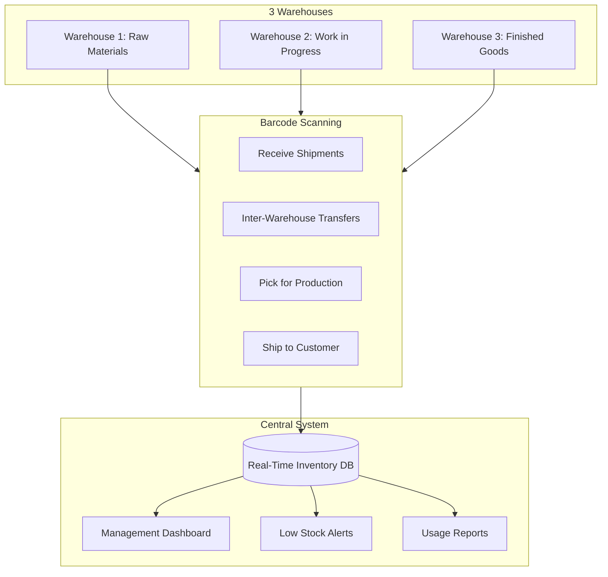
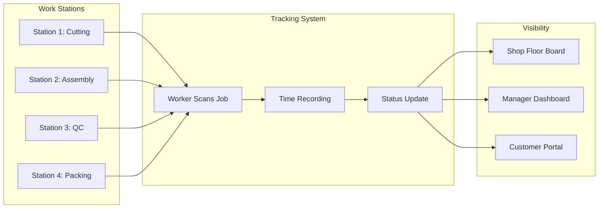

# Retinue for Manufacturing: Real-Time Inventory Tracking Without the $80k Price Tag

*How manufacturers are building warehouse systems, barcode scanning, and production tracking in hours—not months.*

---

## The Manufacturing Tech Gap

Manufacturing has a technology problem.

Enterprise solutions like SAP or Oracle cost hundreds of thousands. They take 6-18 months to implement. They require dedicated IT teams to maintain.

Small and mid-sized manufacturers can't afford that. So they run on spreadsheets, whiteboards, and tribal knowledge. They lose track of inventory. They can't trace production issues. They're flying blind.

Retinue changes that equation.

---

## The Real Example: Multi-Warehouse Inventory

A manufacturing client came to me with this situation:

> "We have 3 warehouses. Nobody knows what's actually in stock. We're either overstocking (capital tied up) or understocking (production delays). SAP quoted us $80k just for the software."

### What They Got with Retinue

**Timeline:** 18 hours of AI generation + 6 hours of review
**Cost:** ~$1,800 in API costs
**Result:** Complete inventory management system



---

## What Retinue Generates

### Mobile Barcode Scanner App

```typescript
// React Native barcode scanner component
export function InventoryScanner() {
  const [scanning, setScanning] = useState(false)
  const { mutate: recordScan } = useRecordInventoryScan()

  const handleBarcodeScan = async (barcode: string) => {
    setScanning(true)

    try {
      // Look up item
      const item = await lookupItem(barcode)

      // Show item details and prompt for action
      const action = await promptAction({
        item,
        options: ['Receive', 'Transfer', 'Pick', 'Adjust']
      })

      // Record the scan
      await recordScan({
        barcode,
        action,
        location: await getCurrentLocation(),
        quantity: action.quantity,
        timestamp: new Date()
      })

      // Vibrate and show confirmation
      Haptics.notificationAsync(Haptics.NotificationFeedbackType.Success)
      showToast(`${action.type}: ${item.name}`)
    } catch (error) {
      Haptics.notificationAsync(Haptics.NotificationFeedbackType.Error)
      showError(error.message)
    } finally {
      setScanning(false)
    }
  }

  return (
    <Camera
      onBarCodeScanned={scanning ? undefined : handleBarcodeScan}
      style={styles.scanner}
    >
      <ScannerOverlay />
      <ScanHistory />
    </Camera>
  )
}
```

### Real-Time Dashboard

```typescript
export function InventoryDashboard() {
  const { data: overview } = useInventoryOverview()
  const { data: lowStock } = useLowStockAlerts()
  const { data: recentActivity } = useRecentActivity()

  return (
    <div className="grid grid-cols-12 gap-6">
      {/* Warehouse Overview */}
      <div className="col-span-8">
        <WarehouseMap
          warehouses={overview?.warehouses}
          selectedMetric="stockLevel"
        />
      </div>

      {/* Key Metrics */}
      <div className="col-span-4 space-y-4">
        <MetricCard
          title="Total SKUs"
          value={overview?.totalSKUs}
          subtitle={`${overview?.activeSKUs} active`}
        />
        <MetricCard
          title="Total Value"
          value={formatCurrency(overview?.totalValue)}
          trend={overview?.valueTrend}
        />
        <MetricCard
          title="Low Stock Items"
          value={lowStock?.length}
          alert={lowStock?.length > 10}
        />
      </div>

      {/* Low Stock Alerts */}
      <div className="col-span-6">
        <LowStockTable items={lowStock} />
      </div>

      {/* Recent Activity */}
      <div className="col-span-6">
        <ActivityFeed activities={recentActivity} />
      </div>
    </div>
  )
}
```

### Backend API

```python
# FastAPI inventory endpoints
@router.post("/scan")
async def record_scan(
    scan: InventoryScan,
    current_user: User = Depends(get_current_user),
    db: Session = Depends(get_db)
):
    """Record a barcode scan and update inventory."""

    # Get current inventory level
    inventory = await get_inventory_by_barcode(db, scan.barcode, scan.location)

    if not inventory:
        raise HTTPException(404, "Item not found in this location")

    # Update based on action
    if scan.action == "receive":
        inventory.quantity += scan.quantity
        inventory.last_received = datetime.utcnow()

    elif scan.action == "pick":
        if inventory.quantity < scan.quantity:
            raise HTTPException(400, "Insufficient stock")
        inventory.quantity -= scan.quantity
        inventory.last_picked = datetime.utcnow()

    elif scan.action == "transfer":
        # Decrease source
        inventory.quantity -= scan.quantity
        # Increase destination
        await add_to_location(db, scan.barcode, scan.destination, scan.quantity)

    elif scan.action == "adjust":
        inventory.quantity = scan.quantity
        inventory.adjustment_reason = scan.reason

    # Save and create audit record
    await db.commit()
    await create_audit_record(db, scan, current_user)

    # Check for low stock alert
    if inventory.quantity <= inventory.reorder_point:
        await create_low_stock_alert(inventory)

    return {"success": True, "new_quantity": inventory.quantity}
```

---

## More Manufacturing Use Cases

### 1. Production Tracking

**Problem:** Don't know where jobs are or when they'll finish

**Retinue Solution (14 hours, ~$1,400):**



**Features:**
- Job barcode scanning at each station
- Automatic time tracking per station
- Real-time production board display
- Manager dashboard with bottleneck detection
- Customer-facing order status

### 2. Quality Control System

**Problem:** Paper-based QC, lost records, can't trace issues

**Retinue Solution (12 hours, ~$1,200):**

**Features:**
- Digital QC checklists
- Photo documentation of defects
- Automatic traceability (batch → materials → supplier)
- Trend analysis (which issues are increasing?)
- Corrective action tracking

### 3. Equipment Maintenance

**Problem:** Reactive maintenance, unexpected downtime

**Retinue Solution (10 hours, ~$1,000):**

**Features:**
- Equipment registry with maintenance schedules
- PM task generation and tracking
- Breakdown logging and analysis
- Spare parts inventory
- Maintenance cost tracking per machine

### 4. Shipping & Receiving

**Problem:** Manual paperwork, data entry errors

**Retinue Solution (8 hours, ~$800):**

**Features:**
- PO receiving with barcode scanning
- Packing list generation
- Shipping label printing
- Carrier integration (UPS, FedEx)
- Delivery confirmation tracking

---

## The ROI for Manufacturing

### Inventory Accuracy Improvement

**Before:** 75% inventory accuracy (common without barcode scanning)
**After:** 98%+ accuracy

**Impact:**
- Reduced emergency orders: Save 15% on expedited shipping
- Reduced overstock: Free up 20% of working capital
- Reduced stockouts: Avoid $X in lost production

### Labor Efficiency

**Before:** 2 hours/day of manual inventory counting
**After:** 15 minutes of exception handling

**With 5 warehouse workers:**
- Before: 10 hours/day on inventory
- After: 1.25 hours/day on inventory
- Saved: 8.75 hours/day = 43+ hours/week

At $25/hour: **$56,000/year savings**

### Error Reduction

**Before:** 5% shipping error rate (wrong item, wrong quantity)
**After:** 0.5% error rate

**On 1000 shipments/month:**
- Before: 50 errors/month × $50 avg cost = $2,500/month
- After: 5 errors/month × $50 = $250/month
- Saved: $2,250/month = **$27,000/year**

---

## Technical Considerations

### Offline Capability

Warehouses don't always have great WiFi. Retinue generates apps with offline support:

```typescript
// Offline-first architecture
export function useInventoryScan() {
  const queryClient = useQueryClient()
  const { isOnline } = useNetworkState()

  return useMutation({
    mutationFn: async (scan: InventoryScan) => {
      if (isOnline) {
        return api.recordScan(scan)
      } else {
        // Store offline
        await offlineStorage.queueScan(scan)
        return { queued: true }
      }
    },
    onSuccess: () => {
      queryClient.invalidateQueries(['inventory'])
    }
  })
}

// Background sync when connection restored
useEffect(() => {
  if (isOnline) {
    syncQueuedScans()
  }
}, [isOnline])
```

### Barcode Hardware Integration

Works with common hardware:
- USB barcode scanners
- Bluetooth ring scanners
- Phone cameras
- Zebra/Honeywell handhelds

### Industrial Environment

- High-contrast UI for bright/dusty environments
- Large touch targets for gloved operation
- Audio/haptic feedback for noisy areas

---

## Implementation for Manufacturing

### Week 1: Assessment
- Map current processes
- Identify pain points
- Define requirements

### Week 2: Generation
- Create Retinue project
- Generate system
- Initial testing

### Week 3: Pilot
- Deploy to one area/warehouse
- Train key users
- Gather feedback

### Week 4: Rollout
- Deploy to all locations
- Full training
- Go live

### Ongoing
- Monitor and refine
- Add features as needed
- Measure ROI

---

## Comparison to Alternatives

| Solution | Cost | Timeline | Customization | Maintenance |
|----------|------|----------|---------------|-------------|
| SAP Business One | $50-100k | 6-12 months | Limited | Vendor |
| Oracle NetSuite | $40-80k | 4-8 months | Limited | Vendor |
| Fishbowl | $15-40k | 2-4 months | Moderate | Vendor |
| Custom Development | $80-200k | 6-12 months | Full | You |
| **Retinue** | **$1-3k** | **2-4 weeks** | **Full** | **You** |

---

## The Takeaway

Manufacturing software doesn't have to cost $80k and take 6 months.

Retinue delivers:
- **Real-time inventory** across all locations
- **Barcode scanning** with mobile and handheld support
- **Production tracking** with full visibility
- **Custom workflows** that match how you actually work

All for ~$1,800 and 18 hours.

The technology that big manufacturers take for granted is now accessible to everyone.

---

**Next**: [Retinue for E-Commerce →](./08-for-ecommerce.md)

---

*Nicanor Korir has seen manufacturers struggle with tools built for enterprises 10x their size. Retinue levels the playing field.*
