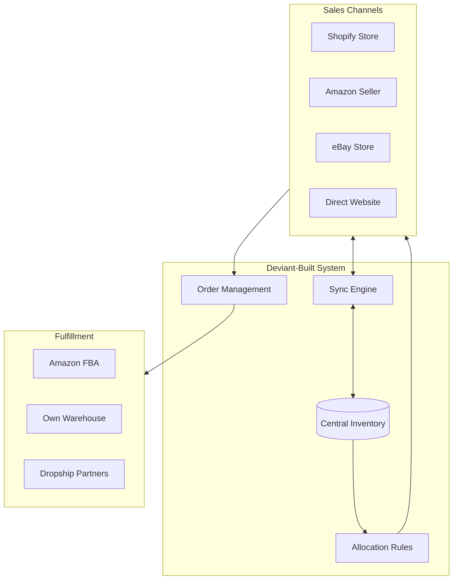

# Deviant for E-Commerce: Multi-Channel Sync Without the $25k Setup Fee

*How online sellers are building inventory synchronization, order management, and fulfillment systems that rival enterprise solutions.*

---

## The Multi-Channel Nightmare

If you sell on multiple platforms, you know this pain:

**Shopify** says you have 50 units.
**Amazon** says you have 50 units.
**eBay** says you have 50 units.

You actually have 50 units total—not 150.

Someone buys 30 on Amazon. Now you're oversold on Shopify and eBay. Customer complaints. Seller rating drops. Suspended listings.

The "solutions" on the market?
- **Skubana/Extensiv:** $1,000+/month
- **ChannelAdvisor:** $500-2,000+/month + setup fees
- **SellerCloud:** $25,000+ setup + monthly fees

For a seller doing $50k-500k/year, these don't make economic sense.

---

## The Deviant Alternative

**Timeline:** 9 hours of AI generation
**Cost:** ~$900 in API costs
**Result:** Real-time inventory sync across Shopify, Amazon, and eBay



---

## What Gets Built

### Real-Time Inventory Sync

```python
# Inventory synchronization engine
class InventorySyncEngine:
    def __init__(self):
        self.shopify = ShopifyClient()
        self.amazon = AmazonMWSClient()
        self.ebay = eBayClient()
        self.channels = [self.shopify, self.amazon, self.ebay]

    async def sync_inventory(self, sku: str, quantity: int):
        """Sync inventory across all channels with buffer."""
        # Calculate per-channel allocation
        allocations = await self.calculate_allocations(sku, quantity)

        # Update each channel
        updates = []
        for channel, allocated_qty in allocations.items():
            updates.append(
                self.update_channel(channel, sku, allocated_qty)
            )

        results = await asyncio.gather(*updates, return_exceptions=True)

        # Log any failures for retry
        for channel, result in zip(allocations.keys(), results):
            if isinstance(result, Exception):
                await self.queue_retry(channel, sku, allocations[channel])

        return results

    async def calculate_allocations(self, sku: str, total: int):
        """Allocate inventory based on channel performance."""
        rules = await self.get_allocation_rules(sku)

        # Safety buffer (never allocate 100%)
        available = int(total * 0.95)

        if rules.strategy == "equal":
            per_channel = available // len(self.channels)
            return {c: per_channel for c in self.channels}

        elif rules.strategy == "weighted":
            # Weight by sales velocity
            velocities = await self.get_channel_velocities(sku)
            total_velocity = sum(velocities.values())

            return {
                channel: int(available * (vel / total_velocity))
                for channel, vel in velocities.items()
            }

        elif rules.strategy == "priority":
            # Prioritize highest-margin channel
            allocated = {}
            remaining = available
            for channel in rules.priority_order:
                channel_min = rules.minimums.get(channel, 0)
                allocated[channel] = min(channel_min, remaining)
                remaining -= allocated[channel]
            # Give remainder to top priority
            allocated[rules.priority_order[0]] += remaining
            return allocated
```

### Order Management Dashboard

```typescript
export function OrdersDashboard() {
  const { data: orders } = useOrders({ status: 'pending' })
  const { data: metrics } = useOrderMetrics()

  return (
    <div className="space-y-6">
      {/* Metrics Row */}
      <div className="grid grid-cols-5 gap-4">
        <ChannelMetric
          channel="shopify"
          orders={metrics?.shopify.pending}
          revenue={metrics?.shopify.revenue}
        />
        <ChannelMetric
          channel="amazon"
          orders={metrics?.amazon.pending}
          revenue={metrics?.amazon.revenue}
        />
        <ChannelMetric
          channel="ebay"
          orders={metrics?.ebay.pending}
          revenue={metrics?.ebay.revenue}
        />
        <ChannelMetric
          channel="direct"
          orders={metrics?.direct.pending}
          revenue={metrics?.direct.revenue}
        />
        <MetricCard
          title="Total Pending"
          value={metrics?.totalPending}
          subtitle="Ready to fulfill"
        />
      </div>

      {/* Unified Orders Table */}
      <OrdersTable
        orders={orders}
        columns={[
          'orderNumber',
          'channel',
          'customer',
          'items',
          'total',
          'status',
          'actions'
        ]}
        onFulfill={handleFulfill}
        onBulkAction={handleBulkAction}
      />

      {/* Fulfillment Queue */}
      <FulfillmentQueue />
    </div>
  )
}
```

### Webhook Handlers

```python
# Real-time order ingestion
@router.post("/webhooks/shopify/order")
async def handle_shopify_order(
    request: Request,
    background_tasks: BackgroundTasks
):
    """Handle new Shopify order webhook."""
    payload = await request.json()

    # Verify webhook signature
    if not verify_shopify_signature(request):
        raise HTTPException(401, "Invalid signature")

    # Create unified order
    order = Order(
        channel="shopify",
        channel_order_id=payload["id"],
        customer=extract_customer(payload),
        items=[
            OrderItem(
                sku=item["sku"],
                quantity=item["quantity"],
                price=item["price"]
            )
            for item in payload["line_items"]
        ],
        shipping_address=extract_address(payload["shipping_address"]),
        total=payload["total_price"]
    )

    await db.orders.insert(order)

    # Update inventory immediately
    background_tasks.add_task(
        update_inventory_for_order,
        order
    )

    # Trigger sync to other channels
    background_tasks.add_task(
        sync_inventory_all_channels,
        [item.sku for item in order.items]
    )

    return {"received": True}
```

---

## More E-Commerce Use Cases

### 1. Automated Repricing

**Problem:** Competitors change prices, you lose buy box

**Deviant Solution (6 hours, ~$600):**

```python
class RepricingEngine:
    async def analyze_and_reprice(self, sku: str):
        """Analyze competition and adjust price."""
        # Get competitor prices
        competitors = await self.get_competitor_prices(sku)

        # Get our costs
        product = await self.get_product(sku)
        floor_price = product.cost * (1 + self.min_margin)
        ceiling_price = product.msrp

        # Calculate optimal price
        if competitors:
            target = min(competitors) - 0.01  # Beat by penny
            new_price = max(floor_price, min(ceiling_price, target))
        else:
            new_price = product.default_price

        # Update if changed significantly
        if abs(new_price - product.current_price) > 0.05:
            await self.update_price(sku, new_price)
            await self.log_price_change(sku, product.current_price, new_price)

        return new_price
```

### 2. Automated Review Requests

**Problem:** Not enough reviews, lower conversion

**Deviant Solution (4 hours, ~$400):**

- Track order delivery dates
- Wait optimal period (7-14 days)
- Send personalized review request
- A/B test messaging
- Track conversion to review

### 3. Return Processing

**Problem:** Returns are manual, refunds delayed, inventory not updated

**Deviant Solution (8 hours, ~$800):**

- Customer-facing return portal
- Automatic RMA generation
- Return label creation
- Inspection tracking
- Automatic inventory update
- Refund processing

### 4. Bundle Management

**Problem:** Bundles sell but component inventory not tracked

**Deviant Solution (5 hours, ~$500):**

- Define bundle compositions
- Automatic component reservation
- Dynamic bundle availability
- Bundle profitability analysis

---

## The Sync Challenge

Multi-channel sync is technically hard. Here's how Deviant handles it:

### Rate Limiting

Each platform has API limits:

```python
class RateLimitedClient:
    def __init__(self, calls_per_second: float):
        self.semaphore = asyncio.Semaphore(1)
        self.min_interval = 1.0 / calls_per_second
        self.last_call = 0

    async def call(self, func, *args, **kwargs):
        async with self.semaphore:
            # Wait if needed
            elapsed = time.time() - self.last_call
            if elapsed < self.min_interval:
                await asyncio.sleep(self.min_interval - elapsed)

            self.last_call = time.time()
            return await func(*args, **kwargs)

# Platform-specific limits
shopify_client = RateLimitedClient(2)  # 2 calls/sec
amazon_client = RateLimitedClient(0.5)  # 1 call/2 sec
ebay_client = RateLimitedClient(5)  # 5 calls/sec
```

### Conflict Resolution

What if two orders come in simultaneously?

```python
async def process_order_with_lock(order: Order):
    """Process order with inventory locking."""
    lock_keys = [f"sku:{item.sku}" for item in order.items]

    # Acquire locks
    async with distributed_lock(*lock_keys, timeout=30):
        # Check availability
        for item in order.items:
            available = await get_available_inventory(item.sku)
            if available < item.quantity:
                raise InsufficientInventoryError(item.sku)

        # Reserve inventory
        for item in order.items:
            await reserve_inventory(item.sku, item.quantity, order.id)

        # Process order
        await mark_order_confirmed(order)

        # Sync to channels
        await sync_inventory_all_channels([item.sku for item in order.items])
```

### Recovery from Failures

```python
class InventorySyncRecovery:
    async def check_sync_health(self):
        """Verify inventory is in sync across channels."""
        discrepancies = []

        for sku in await self.get_all_skus():
            expected = await self.get_central_inventory(sku)
            channel_totals = await self.get_channel_inventories(sku)

            total_allocated = sum(channel_totals.values())

            if abs(total_allocated - expected) > expected * 0.05:
                discrepancies.append({
                    "sku": sku,
                    "expected": expected,
                    "allocated": total_allocated,
                    "by_channel": channel_totals
                })

        return discrepancies

    async def repair_sync(self, sku: str):
        """Force resync for a SKU."""
        # Get source of truth
        actual = await self.physical_inventory_count(sku)

        # Update central
        await self.set_central_inventory(sku, actual)

        # Push to all channels
        await self.sync_inventory(sku, actual)
```

---

## The Economics

### Monthly Costs Comparison

| Solution | Setup | Monthly | Annual |
|----------|-------|---------|--------|
| Skubana | $2,000 | $1,000 | $14,000 |
| ChannelAdvisor | $5,000 | $1,500 | $23,000 |
| Sellbrite | $0 | $180 | $2,160 |
| Custom Dev | $50,000 | $500 | $56,000 |
| **Deviant** | **$900** | **$100** | **$2,100** |

### Break-Even Analysis

For a seller doing $200k/year:
- Traditional solution: $15k/year = 7.5% of revenue
- Deviant solution: $2k/year = 1% of revenue

**Savings: 6.5% of revenue = $13,000/year**

That's profit that stays with you.

---

## Platform-Specific Notes

### Shopify

```python
# Shopify API integration
class ShopifyClient:
    async def update_inventory(self, sku: str, quantity: int):
        inventory_item = await self.get_inventory_item_by_sku(sku)
        location = await self.get_primary_location()

        await self.api.post(
            f"/inventory_levels/set.json",
            json={
                "inventory_item_id": inventory_item["id"],
                "location_id": location["id"],
                "available": quantity
            }
        )
```

### Amazon MWS/SP-API

```python
# Amazon Seller Partner API
class AmazonClient:
    async def update_inventory(self, sku: str, quantity: int):
        # Amazon requires feed submission
        feed = InventoryFeed()
        feed.add_item(sku=sku, quantity=quantity)

        response = await self.feeds_api.create_feed(
            feed_type="POST_INVENTORY_AVAILABILITY_DATA",
            content_type="text/xml",
            body=feed.to_xml()
        )

        # Check feed processing status
        return await self.wait_for_feed_processing(response["feedId"])
```

### eBay

```python
# eBay Trading API
class eBayClient:
    async def update_inventory(self, sku: str, quantity: int):
        item_id = await self.get_item_id_by_sku(sku)

        await self.api.call("ReviseInventoryStatus", {
            "InventoryStatus": {
                "ItemID": item_id,
                "Quantity": quantity
            }
        })
```

---

## Getting Started

### Phase 1: Audit Current State
- List all sales channels
- Document current sync process (or lack thereof)
- Identify pain points and costs

### Phase 2: Build with Deviant
- Create project with channel specifications
- Generate sync engine and dashboard
- Test with subset of SKUs

### Phase 3: Gradual Rollout
- Start with slow-moving items
- Add high-velocity items
- Monitor for discrepancies

### Phase 4: Optimize
- Tune allocation rules
- Add automation (repricing, review requests)
- Measure ROI

---

## The Takeaway

Multi-channel selling shouldn't require enterprise software budgets.

Deviant delivers:
- **Real-time sync** across all channels
- **$900** instead of $25,000 setup
- **Your rules** for inventory allocation
- **Full control** of your data

The tools that enterprise sellers take for granted are now accessible to everyone.

---

**Next**: [Deviant for Education →](./09-for-education.md)

---

*Nicanor Korir has watched sellers drown in channel chaos. Deviant brings order to multi-channel selling.*
