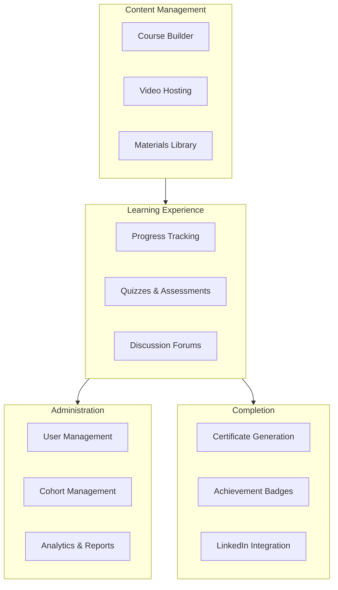
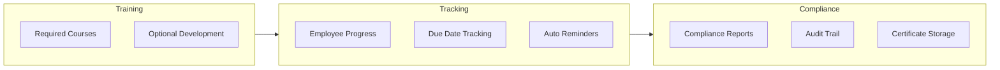

# Deviant for Education: Build Your Own LMS Without the Enterprise Price

*How educators and training companies are creating course platforms with video hosting, quizzes, certificates, and dashboards—in days, not months.*

---

## The Education Tech Gap

Every educator, corporate trainer, and course creator faces the same dilemma:

**Off-the-shelf LMS options:**
- **Teachable/Thinkific:** $99-399/month, limited customization
- **Kajabi:** $149-399/month, locked into their ecosystem
- **Canvas/Blackboard:** $50k+/year, enterprise complexity
- **Custom development:** $60k+, 3-6 months

You're either overpaying for features you don't need, or can't afford what you actually want.

---

## The Deviant Alternative

**Timeline:** 14 hours of AI generation
**Cost:** ~$1,400 in API costs
**Result:** Full-featured LMS with your exact requirements



---

## What Gets Built

### Course Builder Interface

```typescript
export function CourseBuilder({ courseId }: { courseId: string }) {
  const { data: course, mutate } = useCourse(courseId)
  const [modules, setModules] = useState(course?.modules || [])

  const addModule = () => {
    setModules([...modules, {
      id: generateId(),
      title: 'New Module',
      lessons: []
    }])
  }

  const addLesson = (moduleId: string, type: LessonType) => {
    setModules(modules.map(m =>
      m.id === moduleId
        ? { ...m, lessons: [...m.lessons, createLesson(type)] }
        : m
    ))
  }

  return (
    <div className="grid grid-cols-12 gap-6">
      {/* Module List */}
      <div className="col-span-4">
        <DragDropContext onDragEnd={handleDragEnd}>
          <Droppable droppableId="modules">
            {(provided) => (
              <div ref={provided.innerRef} {...provided.droppableProps}>
                {modules.map((module, index) => (
                  <ModuleCard
                    key={module.id}
                    module={module}
                    index={index}
                    onAddLesson={addLesson}
                  />
                ))}
                {provided.placeholder}
              </div>
            )}
          </Droppable>
        </DragDropContext>
        <Button onClick={addModule}>+ Add Module</Button>
      </div>

      {/* Lesson Editor */}
      <div className="col-span-8">
        {selectedLesson ? (
          <LessonEditor
            lesson={selectedLesson}
            onSave={handleSaveLesson}
          />
        ) : (
          <EmptyState message="Select a lesson to edit" />
        )}
      </div>
    </div>
  )
}
```

### Video Player with Progress Tracking

```typescript
export function VideoLesson({ lesson, onProgress }: VideoLessonProps) {
  const videoRef = useRef<HTMLVideoElement>(null)
  const [watched, setWatched] = useState(0)

  useEffect(() => {
    const video = videoRef.current
    if (!video) return

    const handleTimeUpdate = () => {
      const percentWatched = (video.currentTime / video.duration) * 100
      setWatched(Math.max(watched, percentWatched))

      // Save progress periodically
      if (Math.floor(percentWatched) % 10 === 0) {
        onProgress({
          lessonId: lesson.id,
          percentComplete: percentWatched,
          timestamp: video.currentTime
        })
      }
    }

    const handleEnded = () => {
      onProgress({
        lessonId: lesson.id,
        percentComplete: 100,
        completed: true
      })
    }

    video.addEventListener('timeupdate', handleTimeUpdate)
    video.addEventListener('ended', handleEnded)

    return () => {
      video.removeEventListener('timeupdate', handleTimeUpdate)
      video.removeEventListener('ended', handleEnded)
    }
  }, [lesson.id])

  return (
    <div className="relative">
      <video
        ref={videoRef}
        src={lesson.videoUrl}
        controls
        className="w-full rounded-lg"
      />
      <ProgressBar value={watched} className="mt-2" />
    </div>
  )
}
```

### Quiz System

```typescript
export function QuizLesson({ lesson, onComplete }: QuizLessonProps) {
  const [currentQuestion, setCurrentQuestion] = useState(0)
  const [answers, setAnswers] = useState<Record<string, string>>({})
  const [submitted, setSubmitted] = useState(false)

  const questions = lesson.quiz.questions

  const handleAnswer = (questionId: string, answer: string) => {
    setAnswers({ ...answers, [questionId]: answer })
  }

  const handleSubmit = async () => {
    const results = await submitQuiz({
      lessonId: lesson.id,
      answers
    })

    setSubmitted(true)

    if (results.passed) {
      onComplete({
        lessonId: lesson.id,
        score: results.score,
        passed: true
      })
    }
  }

  if (submitted) {
    return <QuizResults results={results} onRetry={handleRetry} />
  }

  return (
    <div className="space-y-6">
      <ProgressIndicator
        current={currentQuestion + 1}
        total={questions.length}
      />

      <QuestionCard
        question={questions[currentQuestion]}
        selectedAnswer={answers[questions[currentQuestion].id]}
        onAnswer={(a) => handleAnswer(questions[currentQuestion].id, a)}
      />

      <div className="flex justify-between">
        <Button
          onClick={() => setCurrentQuestion(c => c - 1)}
          disabled={currentQuestion === 0}
        >
          Previous
        </Button>

        {currentQuestion < questions.length - 1 ? (
          <Button onClick={() => setCurrentQuestion(c => c + 1)}>
            Next
          </Button>
        ) : (
          <Button onClick={handleSubmit} variant="primary">
            Submit Quiz
          </Button>
        )}
      </div>
    </div>
  )
}
```

### Certificate Generation

```python
# Certificate generation with PDF output
class CertificateGenerator:
    async def generate(
        self,
        user: User,
        course: Course,
        completion_date: datetime
    ) -> bytes:
        """Generate PDF certificate."""
        # Create certificate data
        certificate = Certificate(
            id=generate_certificate_id(),
            user_name=user.full_name,
            course_name=course.title,
            completion_date=completion_date,
            credential_id=generate_credential_id()
        )

        # Render HTML template
        html = await self.render_template(
            "certificate.html",
            certificate=certificate,
            organization=self.organization
        )

        # Convert to PDF
        pdf_bytes = await self.html_to_pdf(html)

        # Store certificate record
        await self.store_certificate(certificate, pdf_bytes)

        return pdf_bytes

    async def verify_certificate(self, credential_id: str) -> Certificate:
        """Verify a certificate is valid."""
        certificate = await self.get_certificate(credential_id)

        if not certificate:
            raise CertificateNotFoundError()

        return certificate
```

---

## More Education Use Cases

### 1. Corporate Training Portal

**Problem:** Compliance training scattered across email attachments

**Deviant Solution (12 hours, ~$1,200):**



**Features:**
- Role-based course assignments
- Deadline tracking with reminders
- Manager dashboards
- Compliance reporting
- Integration with HR systems

### 2. Certification Program

**Problem:** Paper-based certifications, no verification

**Deviant Solution (10 hours, ~$1,000):**

**Features:**
- Multi-level certification paths
- Proctored assessments
- Digital credentials (Credly-like)
- Public verification page
- LinkedIn badge integration

### 3. Cohort-Based Learning

**Problem:** Self-paced doesn't work, need live elements

**Deviant Solution (14 hours, ~$1,400):**

**Features:**
- Cohort scheduling and enrollment
- Drip content release
- Live session scheduling (Zoom integration)
- Peer discussion forums
- Group assignments
- Cohort analytics

### 4. Microlearning Platform

**Problem:** Long courses don't get finished

**Deviant Solution (8 hours, ~$800):**

**Features:**
- 5-minute bite-sized lessons
- Daily learning streaks
- Mobile-first design
- Push notifications
- Gamification (points, badges)
- Spaced repetition for retention

---

## Technical Considerations

### Video Hosting

Options generated by Deviant:

```typescript
// Option 1: Cloudflare Stream (recommended)
const videoConfig = {
  provider: 'cloudflare-stream',
  features: ['adaptive-bitrate', 'signed-urls', 'analytics']
}

// Option 2: Mux
const videoConfig = {
  provider: 'mux',
  features: ['adaptive-bitrate', 'thumbnails', 'captions']
}

// Option 3: Self-hosted (lower cost, more maintenance)
const videoConfig = {
  provider: 's3-hls',
  features: ['transcoding', 'cdn-distribution']
}
```

### SCORM Compatibility

For enterprise clients needing SCORM:

```python
class SCORMExporter:
    async def export_course(self, course: Course) -> bytes:
        """Export course as SCORM 1.2 package."""
        manifest = self.create_manifest(course)
        content = self.package_content(course)
        scorm_api = self.create_scorm_wrapper()

        package = SCORMPackage()
        package.add_manifest(manifest)
        package.add_content(content)
        package.add_api(scorm_api)

        return package.to_zip()
```

### Mobile App Generation

```typescript
// React Native mobile app structure
// Generated alongside web platform

export function MobileCourseView({ courseId }: Props) {
  const { data: course } = useCourse(courseId)
  const { downloadForOffline, offlineStatus } = useOffline()

  return (
    <ScrollView>
      <CourseHeader
        course={course}
        onDownload={() => downloadForOffline(courseId)}
        offlineStatus={offlineStatus}
      />

      {course.modules.map(module => (
        <ModuleAccordion key={module.id} module={module} />
      ))}
    </ScrollView>
  )
}
```

---

## The Economics

### Cost Comparison

| Solution | Monthly | Annual | Students Included |
|----------|---------|--------|-------------------|
| Teachable Basic | $39 | $468 | Unlimited |
| Teachable Pro | $119 | $1,428 | Unlimited |
| Thinkific Pro | $99 | $1,188 | Unlimited |
| Kajabi Basic | $149 | $1,788 | 10,000 |
| Custom Dev | - | $60,000 | Unlimited |
| **Deviant LMS** | **~$50** | **~$600** | **Unlimited** |

*Deviant cost = hosting only, you own the platform*

### Revenue Model Freedom

With your own platform:
- No transaction fees (Teachable takes 5% on basic)
- No student limits (Kajabi caps at 10,000)
- Any pricing model (subscriptions, bundles, teams)
- White-label for B2B sales

---

## Example: Online Course Business

**Before:**
- Platform: Teachable Pro ($119/month)
- 500 students
- $50/course average
- Revenue: $25,000/month
- Platform fees: $119 + 5% = ~$1,369/month
- Net: $23,631/month

**After (Deviant-built LMS):**
- Platform: Self-hosted (~$50/month)
- Same 500 students
- Same $50/course
- Revenue: $25,000/month
- Platform fees: ~$50/month
- Net: $24,950/month

**Savings: $1,319/month = $15,828/year**

Plus: full customization, data ownership, no platform lock-in.

---

## Implementation Path

### Week 1: Requirements
- Define course structure
- List required features
- Identify integrations needed

### Week 2: Generation
- Create Deviant project
- Generate platform
- Initial review

### Week 3: Content Migration
- Import existing content
- Set up video hosting
- Create quizzes

### Week 4: Testing & Launch
- User acceptance testing
- Payment integration
- Marketing launch

---

## Advanced Features

### AI-Powered Learning

Deviant can also generate:

```python
class AdaptiveLearning:
    async def get_next_content(self, user: User, course: Course):
        """Recommend next content based on performance."""
        # Analyze user's performance
        performance = await self.analyze_performance(user, course)

        if performance.struggling_topics:
            # Recommend remedial content
            return await self.get_remedial_content(
                performance.struggling_topics
            )

        if performance.ahead_of_schedule:
            # Recommend advanced content
            return await self.get_advanced_content(
                performance.mastered_topics
            )

        # Standard progression
        return await self.get_next_lesson(user, course)
```

### Discussion Forums

```typescript
export function DiscussionForum({ lessonId }: Props) {
  const { data: threads } = useThreads(lessonId)

  return (
    <div className="space-y-4">
      <NewThreadForm onSubmit={handleNewThread} />

      {threads.map(thread => (
        <ThreadCard
          key={thread.id}
          thread={thread}
          onReply={handleReply}
          onUpvote={handleUpvote}
        />
      ))}
    </div>
  )
}
```

### Analytics Dashboard

```typescript
export function InstructorDashboard() {
  const { data: analytics } = useCourseAnalytics()

  return (
    <div className="grid grid-cols-12 gap-6">
      <div className="col-span-8">
        <EngagementChart data={analytics.engagement} />
      </div>
      <div className="col-span-4 space-y-4">
        <MetricCard title="Active Students" value={analytics.activeStudents} />
        <MetricCard title="Completion Rate" value={`${analytics.completionRate}%`} />
        <MetricCard title="Avg Quiz Score" value={`${analytics.avgQuizScore}%`} />
      </div>
      <div className="col-span-6">
        <TopPerformersTable students={analytics.topPerformers} />
      </div>
      <div className="col-span-6">
        <StrugglingStudentsTable students={analytics.struggling} />
      </div>
    </div>
  )
}
```

---

## The Takeaway

Education technology shouldn't require enterprise budgets.

Deviant delivers:
- **Full LMS** in 14 hours instead of 3 months
- **$1,400** instead of $60,000
- **Your design** instead of template constraints
- **No fees** on your revenue

Every educator deserves professional learning tools. Now they're accessible.

---

**Next**: [Deviant for Healthcare →](./10-for-healthcare.md)

---

*Nicanor Korir believes education should be democratized—including the tools to deliver it. Deviant makes that possible.*
