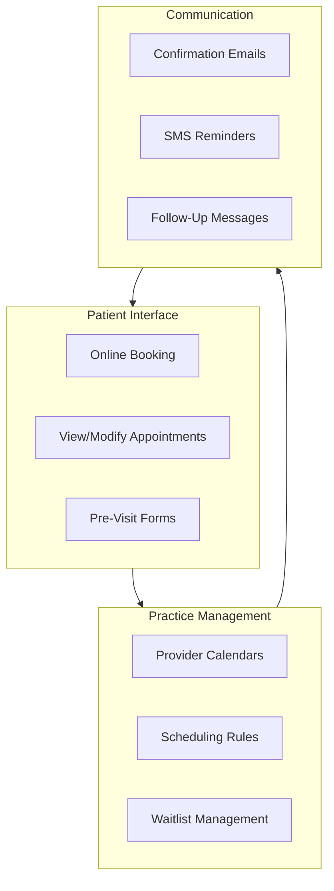

# Retinue for Healthcare: HIPAA-Aware Appointment Scheduling in Hours

*How healthcare providers are building patient-facing systems without the compliance nightmares or enterprise costs.*

---

## The Healthcare Software Dilemma

Healthcare has unique software challenges:

1. **HIPAA compliance** - Every system touching patient data needs safeguards
2. **Integration complexity** - EHRs, billing, insurance, labs
3. **Patient expectations** - They want modern UX, not 1990s interfaces
4. **Budget constraints** - Smaller practices can't afford enterprise solutions

Most practices end up with:
- Expensive EHR add-ons that don't quite fit
- Third-party tools that create data silos
- Paper processes because software is too complex/expensive

---

## What Retinue Can Build

**Important caveat:** Retinue generates code, not certified medical software. The output provides a strong foundation but requires proper security review, HIPAA compliance audit, and potentially BAA agreements before production use with real patient data.

That said, here's what's possible:

### Patient Appointment Scheduling

**Timeline:** 11 hours
**Cost:** ~$1,100



---

## Built-In HIPAA Considerations

Retinue generates code with security best practices:

### Data Encryption

```python
# Encryption at rest for PHI
from cryptography.fernet import Fernet

class PHIEncryption:
    def __init__(self, key: bytes):
        self.cipher = Fernet(key)

    def encrypt_phi(self, data: dict) -> dict:
        """Encrypt PHI fields before storage."""
        phi_fields = ['name', 'dob', 'ssn', 'diagnosis', 'notes']

        encrypted = data.copy()
        for field in phi_fields:
            if field in encrypted and encrypted[field]:
                encrypted[field] = self.cipher.encrypt(
                    encrypted[field].encode()
                ).decode()

        return encrypted

    def decrypt_phi(self, data: dict) -> dict:
        """Decrypt PHI fields for authorized access."""
        phi_fields = ['name', 'dob', 'ssn', 'diagnosis', 'notes']

        decrypted = data.copy()
        for field in phi_fields:
            if field in decrypted and decrypted[field]:
                decrypted[field] = self.cipher.decrypt(
                    decrypted[field].encode()
                ).decode()

        return decrypted
```

### Audit Logging

```python
# Comprehensive audit trail
class HIPAAAuditLog:
    async def log_access(
        self,
        user_id: str,
        patient_id: str,
        action: str,
        data_accessed: List[str],
        reason: str
    ):
        """Log all PHI access for HIPAA compliance."""
        await self.db.insert("audit_log", {
            "timestamp": datetime.utcnow(),
            "user_id": user_id,
            "patient_id": patient_id,
            "action": action,
            "data_fields": data_accessed,
            "access_reason": reason,
            "ip_address": get_client_ip(),
            "user_agent": get_user_agent(),
            "session_id": get_session_id()
        })

    async def generate_access_report(
        self,
        patient_id: str,
        start_date: date,
        end_date: date
    ) -> List[AuditEntry]:
        """Generate patient access report for compliance."""
        return await self.db.query(
            """
            SELECT * FROM audit_log
            WHERE patient_id = $1
            AND timestamp BETWEEN $2 AND $3
            ORDER BY timestamp DESC
            """,
            patient_id, start_date, end_date
        )
```

### Access Controls

```python
# Role-based access control
HEALTHCARE_ROLES = {
    "front_desk": {
        "can_view": ["name", "dob", "contact", "appointments"],
        "can_modify": ["contact", "appointments"],
        "can_create": ["appointments"]
    },
    "nurse": {
        "can_view": ["name", "dob", "contact", "vitals", "allergies", "medications"],
        "can_modify": ["vitals"],
        "can_create": ["vitals"]
    },
    "physician": {
        "can_view": "*",  # All fields
        "can_modify": ["diagnosis", "notes", "prescriptions"],
        "can_create": ["diagnosis", "notes", "prescriptions"]
    },
    "billing": {
        "can_view": ["name", "dob", "insurance", "procedures", "billing"],
        "can_modify": ["billing"],
        "can_create": ["invoices"]
    }
}

class PHIAccessControl:
    async def check_access(
        self,
        user: User,
        patient_id: str,
        action: str,
        fields: List[str]
    ) -> bool:
        """Verify user can access requested PHI fields."""
        role_permissions = HEALTHCARE_ROLES.get(user.role)

        if not role_permissions:
            return False

        allowed_fields = role_permissions.get(f"can_{action}", [])

        if allowed_fields == "*":
            return True

        return all(field in allowed_fields for field in fields)
```

---

## Appointment Scheduling System

### Patient Booking Interface

```typescript
export function AppointmentBooking({ providerId }: Props) {
  const [selectedDate, setSelectedDate] = useState<Date>()
  const [selectedSlot, setSelectedSlot] = useState<TimeSlot>()
  const { data: availability } = useAvailability(providerId, selectedDate)

  return (
    <div className="max-w-2xl mx-auto space-y-6">
      {/* Provider Info */}
      <ProviderCard providerId={providerId} />

      {/* Appointment Type */}
      <AppointmentTypeSelector
        providerId={providerId}
        onSelect={setAppointmentType}
      />

      {/* Calendar */}
      <Calendar
        availableDates={availability?.dates}
        selectedDate={selectedDate}
        onSelect={setSelectedDate}
      />

      {/* Time Slots */}
      {selectedDate && (
        <TimeSlotGrid
          slots={availability?.slots}
          selectedSlot={selectedSlot}
          onSelect={setSelectedSlot}
        />
      )}

      {/* Confirmation */}
      {selectedSlot && (
        <ConfirmationForm
          provider={provider}
          slot={selectedSlot}
          onConfirm={handleBooking}
        />
      )}
    </div>
  )
}
```

### Smart Scheduling Rules

```python
class SchedulingRules:
    async def get_available_slots(
        self,
        provider_id: str,
        date: date,
        appointment_type: str
    ) -> List[TimeSlot]:
        """Get available slots respecting all rules."""

        # Get provider's base schedule
        schedule = await self.get_provider_schedule(provider_id, date)

        # Get existing appointments
        existing = await self.get_existing_appointments(provider_id, date)

        # Get appointment type requirements
        appt_type = await self.get_appointment_type(appointment_type)

        available = []
        for slot in schedule.generate_slots(appt_type.duration):
            # Check not already booked
            if self.slot_conflicts(slot, existing):
                continue

            # Check buffer time between appointments
            if not self.has_required_buffer(slot, existing, appt_type.buffer):
                continue

            # Check provider preferences
            if not self.matches_provider_preferences(slot, provider_id, appt_type):
                continue

            # Check practice rules (lunch, meetings, etc.)
            if self.is_blocked_time(slot, date):
                continue

            available.append(slot)

        return available
```

### SMS Reminders

```python
class AppointmentReminders:
    async def schedule_reminders(self, appointment: Appointment):
        """Schedule reminder messages for appointment."""

        # 24 hours before
        await self.schedule_message(
            appointment.patient_phone,
            appointment.datetime - timedelta(hours=24),
            self.format_reminder_24h(appointment)
        )

        # 2 hours before
        await self.schedule_message(
            appointment.patient_phone,
            appointment.datetime - timedelta(hours=2),
            self.format_reminder_2h(appointment)
        )

    def format_reminder_24h(self, appointment: Appointment) -> str:
        return f"""
        Reminder: You have an appointment tomorrow at {appointment.time}
        with {appointment.provider_name}.

        Location: {appointment.location}

        Reply CONFIRM to confirm or CANCEL to cancel.
        """

    async def handle_reply(self, phone: str, message: str):
        """Handle patient SMS reply."""
        appointment = await self.get_upcoming_appointment(phone)

        if 'CONFIRM' in message.upper():
            await self.mark_confirmed(appointment)
            await self.send_sms(phone, "Confirmed! See you tomorrow.")

        elif 'CANCEL' in message.upper():
            await self.cancel_appointment(appointment)
            await self.send_sms(phone, "Cancelled. Call to reschedule.")
            await self.notify_practice(appointment, "Patient cancelled via SMS")
```

---

## More Healthcare Use Cases

### 1. Patient Intake Forms

**Problem:** Paper forms, data entry, lost information

**Retinue Solution (8 hours, ~$800):**

```typescript
export function IntakeForms({ appointmentId }: Props) {
  const { data: forms } = useRequiredForms(appointmentId)
  const [currentForm, setCurrentForm] = useState(0)

  return (
    <div className="max-w-xl mx-auto">
      <FormProgress forms={forms} current={currentForm} />

      <DynamicForm
        schema={forms[currentForm].schema}
        onSubmit={handleSubmit}
        onBack={() => setCurrentForm(c => c - 1)}
      />

      <SecureNotice>
        Your information is encrypted and protected under HIPAA.
      </SecureNotice>
    </div>
  )
}
```

### 2. Patient Portal

**Problem:** Patients can't access their own information

**Retinue Solution (12 hours, ~$1,200):**

**Features:**
- Secure login (MFA optional)
- Appointment history and upcoming
- Message provider
- View test results (when released)
- Prescription refill requests
- Bill pay

### 3. Waitlist Management

**Problem:** Cancellations leave empty slots

**Retinue Solution (6 hours, ~$600):**

```python
class WaitlistManager:
    async def handle_cancellation(self, appointment: Appointment):
        """Fill cancelled slot from waitlist."""

        # Find waitlist patients
        waitlist = await self.get_waitlist(
            provider_id=appointment.provider_id,
            appointment_type=appointment.type,
            date_range=(appointment.date, appointment.date + timedelta(days=7))
        )

        # Notify in priority order
        for patient in waitlist:
            notification = await self.send_offer(
                patient,
                appointment,
                expires_in=timedelta(hours=2)
            )

            # Wait for response or timeout
            response = await self.wait_for_response(notification, timeout=7200)

            if response and response.accepted:
                await self.book_from_waitlist(patient, appointment)
                return

        # No takers - slot remains open
        await self.mark_slot_available(appointment)
```

### 4. Telehealth Integration

**Problem:** Need video visits but separate from scheduling

**Retinue Solution (10 hours, ~$1,000):**

**Features:**
- Video visit scheduling
- Automatic room creation (Twilio/Daily.co)
- Waiting room experience
- Screen sharing for education
- Visit documentation integration

---

## Integration Considerations

### EHR Integration

```python
# Example: Basic EHR read integration
class EHRIntegration:
    """
    Note: Real EHR integrations require vendor partnerships,
    certification, and significant compliance work.
    This shows the pattern for when those are in place.
    """

    async def fetch_patient(self, patient_id: str) -> Patient:
        """Fetch patient demographics from EHR."""
        # FHIR R4 API call
        response = await self.fhir_client.get(
            f"/Patient/{patient_id}"
        )
        return self.parse_fhir_patient(response)

    async def create_appointment(self, appointment: Appointment):
        """Create appointment in EHR."""
        fhir_appointment = self.to_fhir_appointment(appointment)
        return await self.fhir_client.post(
            "/Appointment",
            json=fhir_appointment
        )
```

### Billing System

```python
class BillingIntegration:
    async def create_charge(
        self,
        appointment: Appointment,
        cpt_codes: List[str]
    ):
        """Create billing record for completed visit."""
        charges = []
        for code in cpt_codes:
            fee = await self.get_fee_schedule(code, appointment.insurance)
            charges.append(Charge(
                code=code,
                amount=fee.amount,
                patient_responsibility=fee.copay
            ))

        return await self.billing_system.create_claim(
            patient_id=appointment.patient_id,
            date_of_service=appointment.date,
            charges=charges
        )
```

---

## Compliance Checklist

Before production use, ensure:

### Technical Safeguards
- [ ] Encryption at rest (AES-256)
- [ ] Encryption in transit (TLS 1.2+)
- [ ] Access logging for all PHI
- [ ] Automatic session timeout
- [ ] Strong authentication (MFA recommended)

### Administrative Safeguards
- [ ] Business Associate Agreement with hosting provider
- [ ] Security risk assessment completed
- [ ] Policies and procedures documented
- [ ] Staff training on HIPAA

### Physical Safeguards
- [ ] Secure hosting environment
- [ ] Backup procedures
- [ ] Disaster recovery plan

---

## The Honest Limitations

Retinue generates excellent starting code, but healthcare software requires additional steps:

1. **Security audit** by qualified professionals
2. **HIPAA compliance review** before handling real PHI
3. **Integration work** with existing systems (EHR, billing)
4. **BAA agreements** with cloud providers
5. **Ongoing compliance** monitoring

Retinue saves 80% of development time and cost. The remaining 20% (compliance, security, integration) still requires appropriate expertise.

---

## The Economics

### Traditional Development

| Component | Cost |
|-----------|------|
| Custom development | $40,000 |
| HIPAA compliance consulting | $10,000 |
| Security audit | $5,000 |
| Integration development | $15,000 |
| **Total** | **$70,000** |

### With Retinue

| Component | Cost |
|-----------|------|
| Retinue generation | $1,100 |
| HIPAA compliance consulting | $10,000 |
| Security audit | $5,000 |
| Integration development | $5,000 |
| **Total** | **$21,100** |

**Savings: $48,900 (70%)**

The compliance and security work is still needed—but the development cost drops dramatically.

---

## The Takeaway

Healthcare software doesn't have to cost $70k and take 6 months.

Retinue delivers:
- **HIPAA-aware code** with encryption and audit logging
- **Patient-friendly interfaces** that match modern expectations
- **$1,100** in generation costs instead of $40,000
- **Foundation for compliance** (not a substitute for proper review)

Smaller practices deserve modern software. Retinue makes it accessible.

---

*This completes the industry-specific use case series. Each article demonstrates how Retinue applies to different business contexts with realistic cost/time comparisons.*

---

*Nicanor Korir believes every practice deserves good software, not just those with enterprise budgets. Retinue is a step toward that vision—with appropriate respect for healthcare's unique requirements.*
