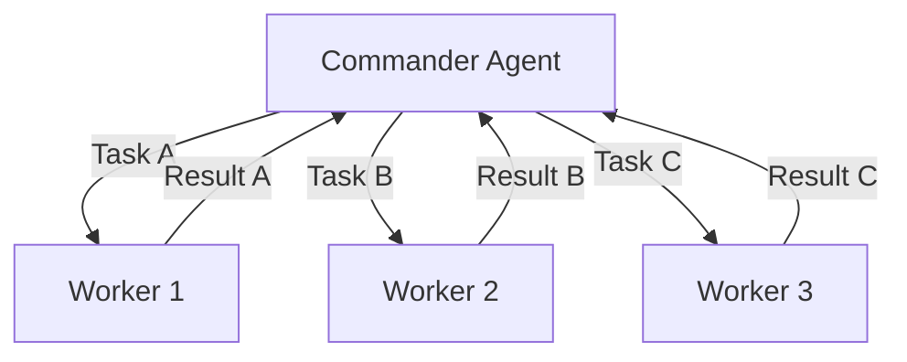
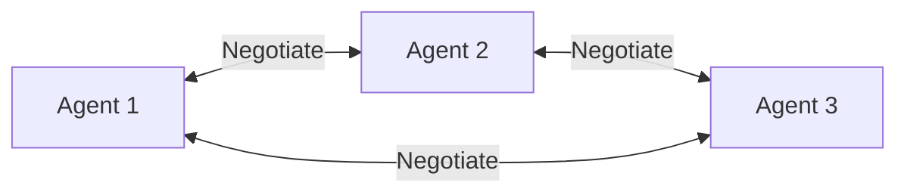
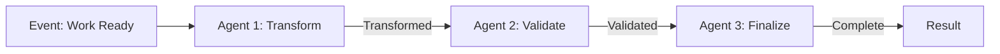
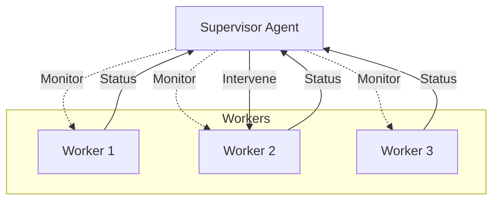
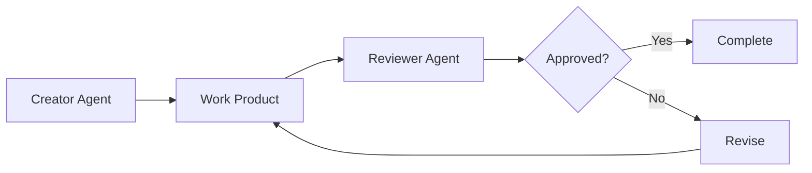
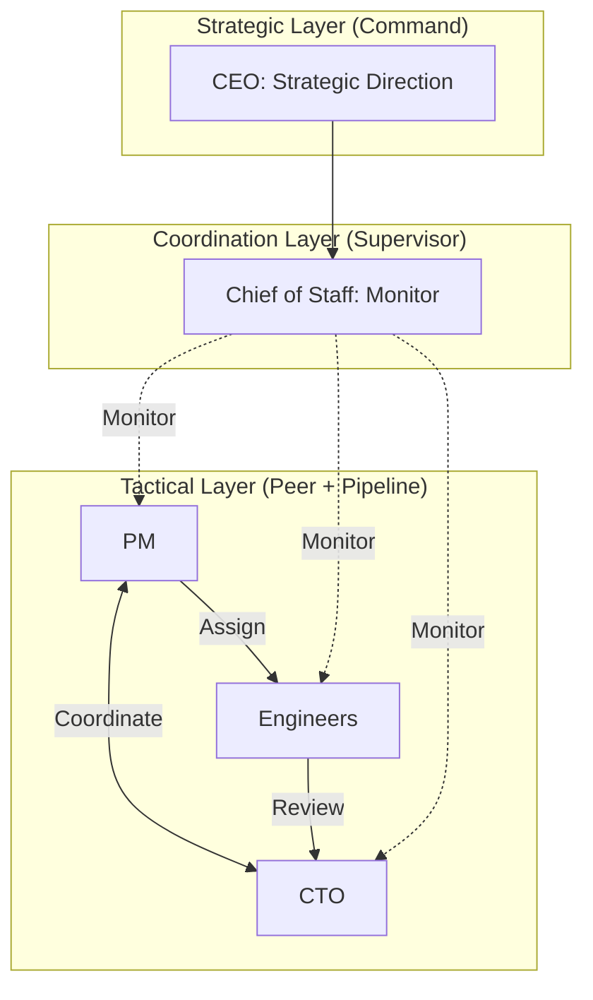
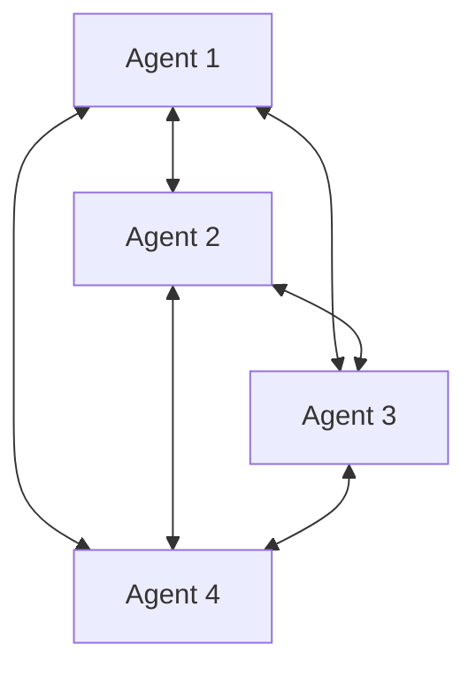
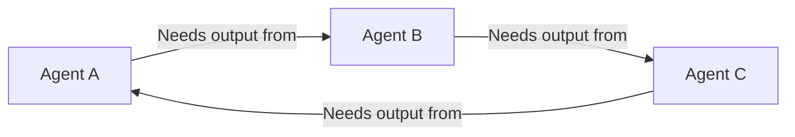

# The Multi-Agent Orchestration Pattern: Coordination Strategies That Actually Work

*How to make AI agents work together without chaos, deadlocks, or contradictions.*

---

## The Core Problem

Put five developers in a room without coordination, and you get:
- Conflicting implementations
- Duplicated work
- Integration nightmares
- Blame games

Put five AI agents together without orchestration, and you get the same thing—just faster and more expensive.

The solution isn't smarter agents. It's smarter coordination.

---

## Pattern 1: Hierarchical Command

**The idea:** One agent issues orders. Others follow.



**How it works:**
1. Commander receives goal
2. Commander breaks down into tasks
3. Commander assigns to workers
4. Workers execute and report back
5. Commander integrates results

**Implementation:**

```python
class CommanderAgent:
    async def execute_goal(self, goal: str):
        # Break down the goal
        tasks = await self.decompose(goal)

        # Assign to workers
        results = []
        for task in tasks:
            worker = self.select_worker(task)
            result = await worker.execute(task)
            results.append(result)

        # Integrate
        return await self.integrate(results)
```

**Pros:**
- Clear authority
- Simple to understand
- Easy to debug

**Cons:**
- Commander becomes bottleneck
- Limited parallelism
- Single point of failure

**When to use:**
- Clear task decomposition possible
- Tasks are independent
- Need strong control

**Retinue application:** PM Agent uses this pattern for task assignment.

---

## Pattern 2: Peer Collaboration

**The idea:** Agents work as equals, negotiating coordination.



**How it works:**
1. Each agent announces capabilities
2. Agents negotiate task ownership
3. Agents coordinate directly
4. Consensus on integration

**Implementation:**

```python
class PeerAgent:
    async def receive_work_request(self, request: WorkRequest):
        # Evaluate fit
        fit_score = await self.evaluate_fit(request)

        if fit_score > self.threshold:
            # Claim the work
            await self.broadcast(WorkClaim(
                agent=self.id,
                request=request,
                score=fit_score
            ))

    async def on_claim_received(self, claim: WorkClaim):
        # Compare to own claim if any
        if self.has_claim(claim.request):
            if claim.score > self.claims[claim.request].score:
                # Yield to better-fit agent
                await self.yield_claim(claim.request)
```

**Pros:**
- No bottleneck
- Parallel execution
- Resilient to failures

**Cons:**
- Coordination overhead
- Potential for deadlocks
- Complex conflict resolution

**When to use:**
- Agents have distinct specialties
- Tasks can be self-selected
- Need high parallelism

**Retinue application:** Future Chief of Staff pattern uses elements of peer negotiation.

---

## Pattern 3: Event-Driven Pipeline

**The idea:** Agents respond to events, forming processing chains.



**How it works:**
1. Events trigger agent actions
2. Agents process and emit new events
3. Next agent in chain responds
4. Chain completes when final event fires

**Implementation:**

```python
class PipelineAgent:
    def __init__(self, input_event: str, output_event: str):
        self.input_event = input_event
        self.output_event = output_event

    async def on_event(self, event: Event):
        if event.type == self.input_event:
            # Process
            result = await self.process(event.data)

            # Emit next event
            await self.emit(Event(
                type=self.output_event,
                data=result
            ))
```

**Pros:**
- Loose coupling
- Easy to add stages
- Natural async flow

**Cons:**
- Harder to track overall progress
- Debugging spans agents
- State management across events

**When to use:**
- Clear processing stages
- Stages are independent
- Need flexibility in pipeline

**Retinue application:** Core event-driven architecture uses this pattern extensively.

---

## Pattern 4: Supervisor/Worker

**The idea:** Supervisor monitors workers, intervening when needed.



**How it works:**
1. Workers operate autonomously
2. Supervisor monitors health/progress
3. Supervisor intervenes on problems
4. Supervisor handles escalations

**Implementation:**

```python
class SupervisorAgent:
    async def monitoring_loop(self):
        while True:
            for worker in self.workers:
                status = await worker.get_status()

                if status.health == "stuck":
                    await self.intervene(worker)
                elif status.health == "failed":
                    await self.escalate(worker)

            await asyncio.sleep(self.check_interval)

    async def intervene(self, worker: WorkerAgent):
        # Analyze the problem
        diagnosis = await self.diagnose(worker)

        # Take corrective action
        if diagnosis.can_recover:
            await worker.reset()
        else:
            await self.reassign_work(worker)
```

**Pros:**
- Workers stay autonomous
- Problems caught early
- Clear escalation path

**Cons:**
- Supervision overhead
- Delayed intervention (check intervals)
- Supervisor knowledge requirements

**When to use:**
- Workers can mostly self-manage
- Need fault tolerance
- Want autonomous operation with safety net

**Retinue application:** HR Agent implements this pattern for agent health monitoring.

---

## Pattern 5: Approval Workflow

**The idea:** Work flows through approval gates before completion.



**How it works:**
1. Creator produces work
2. Work submitted for review
3. Reviewer evaluates
4. Approval or revision request
5. Loop until approved

**Implementation:**

```python
class ApprovalWorkflow:
    async def submit(self, work: WorkProduct, reviewer: Agent):
        # Submit for review
        await self.notify_reviewer(reviewer, work)

        # Wait for decision
        decision = await self.wait_for_decision(work.id)

        if decision.approved:
            return await self.complete(work)
        else:
            # Request revision
            revised = await self.request_revision(
                work,
                decision.feedback
            )
            # Recursively resubmit
            return await self.submit(revised, reviewer)
```

**Pros:**
- Quality gates enforced
- Clear feedback loops
- Audit trail of decisions

**Cons:**
- Can slow execution
- Reviewer becomes bottleneck
- Potential for infinite loops

**When to use:**
- Quality is critical
- Need human-like review process
- Decisions need documentation

**Retinue application:** CTO code review uses this pattern for all task output.

---

## Pattern 6: Hybrid Orchestration

**The idea:** Combine patterns based on context.



**How it works:**
1. Different patterns at different levels
2. Commander for strategy
3. Supervisor for oversight
4. Peers for tactical coordination
5. Pipeline for execution flow

**Implementation:**

```python
class HybridOrchestrator:
    def __init__(self):
        self.strategic = CommanderAgent("CEO")
        self.supervisor = SupervisorAgent("ChiefOfStaff")
        self.tactical = PeerNetwork([PM, CTO, Engineers])

    async def execute_project(self, project: Project):
        # Strategic decision (command pattern)
        approved = await self.strategic.evaluate(project)

        if not approved:
            return None

        # Tactical execution (peer pattern)
        tasks = await self.tactical.coordinate(project)

        # Supervised execution (supervisor pattern)
        while not self.complete(tasks):
            await self.supervisor.check()
            await asyncio.sleep(30)

        return await self.collect_results(tasks)
```

**Pros:**
- Best of all patterns
- Flexible coordination
- Matches real organizations

**Cons:**
- Complexity
- Harder to understand
- More points of failure

**When to use:**
- Complex multi-agent systems
- Need flexibility
- Mimicking real organizations

**Retinue application:** Full system uses hybrid orchestration across all agents.

---

## Choosing the Right Pattern

| Scenario | Recommended Pattern |
|----------|---------------------|
| Simple task breakdown | Hierarchical Command |
| Agents with distinct skills | Peer Collaboration |
| Sequential processing | Event-Driven Pipeline |
| Need fault tolerance | Supervisor/Worker |
| Quality-critical output | Approval Workflow |
| Complex system | Hybrid Orchestration |

---

## Anti-Patterns to Avoid

### 1. Everyone Talks to Everyone



**Problem:** N² communication overhead. Conflicting instructions.

**Solution:** Structured communication channels.

### 2. No Authority

**Problem:** Multiple agents can approve/reject the same work.

**Solution:** Clear authority definitions. One approver per decision type.

### 3. Circular Dependencies



**Problem:** Deadlock. Nothing can proceed.

**Solution:** Dependency analysis before assignment. Break cycles.

### 4. Chatty Agents

**Problem:** Agents over-communicate, generating noise.

**Solution:** Message types with purpose. Rate limiting.

---

## The Takeaway

Multi-agent orchestration isn't about picking one pattern—it's about composing patterns appropriately:

1. **Command** for clear hierarchy
2. **Peer** for equal collaboration
3. **Pipeline** for sequential flow
4. **Supervisor** for monitoring
5. **Approval** for quality gates
6. **Hybrid** for complex systems

The right orchestration makes agents productive. The wrong orchestration makes them chaos.

---

**Next**: [Hybrid Polling and Event-Driven Systems: Best of Both Worlds →](./02-hybrid-polling-events.md)

---

*Nicanor Korir has built more multi-agent systems that failed than succeeded. These patterns are distilled from the failures.*
