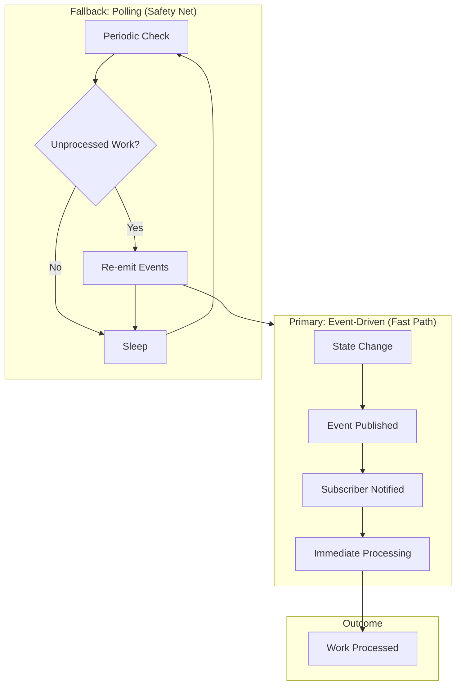
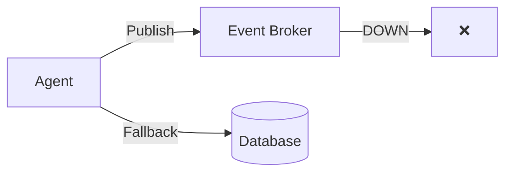

# Hybrid Polling and Event-Driven Systems: Getting the Best of Both Worlds

*Why you shouldn't choose between polling and events—and how to combine them for reliability.*

---

## The Religious War

In distributed systems, there are two camps:

**Team Polling:**
"Just check periodically. Simple. Reliable. No message broker complexity."

**Team Events:**
"Push notifications. Real-time. No wasted cycles on empty checks."

Both are right. Both are wrong. The answer is: **use both**.

---

## The Case for Events

When the Backend Engineer finishes a task, the CTO needs to know immediately. With polling:

```
T+0:00    Backend finishes
T+0:00    CTO polling sleep (14:55 remaining)
T+14:55   CTO checks, finds work
T+14:56   CTO starts review
```

That's 15 minutes of wasted time. With events:

```
T+0:00    Backend finishes
T+0:01    Event fires
T+0:02    CTO receives event
T+0:03    CTO starts review
```

Sub-second response. 15 minutes saved per handoff.

---

## The Case for Polling

But events have failure modes:

**Lost messages:** Network blip, Redis restart, subscriber crash.

**Missed subscriptions:** Agent starts after event fired.

**Ordering issues:** Events arrive out of sequence.

What happens then? Work sits unprocessed. Agents wait for events that never come. The system grinds to a halt.

Polling is the safety net:

```python
async def polling_safety_net():
    """Every 30 seconds, check for missed work."""
    while True:
        # Find tasks that should have events but didn't trigger
        stuck = await find_tasks_older_than(
            status="READY",
            threshold=timedelta(seconds=30)
        )

        for task in stuck:
            # Re-emit the event
            await event_bus.publish(TaskReadyEvent(task.id))
            logger.warning(f"Re-emitted event for task {task.id}")

        await asyncio.sleep(30)
```

If events work (99% of the time), great. If they fail, polling catches it within 30 seconds.

---

## The Hybrid Pattern



Events for speed. Polling for reliability. Together for both.

---

## Implementation: The Hybrid Agent

```python
class HybridAgent:
    def __init__(self, agent_id: str):
        self.agent_id = agent_id
        self.event_subscriber = EventSubscriber(agent_id)
        self.poll_interval = 30  # seconds

    async def start(self):
        # Start both mechanisms
        await asyncio.gather(
            self.event_loop(),
            self.polling_loop()
        )

    async def event_loop(self):
        """Primary: React to events immediately."""
        async for event in self.event_subscriber.listen():
            await self.process(event.data)

    async def polling_loop(self):
        """Fallback: Check for missed work periodically."""
        while True:
            await asyncio.sleep(self.poll_interval)

            # Find any work that might have been missed
            pending = await self.find_pending_work()

            for work in pending:
                # Check if already processed (idempotency)
                if not await self.already_processed(work):
                    await self.process(work)
```

### Key Design Decisions

**1. Idempotent Processing**

Both paths can trigger processing. Must handle duplicates:

```python
async def process(self, work: Work):
    # Check if already done
    if work.status in ["PROCESSING", "COMPLETE"]:
        return  # Idempotent: skip if already handled

    # Mark as processing (atomic)
    updated = await self.db.update(
        "work",
        {"id": work.id, "status": "PENDING"},  # Condition
        {"status": "PROCESSING"}               # Update
    )

    if not updated:
        return  # Another process got it

    # Actually process
    result = await self.do_work(work)

    # Mark complete
    await self.db.update(
        "work",
        {"id": work.id},
        {"status": "COMPLETE", "result": result}
    )
```

**2. Event Deduplication**

Same event might arrive multiple times:

```python
class DeduplicatingSubscriber:
    def __init__(self):
        self.seen_events = TTLCache(maxsize=10000, ttl=300)

    async def on_event(self, event: Event):
        if event.id in self.seen_events:
            return  # Already processed

        self.seen_events[event.id] = True
        await self.handler(event)
```

**3. Polling Efficiency**

Don't re-check everything every time:

```python
async def find_pending_work(self):
    """Only find work that's likely missed by events."""
    return await self.db.query("""
        SELECT * FROM tasks
        WHERE status = 'READY'
        AND assigned_to = $1
        AND updated_at < NOW() - INTERVAL '30 seconds'
        -- Only stuff older than event lag
        LIMIT 10
        -- Don't overload on backlog
    """, self.agent_id)
```

---

## Tuning the Balance

Different scenarios need different settings:

### High-Reliability Mode

When you can't afford to miss anything:

```python
SETTINGS = {
    "poll_interval": 10,        # Check every 10 seconds
    "event_retry_count": 5,     # Retry events 5 times
    "event_retry_delay": 1,     # 1 second between retries
    "stale_threshold": 15,      # Consider stale after 15 seconds
}
```

Higher overhead, maximum reliability.

### High-Performance Mode

When speed matters more than perfect reliability:

```python
SETTINGS = {
    "poll_interval": 60,        # Check every minute
    "event_retry_count": 2,     # Retry events twice
    "event_retry_delay": 0.1,   # Quick retries
    "stale_threshold": 45,      # Longer stale threshold
}
```

Lower overhead, faster under normal conditions.

### Adaptive Mode

Adjust based on observed behavior:

```python
class AdaptiveSettings:
    def __init__(self):
        self.event_miss_count = 0
        self.poll_interval = 30

    def on_polling_found_work(self):
        """Polling found work that events missed."""
        self.event_miss_count += 1

        if self.event_miss_count > 5:
            # Events unreliable, poll more frequently
            self.poll_interval = max(10, self.poll_interval - 5)
            logger.warning(f"Reduced poll interval to {self.poll_interval}")

    def on_event_processed(self):
        """Event processed successfully."""
        if self.event_miss_count > 0:
            self.event_miss_count -= 0.1  # Slow decay

        # Events reliable, poll less frequently
        if self.event_miss_count < 1 and self.poll_interval < 60:
            self.poll_interval = min(60, self.poll_interval + 1)
```

---

## Handling Specific Failure Modes

### 1. Event Broker Down



**Solution:** Write to database first, publish event second.

```python
async def complete_task(self, task: Task):
    # 1. Update database (durable)
    await self.db.update(task.id, {"status": "COMPLETE"})

    # 2. Publish event (best effort)
    try:
        await self.event_bus.publish(TaskCompleteEvent(task.id))
    except EventBrokerUnavailable:
        logger.warning("Event broker down, relying on polling")
        # Polling will pick this up
```

### 2. Subscriber Crash During Processing

**Problem:** Event delivered, processing started, subscriber crashes.

**Solution:** Event acknowledgment after processing.

```python
async def process_with_ack(self, event: Event):
    try:
        await self.do_processing(event)
        await self.event_bus.ack(event.id)  # Only ack on success
    except Exception:
        await self.event_bus.nack(event.id)  # Will be redelivered
        raise
```

### 3. Events Arrive Out of Order

**Problem:** "Task Completed" arrives before "Task Assigned"

**Solution:** State machine validation.

```python
VALID_TRANSITIONS = {
    "PENDING": ["ASSIGNED", "CANCELLED"],
    "ASSIGNED": ["IN_PROGRESS", "CANCELLED"],
    "IN_PROGRESS": ["COMPLETE", "BLOCKED", "CANCELLED"],
    "BLOCKED": ["IN_PROGRESS", "CANCELLED"],
    "COMPLETE": [],  # Terminal
}

async def handle_event(self, event: TaskStatusEvent):
    task = await self.get_task(event.task_id)

    if event.new_status not in VALID_TRANSITIONS.get(task.status, []):
        # Out of order - queue for later
        await self.queue_for_retry(event, delay=5)
        return

    await self.apply_status_change(task, event.new_status)
```

---

## Monitoring Hybrid Systems

Track both paths to understand system health:

```python
METRICS = {
    # Event path
    "events_received": Counter("Total events received"),
    "events_processed": Counter("Events processed successfully"),
    "events_failed": Counter("Events that failed processing"),
    "event_latency": Histogram("Time from publish to process"),

    # Polling path
    "poll_checks": Counter("Polling check runs"),
    "poll_found_work": Counter("Work found by polling"),
    "poll_rescued_events": Counter("Events rescued by polling"),

    # Health
    "event_miss_rate": Gauge("Percentage of work found by polling"),
}

async def update_miss_rate():
    """Calculate what percentage of work polling is catching."""
    total = METRICS["events_processed"].value + METRICS["poll_found_work"].value
    if total > 0:
        miss_rate = METRICS["poll_found_work"].value / total
        METRICS["event_miss_rate"].set(miss_rate)
```

### Healthy System

```
Event Path:     98% of work
Polling Path:    2% of work (safety catches)
Event Latency:  <100ms
Poll Rescues:   <5/hour
```

### Degraded System

```
Event Path:     70% of work
Polling Path:   30% of work (events missing)
Event Latency:  >500ms
Poll Rescues:   >50/hour
```

Action: Investigate event broker, network, subscriber health.

---

## The Deviant Implementation

Deviant uses hybrid polling/events throughout:

```python
# Agent base class
class BaseAgent:
    async def start(self):
        await asyncio.gather(
            self.subscribe_to_events(),     # Fast path
            self.periodic_work_check(),     # Safety net
            self.health_reporting()         # Status updates
        )

    async def subscribe_to_events(self):
        """React to events immediately."""
        async for event in self.event_bus.subscribe(self.subscriptions):
            await self.handle_event(event)

    async def periodic_work_check(self):
        """Catch anything events missed."""
        while True:
            await asyncio.sleep(30)
            pending = await self.find_my_pending_work()
            for work in pending:
                if await self.should_process(work):
                    await self.process(work)
```

---

## The Takeaway

Don't choose between polling and events. Use both:

1. **Events** for speed (<100ms response)
2. **Polling** for reliability (30-second safety net)
3. **Idempotent handlers** to support both paths
4. **Monitoring** to understand which path is doing work

The result: fast when everything works, reliable when it doesn't.

---

**Next**: [Goal-Aware Task Execution: Context-Driven AI →](./03-goal-aware-execution.md)

---

*Nicanor Korir has debugged distributed systems at 3 AM. Hybrid polling/events means fewer 3 AM pages.*
