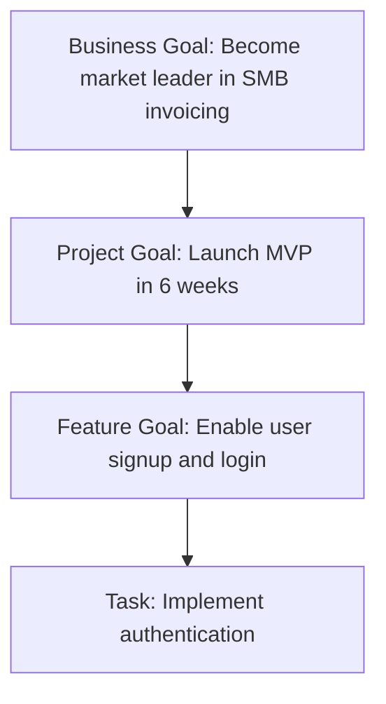

# Goal-Aware Task Execution: Building AI Agents That Understand "Why"

*How to make agents that don't just complete tasks—but complete them the right way.*

---

## The Task Blindness Problem

Ask an AI to "implement user authentication" and it'll generate code. Functional code. Technically correct code.

But is it the *right* code for your project?

If your goal is rapid prototyping, you want simple password auth.
If your goal is enterprise sales, you need SSO and audit logging.
If your goal is user privacy, you need passwordless flows.

Same task. Different goals. Different correct implementations.

Standard AI agents are task-blind. They see "implement authentication" and pick a random valid approach. Goal-aware agents see the task *in context* and choose accordingly.

---

## The Goal Hierarchy

Every task exists in a hierarchy of intent:



When executing the task, the agent should consider:
- **Business goal:** SMB market → simple, not enterprise
- **Project goal:** 6 weeks → speed over perfection
- **Feature goal:** Signup and login → basic auth, not advanced

The "right" implementation emerges from context.

---

## Implementing Goal Awareness

### 1. Project Intent Definition

Every project starts with explicit intent:

```python
class ProjectIntent:
    business_goal: str          # Why this project matters
    success_criteria: List[str] # How we measure success
    constraints: Constraints    # Timeline, budget, quality bars
    priorities: List[str]       # What matters most

project_intent = ProjectIntent(
    business_goal="Capture SMB invoicing market with simple, delightful UX",
    success_criteria=[
        "User can create invoice in <2 minutes",
        "NPS >50 within first month",
        "Zero critical bugs at launch"
    ],
    constraints=Constraints(
        timeline="6 weeks to MVP",
        budget="Minimal—bootstrap phase",
        quality="Good enough, not perfect"
    ),
    priorities=[
        "Speed of development",
        "User experience simplicity",
        "Reliability"
    ]
)
```

### 2. Task-Goal Mapping

Each task links to higher-level goals:

```python
class Task:
    id: str
    title: str
    description: str
    goal_contribution: GoalContribution

class GoalContribution:
    feature_goal: str           # What feature this enables
    success_criteria: List[str] # Which criteria this supports
    priority_alignment: str     # Which priority this serves

task = Task(
    id="auth-001",
    title="Implement user authentication",
    description="Enable users to sign up and log in",
    goal_contribution=GoalContribution(
        feature_goal="User can access their data securely",
        success_criteria=["User can create invoice in <2 minutes"],
        priority_alignment="Speed of development"
    )
)
```

### 3. Decision Framework

When agents make choices, they score against goals:

```python
class DecisionFramework:
    async def evaluate_options(
        self,
        task: Task,
        options: List[Option]
    ) -> Option:
        intent = await self.get_project_intent(task.project_id)

        scored_options = []
        for option in options:
            score = self.score_against_goals(option, intent)
            scored_options.append((option, score))

        # Return highest-scoring option
        return max(scored_options, key=lambda x: x[1])[0]

    def score_against_goals(
        self,
        option: Option,
        intent: ProjectIntent
    ) -> float:
        scores = []

        # Score against priorities
        for priority in intent.priorities:
            if self.supports_priority(option, priority):
                scores.append(1.0)
            else:
                scores.append(0.5)

        # Score against constraints
        if option.complexity <= intent.constraints.budget_level:
            scores.append(1.0)
        else:
            scores.append(0.3)

        if option.implementation_time <= intent.constraints.timeline:
            scores.append(1.0)
        else:
            scores.append(0.1)

        return sum(scores) / len(scores)
```

---

## Example: Authentication Decision

The Backend Engineer receives a task: "Implement user authentication"

### Without Goal Awareness

```
Agent: I'll implement JWT with refresh tokens, social OAuth,
       passwordless magic links, and hardware key support.

Result: 2 weeks of development. Enterprise-grade. Overkill for MVP.
```

### With Goal Awareness

```
Agent thinking:
- Project priority: Speed of development
- Success criteria: User can create invoice in <2 minutes
- Constraint: 6 weeks to MVP

Options evaluated:
1. Full OAuth + passwordless + hardware keys
   - Time: 2 weeks
   - Alignment: Low (priority is speed)
   - Score: 0.3

2. Email/password with JWT
   - Time: 3 days
   - Alignment: High (fast, simple)
   - Score: 0.9

3. Magic link only
   - Time: 2 days
   - Alignment: Medium (fast, might confuse some users)
   - Score: 0.7

Decision: Email/password with JWT. Fast to implement, familiar to users.
```

---

## The Goal-Aware Agent Mixin

```python
class GoalAwareMixin:
    """Add to any agent to enable goal-aware execution."""

    async def start_task(self, task: Task):
        # Load project intent
        self.current_intent = await self.load_project_intent(task.project_id)

        # Log goal context
        await self.log_thought(f"""
            Starting task: {task.title}
            Project priority: {self.current_intent.priorities[0]}
            Key constraint: {self.current_intent.constraints.timeline}
            My contribution: {task.goal_contribution.success_criteria}
        """)

        # Execute with context
        await self.execute_with_goals(task)

    async def make_decision(
        self,
        question: str,
        options: List[str]
    ) -> Decision:
        # Score options against current intent
        scored = []
        for option in options:
            score = await self.score_option(option, self.current_intent)
            scored.append((option, score))

        # Choose best option
        best_option, best_score = max(scored, key=lambda x: x[1])

        # Log decision with reasoning
        decision = Decision(
            question=question,
            choice=best_option,
            score=best_score,
            reasoning=self.explain_choice(best_option, self.current_intent)
        )

        await self.log_decision(decision)
        return decision

    def explain_choice(
        self,
        option: str,
        intent: ProjectIntent
    ) -> str:
        return f"""
            Chose: {option}
            Reason: Aligns with priority '{intent.priorities[0]}'
            Timeline fit: {intent.constraints.timeline}
            Supports: {intent.success_criteria[0]}
        """
```

---

## Handling Goal Conflicts

Sometimes goals conflict. Speed vs quality. Features vs simplicity.

### Priority Ordering

Explicit priority order resolves conflicts:

```python
priorities = [
    "Speed of development",    # First priority
    "User experience",         # Second priority
    "Code quality",            # Third priority
]

# When speed conflicts with quality, speed wins
# When UX conflicts with code quality, UX wins
```

### Explicit Trade-off Rules

```python
trade_off_rules = {
    ("speed", "quality"): "speed",       # Prefer speed
    ("speed", "security"): "security",   # Never compromise security
    ("features", "simplicity"): "simplicity",  # Less is more
}
```

### Human Escalation

When no clear winner:

```python
async def handle_conflict(
    self,
    option_a: Option,
    option_b: Option,
    scores: dict
) -> Option:
    score_diff = abs(scores[option_a] - scores[option_b])

    if score_diff < 0.1:  # Too close to call
        # Escalate to human
        decision = await self.request_human_input(
            question=f"Should we prioritize {option_a} or {option_b}?",
            context=self.current_intent
        )
        return decision

    # Clear winner
    return option_a if scores[option_a] > scores[option_b] else option_b
```

---

## Decision Logging and Audit

Every goal-aligned decision is logged:

```python
class DecisionLog:
    decision_id: str
    task_id: str
    timestamp: datetime
    question: str
    options_considered: List[str]
    option_scores: dict
    chosen_option: str
    reasoning: str
    goal_alignment: float
    project_intent_snapshot: ProjectIntent

# Example log entry
{
    "decision_id": "dec_123",
    "task_id": "auth-001",
    "timestamp": "2024-01-15T10:30:00Z",
    "question": "Which authentication approach?",
    "options_considered": [
        "Full OAuth",
        "Email/password JWT",
        "Magic links"
    ],
    "option_scores": {
        "Full OAuth": 0.3,
        "Email/password JWT": 0.9,
        "Magic links": 0.7
    },
    "chosen_option": "Email/password JWT",
    "reasoning": "Aligns with speed priority, familiar to target users",
    "goal_alignment": 0.9,
    "project_intent_snapshot": {
        "priorities": ["Speed of development"],
        "constraints": {"timeline": "6 weeks"}
    }
}
```

This enables:
- Understanding why decisions were made
- Improving decision quality over time
- Auditing for consistency

---

## Measuring Goal Alignment

### Quantitative Metrics

```python
class GoalAlignmentMetrics:
    async def calculate(self, project_id: str) -> dict:
        decisions = await self.get_project_decisions(project_id)

        return {
            "avg_alignment_score": self.average(
                d.goal_alignment for d in decisions
            ),
            "low_alignment_decisions": len([
                d for d in decisions if d.goal_alignment < 0.5
            ]),
            "decisions_with_reasoning": len([
                d for d in decisions if d.reasoning
            ]) / len(decisions),
            "human_escalations": len([
                d for d in decisions if d.escalated_to_human
            ])
        }
```

### Target Metrics

| Metric | Target | Action if Below |
|--------|--------|-----------------|
| Avg alignment score | >0.8 | Review intent clarity |
| Low-alignment decisions | <10% | Review agent prompts |
| Decisions with reasoning | 100% | Improve logging |
| Human escalations | <5% | Refine decision rules |

---

## Real Example: Retinue in Action

### Project Intent

```python
intent = ProjectIntent(
    business_goal="Build internal dashboard for analytics team",
    success_criteria=[
        "Dashboard loads in <3 seconds",
        "Team adopts within 2 weeks",
        "Zero training needed—self-explanatory UI"
    ],
    constraints=Constraints(
        timeline="2 weeks",
        budget="Internal project—minimal",
        quality="Functional over polished"
    ),
    priorities=[
        "Speed of delivery",
        "Usability",
        "Performance"
    ]
)
```

### Designer Agent Decision

Task: Design the dashboard layout

```
Options considered:
1. Full design system with custom components
2. Pre-built component library (shadcn/ui)
3. Minimal styling, focus on data

Scores:
1. Full design system: 0.3 (too slow for timeline)
2. Pre-built components: 0.9 (fast, professional, usable)
3. Minimal styling: 0.6 (fast but hurts usability)

Decision: Pre-built component library
Reasoning: Achieves professional look within 2-week timeline,
           supports "zero training needed" success criteria
```

### Backend Engineer Decision

Task: Implement data API

```
Options considered:
1. GraphQL with subscriptions for real-time
2. REST API with polling
3. REST API with WebSocket updates

Scores:
1. GraphQL: 0.4 (complex, overkill for internal tool)
2. REST + polling: 0.7 (simple, acceptable refresh lag)
3. REST + WebSocket: 0.8 (simple to implement, real-time updates)

Decision: REST API with WebSocket updates
Reasoning: Balances simplicity (speed priority) with performance
           (dashboard loads in <3 seconds)
```

---

## The Takeaway

Task-blind agents complete tasks. Goal-aware agents complete projects.

The difference is context:
1. **Define intent explicitly** at project level
2. **Map tasks to goals** so agents understand contribution
3. **Score decisions against priorities** not just correctness
4. **Log reasoning** for transparency and improvement
5. **Handle conflicts** with clear rules or escalation

The result: agents that make decisions like informed team members, not isolated workers.

---

*This completes the Design Patterns series. Check out Challenges for honest reflections on what goes wrong, or Future Plans for where Retinue is heading.*

---

*Nicanor Korir has watched AIs build the wrong thing correctly. Goal-aware execution is the fix.*
