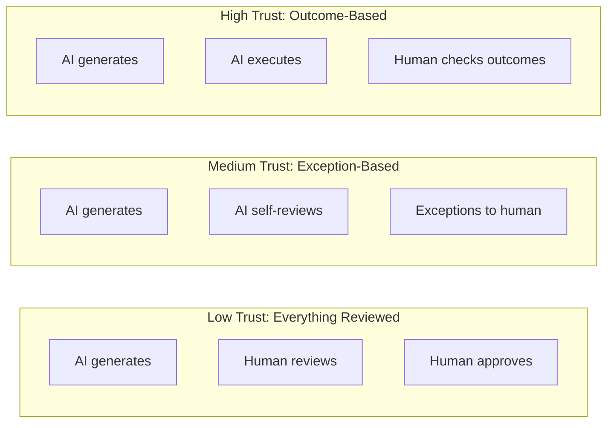

# Building Trust in Autonomous Systems: The Human Oversight Balance

*How much autonomy is too much? Finding the right balance between AI independence and human control.*

---

## The Trust Paradox

Here's the uncomfortable truth about autonomous AI:

If you don't trust it, you review everything. At that point, you're doing the work anyway—just with extra steps.

If you trust it completely, you miss mistakes. And AI makes mistakes. Confidently. Without doubt.

The goal isn't full autonomy or full oversight. It's the right balance for the right situations.

---

## The Trust Spectrum



Retinue operates primarily in the **medium trust** zone:
- Agents self-coordinate for most decisions
- Built-in review (CTO reviews code)
- Escalation for exceptions
- Human approval for critical decisions

---

## What Retinue Decides Autonomously

### Green Zone: AI Decides

These decisions happen without human involvement:

**Task execution approach**
- How to implement a feature
- Which patterns to use
- Code structure and organization

**Inter-agent coordination**
- Who works on what
- When to hand off work
- Review requests and responses

**Self-correction**
- Fixing issues caught in review
- Retrying failed operations
- Recovering from errors

### Yellow Zone: AI Proposes, Human Can Override

These decisions are made by AI but visible for override:

**Task breakdown**
- PM breaks project into tasks
- Human sees the breakdown
- Can modify before execution

**Technical decisions**
- CTO recommends architecture
- Visible in decision log
- Human can override

**Priority ordering**
- PM orders tasks by dependency
- Human can reorder if needed

### Red Zone: Human Decides

These require explicit human approval:

**Project approval**
- CEO recommends, human approves
- Budget implications visible
- No work starts without human OK

**Production deployment**
- All code generated, but not deployed
- Human must take output to production

**Scope changes**
- If project scope changes significantly
- Escalation for human decision

---

## Trust Calibration Over Time

Trust isn't static. It's earned through successful execution.

### The Trust Score

```python
class TrustScore:
    def __init__(self, agent_id: str):
        self.agent_id = agent_id
        self.successful_tasks = 0
        self.failed_tasks = 0
        self.escalations_needed = 0

    @property
    def score(self) -> float:
        if self.total_tasks == 0:
            return 0.5  # Neutral starting trust

        success_rate = self.successful_tasks / self.total_tasks
        escalation_rate = self.escalations_needed / self.total_tasks

        # High success + low escalation = high trust
        return success_rate * (1 - escalation_rate * 0.5)

    @property
    def autonomy_level(self) -> str:
        if self.score > 0.9:
            return "high"  # Minimal oversight needed
        elif self.score > 0.7:
            return "medium"  # Standard oversight
        else:
            return "low"  # Increased oversight
```

### Autonomy Adjustment

As trust changes, oversight adjusts:

```python
class OversightAdjuster:
    async def get_oversight_level(self, agent: Agent) -> OversightConfig:
        trust = await self.get_trust_score(agent.id)

        if trust.autonomy_level == "high":
            return OversightConfig(
                auto_approve_simple=True,
                review_sampling_rate=0.1,  # Review 10% of work
                escalation_threshold=0.3
            )
        elif trust.autonomy_level == "medium":
            return OversightConfig(
                auto_approve_simple=False,
                review_sampling_rate=0.5,  # Review 50% of work
                escalation_threshold=0.5
            )
        else:  # Low trust
            return OversightConfig(
                auto_approve_simple=False,
                review_sampling_rate=1.0,  # Review everything
                escalation_threshold=0.7
            )
```

---

## Transparency: The Foundation of Trust

You can't trust what you can't see. Retinue provides:

### Decision Logs

Every decision with reasoning:

```json
{
  "decision_id": "dec_456",
  "agent": "CTO",
  "type": "code_review",
  "timestamp": "2024-01-15T14:30:00Z",
  "input": {
    "task_id": "task_123",
    "code_length": 250,
    "file_type": "python"
  },
  "analysis": {
    "code_quality": 0.85,
    "security_issues": [],
    "performance_concerns": ["n+1 query potential"],
    "style_compliance": 0.92
  },
  "decision": "APPROVE_WITH_NOTES",
  "reasoning": "Code quality acceptable, noted potential n+1 query for future optimization"
}
```

### Communication History

Every message between agents:

```
[14:25:03] PM → Backend Engineer: Task assigned: Implement user auth
[14:25:05] Backend Engineer → PM: Acknowledged, starting task
[14:31:22] Backend Engineer → CTO: Requesting review of auth implementation
[14:31:24] CTO → Backend Engineer: Review started
[14:35:18] CTO → Backend Engineer: Approved with notes: Consider rate limiting
[14:35:20] Backend Engineer → PM: Task complete
```

### Audit Trail

Complete history of all actions:

```python
class AuditLog:
    async def log_action(
        self,
        actor: str,
        action: str,
        target: str,
        details: dict,
        outcome: str
    ):
        await self.db.insert("audit_log", {
            "timestamp": datetime.now(),
            "actor": actor,
            "action": action,
            "target": target,
            "details": details,
            "outcome": outcome,
            "session_id": self.current_session
        })
```

---

## Handling Disagreement

What happens when you disagree with AI decisions?

### Override Mechanism

Any AI decision can be overridden:

```python
class DecisionOverride:
    async def override(
        self,
        decision_id: str,
        new_decision: str,
        reason: str,
        overrider: str
    ):
        original = await self.get_decision(decision_id)

        # Log the override
        await self.audit.log_action(
            actor=overrider,
            action="OVERRIDE_DECISION",
            target=decision_id,
            details={
                "original": original.decision,
                "new": new_decision,
                "reason": reason
            },
            outcome="OVERRIDDEN"
        )

        # Apply the new decision
        await self.apply_decision(decision_id, new_decision)

        # Update trust score (if AI was wrong)
        if self.was_ai_wrong(original, new_decision):
            await self.trust_score.record_correction(original.agent)
```

### Feedback Loop

Overrides improve future decisions:

```python
class LearningFromOverrides:
    async def process_override(self, override: Override):
        # Extract what went wrong
        original_decision = await self.get_decision(override.decision_id)
        context = await self.get_decision_context(override.decision_id)

        # Create learning entry
        learning = LearningEntry(
            situation=context,
            original_decision=original_decision.decision,
            correct_decision=override.new_decision,
            explanation=override.reason
        )

        # Store in knowledge base
        await self.knowledge_base.add(learning)

        # Future decisions will retrieve this as context
```

---

## Escalation Design

Not every decision should reach humans. Escalation filters the important ones.

### Escalation Triggers

```python
ESCALATION_RULES = [
    # High-impact decisions
    EscalationRule(
        condition="budget_impact > $1000",
        severity="HIGH",
        notify=["project_owner"]
    ),

    # Agent stuck
    EscalationRule(
        condition="task_duration > 2 hours",
        severity="MEDIUM",
        notify=["pm_agent", "hr_agent"]
    ),

    # Quality concerns
    EscalationRule(
        condition="rejection_count >= 3",
        severity="HIGH",
        notify=["cto_agent", "project_owner"]
    ),

    # Security issues
    EscalationRule(
        condition="security_issue_detected",
        severity="CRITICAL",
        notify=["cto_agent", "project_owner", "security_team"]
    ),

    # Novel situation
    EscalationRule(
        condition="confidence < 0.5",
        severity="MEDIUM",
        notify=["relevant_agent", "project_owner"]
    )
]
```

### Escalation UI

Clear presentation of what needs attention:

```
┌─────────────────────────────────────────────────────────────┐
│ ESCALATION: Task Stuck in Review                            │
├─────────────────────────────────────────────────────────────┤
│ Task: Implement payment integration                         │
│ Status: IN_REVIEW for 4 hours                               │
│ Agent: Backend Engineer                                     │
│ Reviewer: CTO Agent                                         │
│                                                             │
│ Issue: CTO has requested 4 revisions. Pattern suggests      │
│        scope mismatch between task definition and           │
│        reviewer expectations.                               │
│                                                             │
│ Recommended Actions:                                        │
│ [1] Review task scope with PM                               │
│ [2] Accept current output as-is                             │
│ [3] Reassign to different engineer                          │
│ [4] Cancel and redefine task                                │
│                                                             │
│ Your decision: _                                            │
└─────────────────────────────────────────────────────────────┘
```

---

## The Human Responsibility

Autonomy isn't about humans doing nothing. It's about humans doing the right things.

### What Humans Must Do

**Set clear intent**
- Define project goals explicitly
- Specify constraints and priorities
- Communicate success criteria

**Review outcomes**
- Check completed work meets requirements
- Verify quality meets standards
- Confirm alignment with goals

**Handle exceptions**
- Respond to escalations promptly
- Make judgment calls when needed
- Override when AI is wrong

**Improve the system**
- Provide feedback on AI decisions
- Refine prompts and rules
- Update guardrails based on experience

### What Humans Shouldn't Do

**Micromanage every task**
- Defeats the purpose of autonomy
- Slows down execution
- Creates bottleneck

**Ignore escalations**
- System degrades without feedback
- Problems compound
- Trust erodes

**Assume AI is always right**
- AI makes confident mistakes
- Human judgment essential for edge cases
- Outcomes need verification

---

## My Personal Balance

After months of using Retinue, here's my oversight approach:

**Daily (10 min):**
- Check dashboard for stuck items
- Review any escalations
- Glance at recent decisions

**Per project:**
- Approve project initiation (2 min)
- Review task breakdown (5 min)
- Check final output (30 min)

**Weekly:**
- Review decision quality
- Check cost trends
- Adjust trust levels if needed

**Total oversight: ~3 hours/week** for projects that would take 40+ hours to do myself.

---

## The Takeaway

Trust in autonomous systems is:
- **Earned** through successful execution
- **Verified** through transparency
- **Calibrated** based on outcomes
- **Maintained** through appropriate oversight

The goal isn't to replace human judgment. It's to focus human judgment where it matters most.

---

*This completes the Challenges series. Check out Future Plans for where Retinue is heading—more autonomy, better control, and the vision for AI companies that build real products.*

---

*Nicanor Korir trusts his AI team—but verifies regularly. This balance took months to find.*
