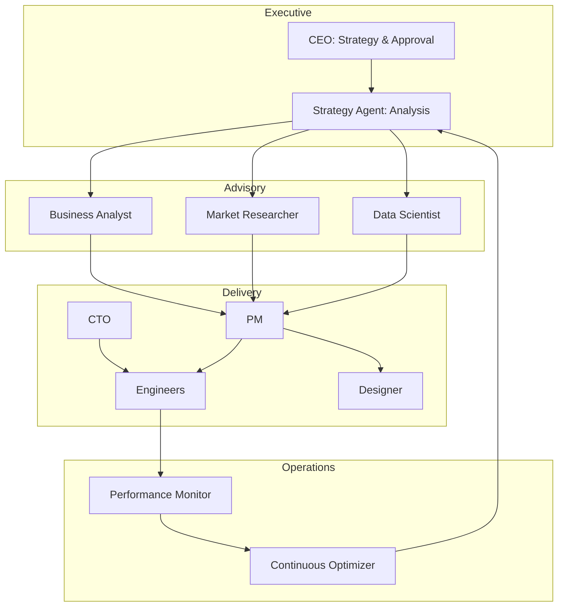

# From Agent to Consultant: The Autonomous Consulting Company

*The vision for AI that doesn't just execute tasks—but advises, strategizes, and delivers complete solutions.*

---

## The Current State

Today, Deviant is an execution engine. You tell it what to build, and it builds.

That's valuable. But it's not the end state.

Real consulting firms don't just execute. They:
- Understand your business problem
- Propose solutions you didn't think of
- Challenge your assumptions
- Deliver outcomes, not just outputs

That's where Deviant is heading.

---

## The Evolution Path

```mermaid
flowchart LR
    subgraph Phase1["Phase 1: Executor (Current)"]
        P1A[Human: Define project]
        P1B[Deviant: Build it]
        P1C[Human: Deploy]
    end

    subgraph Phase2["Phase 2: Advisor"]
        P2A[Human: Describe problem]
        P2B[Deviant: Propose solutions]
        P2C[Human: Choose approach]
        P2D[Deviant: Build it]
    end

    subgraph Phase3["Phase 3: Consultant"]
        P3A[Human: Share context]
        P3B[Deviant: Analyze & strategize]
        P3C[Deviant: Propose & build]
        P3D[Deviant: Measure & iterate]
    end

    Phase1 --> Phase2 --> Phase3
```



---

## Phase 2: The Advisor

### What Changes

Instead of "Build me a dashboard," you say "My sales team can't track performance."

The CEO Agent doesn't just evaluate feasibility. It:
- Asks clarifying questions
- Researches similar solutions
- Proposes 2-3 approaches with trade-offs
- Recommends the best fit

```
Human: My sales team can't track their performance effectively.

CEO Agent: I'd like to understand more about this challenge.

Questions:
1. What does your sales team currently use for tracking?
2. What metrics matter most (revenue, calls, conversion)?
3. Who needs to see this data (reps, managers, executives)?
4. Any existing systems this needs to integrate with?

[Human answers]

CEO Agent: Based on your context, I see three approaches:

Option A: Real-time Dashboard
- Pros: Immediate visibility, motivating for reps
- Cons: Requires data pipeline, ongoing maintenance
- Effort: Medium
- Recommended if: Team is competitive, needs daily motivation

Option B: Weekly Reporting System
- Pros: Simpler, forces reflection, less infrastructure
- Cons: Less immediate feedback
- Effort: Low
- Recommended if: Team prefers analysis over real-time data

Option C: CRM Integration Enhancement
- Pros: Uses existing tools, no new system to learn
- Cons: Limited to CRM capabilities
- Effort: Low-Medium
- Recommended if: Already heavily using CRM

My recommendation: Option A with a simplified MVP first.
Shall I proceed with detailed planning?
```

### Implementation Approach

**Enhanced CEO Agent prompt:**
```python
CEO_ADVISOR_PROMPT = """
You are the CEO of an AI consulting company.

When a human presents a problem:
1. Ask clarifying questions (max 5)
2. Wait for answers
3. Analyze the problem space
4. Propose 2-4 solutions with trade-offs
5. Make a recommendation with reasoning
6. Only proceed with planning after human approval

Never assume you know what they need.
Always validate understanding before building.
"""
```

**Conversation flow support:**
```python
class AdvisoryConversation:
    async def handle_problem_statement(
        self,
        human_input: str
    ) -> CEOResponse:
        # First interaction: Ask questions
        if not self.questions_answered:
            return await self.ceo.generate_questions(human_input)

        # Second interaction: Propose solutions
        if not self.solution_chosen:
            return await self.ceo.propose_solutions(
                problem=human_input,
                answers=self.human_answers
            )

        # Third interaction: Plan and execute
        return await self.ceo.plan_solution(
            solution=self.chosen_solution
        )
```

---

## Phase 3: The Consultant

### Full Autonomy with Oversight

The vision: You share your business context once. Deviant continuously identifies opportunities, proposes initiatives, and—with approval—executes them.

```
Human onboarding:
"I run a B2B SaaS for project management.
500 customers, $50k MRR, 5% monthly churn.
Main challenge: reducing churn."

Deviant (ongoing):

Week 1: "Analyzed usage patterns. Found 3 churn predictors:
- Login frequency dropping
- Feature adoption < 3 features
- No integrations connected
Proposing: Early warning dashboard for CS team.
[Approve to build]"

Week 2: "Built dashboard. Suggested: Automated email sequence
when users show churn signals. Here's the proposed flow.
[Approve to implement]"

Week 3: "Email sequence live. Early data: 15% of at-risk
users re-engaged. Proposing: In-app prompts for feature
adoption. Here's the design.
[Approve to build]"
```

### The Consulting Agent Team

New agents for full consulting capability:



### New Agent Roles

**Strategy Agent**
- Synthesizes business context
- Identifies opportunities
- Proposes initiatives
- Tracks strategic alignment

**Business Analyst**
- Understands business processes
- Maps user journeys
- Identifies pain points
- Quantifies impact

**Market Researcher**
- Monitors industry trends
- Analyzes competitors
- Identifies market gaps
- Informs product direction

**Data Scientist**
- Analyzes user behavior
- Builds predictive models
- Measures outcomes
- Enables data-driven decisions

**Performance Monitor**
- Tracks deployed solutions
- Measures KPIs
- Detects issues
- Reports on impact

**Continuous Optimizer**
- A/B tests changes
- Recommends improvements
- Implements optimizations
- Iterates on performance

---

## The Trust Model Evolution

As autonomy increases, trust mechanisms evolve:

### Phase 1: Task-Level Trust
- Human approves every project
- Human reviews every output
- AI executes, human validates

### Phase 2: Initiative-Level Trust
- Human approves initiatives
- AI handles task-level decisions
- Human reviews outcomes, not steps

### Phase 3: Outcome-Level Trust
- Human sets goals and constraints
- AI proposes and executes initiatives
- Human approves high-impact changes
- AI handles routine optimization

```python
class TrustEvolution:
    PHASE_1 = {
        "project_approval": "human_required",
        "task_approval": "human_review",
        "output_approval": "human_required"
    }

    PHASE_2 = {
        "project_approval": "human_required",
        "task_approval": "ai_with_logging",
        "output_approval": "outcome_based"
    }

    PHASE_3 = {
        "project_approval": "human_for_high_impact",
        "task_approval": "ai_autonomous",
        "output_approval": "outcome_based",
        "optimization": "ai_continuous"
    }
```

---

## Real-World Consulting Scenarios

### Scenario 1: Startup Growth

**Input:**
"Early-stage SaaS, 100 users, need to grow to 1000 for Series A."

**Deviant Consulting Response:**
```
Analysis complete. Current state:
- 100 users, mostly from founder network
- No systematic acquisition channel
- High engagement but low expansion

Proposed initiatives:
1. [High impact] Content marketing engine
   - SEO-optimized blog posts
   - Email capture and nurture
   - Estimated impact: 300 organic users in 6 months

2. [Medium impact] Referral program
   - In-app referral mechanism
   - Incentive structure
   - Estimated impact: 50 users in 3 months

3. [Quick win] LinkedIn thought leadership
   - Content calendar
   - Engagement automation
   - Estimated impact: 100 users in 3 months

Recommendation: Start with #3 (fastest), then #2, then #1.
Total estimated: 450 new users in 6 months.

Shall I build the LinkedIn content system first?
```

### Scenario 2: Operations Optimization

**Input:**
"Our customer support team is overwhelmed. 200 tickets/day, 4 agents."

**Deviant Consulting Response:**
```
Analysis of your support situation:

Current capacity: 4 agents × 50 tickets/day = 200 tickets
You're at 100% capacity with no room for growth.

Proposed solutions:

1. [Immediate] AI-assisted responses
   - Generate draft responses for agents
   - Reduce handle time by 40%
   - New capacity: ~280 tickets/day
   - Build time: 2 weeks

2. [Short-term] Self-service knowledge base
   - Auto-generate from past tickets
   - Reduce ticket volume by 25%
   - New volume: 150 tickets/day
   - Build time: 3 weeks

3. [Medium-term] Ticket routing and prioritization
   - AI categorization and urgency scoring
   - Reduce escalations by 30%
   - Improve resolution time
   - Build time: 4 weeks

Implementing all three: 150 tickets/day to handle,
280 capacity = 53% utilization (room for growth).

Recommended order: 2, 1, 3.
Shall I start with the knowledge base?
```

---

## The Business Model Evolution

### Phase 1: Tool Pricing
- Pay per project/agent-hour
- SaaS subscription model
- Customer drives usage

### Phase 2: Advisor Pricing
- Per consultation engagement
- Strategy packages
- Premium for recommendations

### Phase 3: Consultant Pricing
- Outcome-based pricing
- Revenue share on improvements
- Retainer for ongoing optimization

```
Pricing Evolution:

Phase 1: "$99/month for X agent-hours"
Phase 2: "$499/engagement for strategy + execution"
Phase 3: "2% of revenue improvement" or "$2,000/month retainer"
```

---

## Technical Requirements

To reach Phase 3, Deviant needs:

**Long-term memory**
- Business context persistence
- Historical decision tracking
- Learning from outcomes

**External integrations**
- Analytics platforms (Mixpanel, Amplitude)
- CRM systems (HubSpot, Salesforce)
- Communication tools (Slack, Email)

**Continuous operation**
- 24/7 monitoring
- Automated optimization
- Proactive alerting

**Human-AI collaboration**
- Natural conversation interface
- Approval workflows
- Feedback mechanisms

---

## The Vision

Imagine a world where:

Every founder has access to McKinsey-level strategic advice.
Every startup has a full consulting team working around the clock.
Every business decision is informed by data and analysis.

Not because AI replaces human judgment—but because it amplifies it.

That's the consultant model. That's where Deviant is heading.

---

**Next**: [Full User Control: Putting Humans in the Driver's Seat →](./02-full-user-control.md)

---

*Nicanor Korir has hired consultants and been a consultant. Deviant is the consulting company he wished was affordable for everyone.*
