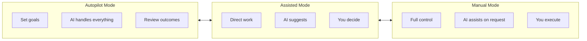
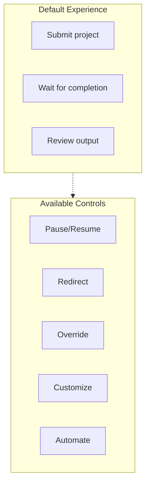

# Full User Control: Putting Humans in the Driver's Seat

*The vision for AI agents that are powerful AND completely controllable.*

---

## The Control Dilemma

There's a tension in autonomous AI:

**More autonomy** = faster execution, less human effort
**More control** = better alignment, more human effort

Most AI tools choose one side. Retinue aims to offer both—maximum power when you want it, complete control when you need it.

---

## The Control Spectrum



Users should be able to slide between modes fluidly—even within a single project.

---

## Control Features Roadmap

### 1. Granular Approval Controls

**Current:** CEO approves projects.

**Future:** Configurable approval requirements.

```python
class ApprovalConfig:
    # Project level
    require_human_approval_for_projects: bool = True
    auto_approve_below_budget: Optional[float] = None

    # Task level
    require_human_approval_for_tasks: bool = False
    require_human_approval_for_task_types: List[str] = ["security", "database"]

    # Decision level
    require_human_approval_for_decisions: List[str] = ["architecture", "technology_choice"]
    auto_approve_decisions_with_confidence_above: float = 0.9

    # Output level
    require_human_approval_for_output: bool = False
    require_human_approval_for_output_types: List[str] = ["production_code"]
```

**UI Example:**

```
Project Controls
─────────────────────────────────────────────────
[x] Require my approval before starting projects
[x] Require my approval for tasks over $10 in API cost
[ ] Let AI handle all task-level decisions
[x] Show me architecture decisions before proceeding
[x] Require my approval before marking complete
```

### 2. Real-Time Intervention

**Current:** Wait for escalations.

**Future:** Intervene any time.

```python
class InterventionSystem:
    async def pause_agent(self, agent_id: str, reason: str):
        """Immediately pause an agent's work."""
        await self.set_agent_status(agent_id, "PAUSED")
        await self.notify_agent(agent_id, f"Paused by human: {reason}")

    async def redirect_task(self, task_id: str, new_direction: str):
        """Change task direction mid-execution."""
        task = await self.get_task(task_id)
        task.human_guidance = new_direction
        await self.restart_task(task)

    async def override_decision(self, decision_id: str, new_choice: str):
        """Override a decision and continue from there."""
        await self.apply_override(decision_id, new_choice)
        await self.resume_from_decision(decision_id)

    async def inject_context(self, agent_id: str, context: str):
        """Add information to agent's working context."""
        await self.add_to_context(agent_id, {
            "type": "human_input",
            "content": context,
            "timestamp": datetime.now()
        })
```

**UI Example:**

```
┌─────────────────────────────────────────────────────────────┐
│ Backend Engineer - Working on: User Authentication          │
│ Status: Generating code (45% complete)                      │
├─────────────────────────────────────────────────────────────┤
│ Live Output:                                                 │
│ > Implementing JWT token generation...                      │
│ > Adding refresh token logic...                             │
│                                                             │
│ [⏸ Pause] [🔄 Redirect] [💬 Add Context] [🛑 Cancel]        │
├─────────────────────────────────────────────────────────────┤
│ Quick guidance: ________________________________________     │
│ [Send to agent]                                             │
└─────────────────────────────────────────────────────────────┘
```

### 3. Custom Agent Instructions

**Current:** Fixed agent prompts.

**Future:** User-customizable agent behavior.

```python
class AgentCustomization:
    # User can modify agent behavior
    agent_id: str

    # Custom instructions added to prompt
    additional_instructions: str = ""

    # Preferred tools and approaches
    preferred_frameworks: List[str] = []
    avoided_patterns: List[str] = []

    # Communication style
    verbosity: Literal["minimal", "standard", "detailed"] = "standard"
    explanation_level: Literal["none", "brief", "comprehensive"] = "brief"

    # Quality preferences
    code_style_guide: Optional[str] = None
    testing_requirements: str = "basic"
```

**UI Example:**

```
Customize: Backend Engineer
─────────────────────────────────────────────────

Instructions for this agent:
┌─────────────────────────────────────────────────┐
│ Always use SQLAlchemy async patterns.           │
│ Include comprehensive error handling.           │
│ Add type hints to all functions.                │
│ Follow our internal API design guidelines.      │
└─────────────────────────────────────────────────┘

Preferred frameworks:
[x] FastAPI    [x] SQLAlchemy    [ ] Django    [ ] Flask

Avoid these patterns:
[x] Synchronous database calls
[x] Global variables
[ ] Dependency injection

Code style:
[Upload style guide] or [Use: Google Python Style]

Testing:
( ) Minimal   (•) Standard   ( ) Comprehensive
```

### 4. Workflow Customization

**Current:** Fixed agent workflow.

**Future:** User-defined workflows.

```python
class CustomWorkflow:
    name: str
    stages: List[WorkflowStage]

    # Example: "My Review Process"
    # Stage 1: PM breaks down task
    # Stage 2: I review and approve breakdown
    # Stage 3: Designer creates specs
    # Stage 4: I review designs before engineering
    # Stage 5: Backend + Frontend in parallel
    # Stage 6: CTO reviews
    # Stage 7: I do final review

class WorkflowStage:
    agent: str
    action: str
    requires_human_approval: bool = False
    parallel_with: List[str] = []
    timeout_hours: Optional[float] = None
```

**UI Example:**

```
Workflow: Custom Development Process
────────────────────────────────────────────────────────

┌──────────────┐    ┌──────────────┐    ┌──────────────┐
│    PM        │ →  │   Review     │ →  │  Designer    │
│  Breakdown   │    │   (Human)    │    │    Specs     │
└──────────────┘    └──────────────┘    └──────────────┘
                                              ↓
┌──────────────┐    ┌──────────────┐    ┌──────────────┐
│   Review     │ ←  │  Engineers   │ ←  │   Review     │
│   (Human)    │    │  (parallel)  │    │   (Human)    │
└──────────────┘    └──────────────┘    └──────────────┘
        ↓
┌──────────────┐
│     CTO      │
│    Review    │
└──────────────┘

[+ Add Stage]  [Save Workflow]  [Set as Default]
```

### 5. Conditional Automation

**Current:** All-or-nothing automation.

**Future:** Rule-based automation.

```python
class AutomationRule:
    name: str
    condition: str  # Expression
    action: str
    enabled: bool = True

# Examples:
rules = [
    AutomationRule(
        name="Auto-approve simple CSS changes",
        condition="task.type == 'styling' and task.files_changed < 3",
        action="auto_approve"
    ),
    AutomationRule(
        name="Escalate database changes",
        condition="'migration' in task.title or 'schema' in task.title",
        action="require_human_review"
    ),
    AutomationRule(
        name="Pause if cost exceeds budget",
        condition="project.cost > project.budget * 0.8",
        action="pause_and_notify"
    ),
    AutomationRule(
        name="Notify on security-related work",
        condition="'auth' in task.title or 'security' in task.description",
        action="notify_owner"
    )
]
```

**UI Example:**

```
Automation Rules
─────────────────────────────────────────────────

[x] Auto-approve simple CSS changes
    When: task is styling AND files changed < 3
    Then: auto-approve without review

[x] Escalate database changes
    When: task involves migration or schema
    Then: require my review

[x] Pause if over budget
    When: project cost > 80% of budget
    Then: pause and notify me

[ ] Auto-assign based on workload
    When: new task created
    Then: assign to least busy agent

[+ Add Rule]
```

---

## The Chat Interface

Beyond dashboards, a conversational interface for real-time control:

```
You: What's the status of the dashboard project?

Retinue: Dashboard project is 65% complete.
- 8/12 tasks done
- Backend Engineer working on API endpoints
- Designer waiting for frontend to catch up
- Estimated completion: 4 hours

You: Pause the Backend Engineer. I want to review the API design first.

Retinue: Backend Engineer paused. Current output:
[Shows API design so far]

What would you like to review?

You: The authentication endpoints look overcomplicated. Simplify to just
email/password, no social auth for MVP.

Retinue: Updated task requirements to exclude social auth.
Redirecting Backend Engineer with new constraints.
Shall I continue?

You: Yes, but notify me when authentication is done.

Retinue: Noted. I'll notify you when authentication task completes.
Backend Engineer resuming with simplified requirements.
```

---

## Permission Levels

Different users need different control:

### Owner/Admin
- Full control over everything
- Can modify agent behavior
- Can override any decision
- Access to all data

### Project Lead
- Control over assigned projects
- Can pause/redirect within project
- Can approve/reject output
- Limited agent customization

### Viewer
- Read-only access
- Can request changes (approved by lead)
- Can provide feedback
- No direct control

```python
class PermissionLevel:
    OWNER = {
        "view_all": True,
        "control_agents": True,
        "modify_workflows": True,
        "override_decisions": True,
        "access_billing": True
    }

    PROJECT_LEAD = {
        "view_project": True,
        "control_project_agents": True,
        "modify_project_workflows": False,
        "override_project_decisions": True,
        "access_billing": False
    }

    VIEWER = {
        "view_project": True,
        "control_agents": False,
        "modify_workflows": False,
        "override_decisions": False,
        "access_billing": False
    }
```

---

## The Balance

Full control doesn't mean micromanagement. It means:

**Available when needed.** Every control exists but doesn't require use.

**Progressive disclosure.** Simple by default, powerful when explored.

**Non-disruptive.** Changes apply smoothly without breaking flow.

**Reversible.** Mistakes can be undone, experiments can be rolled back.



---

## The Vision

The ideal AI system is like a great team:

- Works independently when you trust it
- Takes direction when you provide it
- Asks questions when unsure
- Accepts feedback gracefully
- Never surprises you in bad ways

Full user control makes that possible. Not by limiting AI capability, but by making that capability responsive to human intent.

---

**Next**: [Integration Marketplace: Connecting to the Tools You Use →](./03-integration-marketplace.md)

---

*Nicanor Korir believes AI should be powerful AND controllable. Retinue is designed to prove that's possible.*
