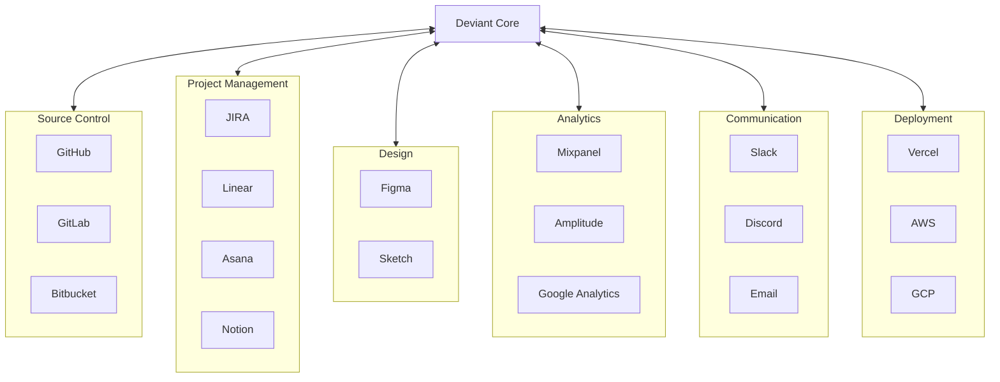
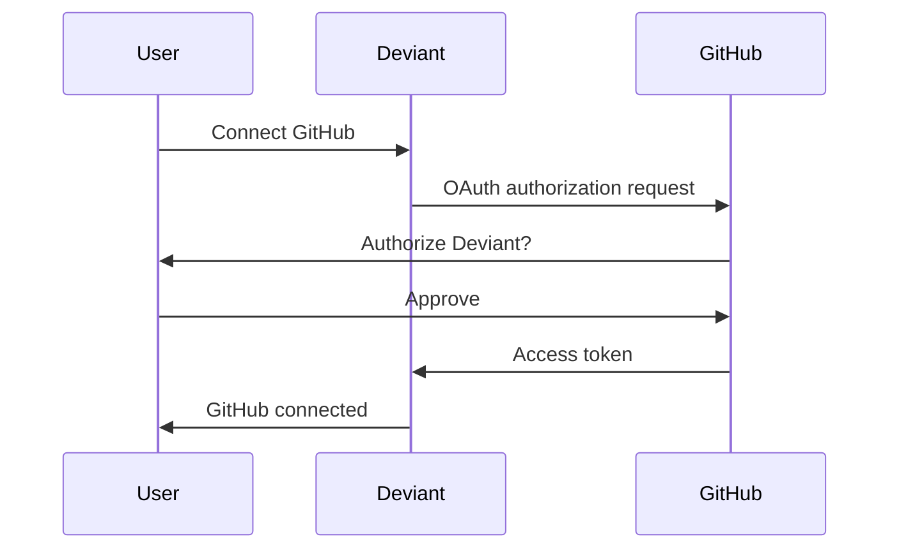

# Integration Marketplace: Connecting to the Tools You Use

*The vision for AI agents that work with your entire tech stack, not in isolation.*

---

## The Island Problem

Right now, Deviant is an island. It generates code and specs, but:

- Doesn't know what's in your GitHub repo
- Can't see your JIRA tickets
- Doesn't access your Figma designs
- Can't check your analytics
- Doesn't integrate with your deployment pipeline

Every output requires manual transfer. Every context requires manual input.

That's not how real teams work.

---

## The Integration Vision



---

## Integration Categories

### 1. Source Control Integrations

**GitHub/GitLab/Bitbucket**

What becomes possible:

```
CEO Agent: "I need to understand the current codebase before we add auth."

[Deviant pulls repo structure, recent commits, existing patterns]

CTO Agent: "Based on the codebase, I see you're using:
- FastAPI with Pydantic models
- SQLAlchemy async ORM
- pytest for testing
- Your auth patterns should follow existing middleware structure."

Backend Engineer: [Generates code matching existing patterns]
[Creates PR directly to feature branch]
[Links to Deviant task in PR description]
```

**Capabilities:**
- Read repository structure
- Analyze existing code patterns
- Create branches and PRs
- Comment on code reviews
- Trigger CI/CD pipelines

### 2. Project Management Integrations

**JIRA/Linear/Asana/Notion**

What becomes possible:

```
Human: "Sync with our Linear board and pick up the next high-priority ticket."

PM Agent: [Fetches Linear tickets marked high-priority]
"Found 3 high-priority tickets:
1. LIN-234: Fix checkout bug (P0)
2. LIN-245: Add export feature (P1)
3. LIN-251: Dashboard performance (P1)

Recommending LIN-234 based on priority and impact.
Shall I start working on it?"

[After completion]
PM Agent: [Updates Linear ticket to Done]
[Links PR and documentation]
[Logs time spent]
```

**Capabilities:**
- Read tickets and priorities
- Create new tickets for subtasks
- Update ticket status
- Add comments and attachments
- Sync with Deviant task tracking

### 3. Design Integrations

**Figma/Sketch**

What becomes possible:

```
Human: "Here's the Figma link for the new dashboard design."

Designer Agent: [Fetches Figma file]
"Analyzing design:
- 5 main components identified
- Color palette extracted
- Spacing system documented
- Interactive states noted

Generating detailed specs for Frontend Engineer..."

Frontend Engineer: [Generates components matching Figma exactly]
[Exports to Storybook for visual comparison]
```

**Capabilities:**
- Parse Figma designs
- Extract design tokens
- Generate component specs
- Compare implementation to design
- Report discrepancies

### 4. Analytics Integrations

**Mixpanel/Amplitude/Google Analytics**

What becomes possible:

```
CEO Agent: "What should we build next based on user behavior?"

[Fetches last 30 days of analytics]

Strategy Agent: "Analysis of user behavior:
- 67% drop-off at onboarding step 3
- Most engaged users use Feature X daily
- Search functionality has 40% no-results rate

Recommendations:
1. Simplify onboarding step 3 (high impact)
2. Improve search relevance (medium impact)
3. Promote Feature X in onboarding (low effort)

Shall I create projects for any of these?"
```

**Capabilities:**
- Pull user behavior data
- Analyze funnel metrics
- Identify patterns and issues
- Suggest data-driven improvements
- Track impact of changes

### 5. Communication Integrations

**Slack/Discord/Email**

What becomes possible:

```
[In Slack]
@deviant Start a project: Add dark mode to the app

CEO Agent (via Slack): "I'll evaluate this request.
Quick questions:
1. Should this apply to all users or be optional?
2. Any specific color palette in mind?
Reply here or I'll assume: optional toggle, system default colors."

[After completion]
Deviant (via Slack): "Dark mode project complete!
- 12 components updated
- PR ready for review: [link]
- Preview: [staging link]
Total time: 3 hours | Cost: $8.50"
```

**Capabilities:**
- Receive project requests
- Ask clarifying questions
- Provide status updates
- Send completion notifications
- Interactive approval flows

### 6. Deployment Integrations

**Vercel/AWS/GCP/Netlify**

What becomes possible:

```
CTO Agent: "Code approved. Initiating deployment to staging."

[Triggers Vercel deployment]

Monitor Agent: "Staging deployment complete.
- Build time: 45 seconds
- All checks passed
- Preview URL: [link]

Running smoke tests..."

[After testing]
Monitor Agent: "Smoke tests passed.
Ready for production deployment.
[Approve for production]"

[Human approves]

[Deploys to production, monitors for issues]
```

**Capabilities:**
- Trigger deployments
- Monitor build status
- Run post-deployment tests
- Rollback on failure
- Report performance metrics

---

## The Marketplace Model

### For Users

Browse and install integrations:

```
┌─────────────────────────────────────────────────────────────┐
│ Integration Marketplace                                      │
├─────────────────────────────────────────────────────────────┤
│                                                             │
│ Popular Integrations                                        │
│                                                             │
│ ┌─────────┐ ┌─────────┐ ┌─────────┐ ┌─────────┐           │
│ │ GitHub  │ │  Slack  │ │  Figma  │ │  Linear │           │
│ │   ✓     │ │   ✓     │ │         │ │         │           │
│ │Installed│ │Installed│ │ Install │ │ Install │           │
│ └─────────┘ └─────────┘ └─────────┘ └─────────┘           │
│                                                             │
│ Categories                                                  │
│ [Source Control] [Project Mgmt] [Design] [Analytics]       │
│ [Communication] [Deployment] [Databases] [APIs]            │
│                                                             │
└─────────────────────────────────────────────────────────────┘
```

### For Developers

Build and publish integrations:

```python
class FigmaIntegration(DeviantIntegration):
    name = "Figma"
    description = "Design file analysis and component extraction"
    category = "Design"

    async def fetch_design(self, file_key: str) -> FigmaFile:
        """Fetch and parse a Figma file."""
        response = await self.api.get(f"/files/{file_key}")
        return FigmaFile.parse(response)

    async def extract_components(self, file: FigmaFile) -> List[Component]:
        """Extract UI components from Figma file."""
        components = []
        for node in file.document.children:
            if node.type == "COMPONENT":
                components.append(self.parse_component(node))
        return components

    async def generate_tokens(self, file: FigmaFile) -> DesignTokens:
        """Extract design tokens (colors, spacing, typography)."""
        return DesignTokens(
            colors=self.extract_colors(file),
            spacing=self.extract_spacing(file),
            typography=self.extract_typography(file)
        )
```

---

## Security and Permissions

### OAuth Flows

Each integration uses standard OAuth:



### Scoped Permissions

Integrations request only needed permissions:

```python
class GitHubIntegration(DeviantIntegration):
    required_scopes = [
        "repo:read",      # Read repository content
        "repo:write",     # Create branches, PRs
        "workflow:read"   # Check CI status
    ]

    optional_scopes = [
        "workflow:write"  # Trigger workflows (if user opts in)
    ]
```

### Data Isolation

Integration data stays separate:

```python
class IntegrationDataStore:
    async def store_credential(
        self,
        user_id: str,
        integration: str,
        credential: EncryptedCredential
    ):
        """Store encrypted credential for user's integration."""
        # Credentials encrypted at rest
        # Accessible only by that user's agents
        # Auto-expires and requires refresh
```

---

## Phased Rollout

### Phase 1: Core Integrations
- GitHub (source control)
- Slack (communication)
- Linear (project management)

### Phase 2: Extended Integrations
- Figma (design)
- Vercel (deployment)
- JIRA (enterprise PM)

### Phase 3: Analytics & Data
- Mixpanel/Amplitude
- PostgreSQL direct access
- API connectors

### Phase 4: Marketplace
- Developer SDK
- Custom integration publishing
- Community integrations

---

## The Impact

With integrations, Deviant becomes:

**Context-aware**
- Understands your codebase
- Knows your design system
- Sees your user behavior

**Action-capable**
- Creates PRs, not just code
- Updates tickets, not just specs
- Deploys, not just generates

**Workflow-integrated**
- Works where you work
- Notifies where you check
- Fits your existing process

---

## The Vision

The end state:

```
"Hey Deviant, I need a dashboard showing our key metrics.
Use our standard design system, put it on the analytics page,
and deploy to staging when ready."

[3 hours later, Slack notification]

"Dashboard complete:
- Pulled metrics from Amplitude
- Matched your Figma component library
- Created PR: github.com/company/app/pull/234
- Deployed to staging: staging.app.com/analytics
- Performance: 95 Lighthouse score

Ready for review. One-click to deploy to production."
```

That's the integration marketplace vision. AI that works with your tools, not around them.

---

**Next**: [The Vision: AI Companies That Build Real Products →](./04-the-vision.md)

---

*Nicanor Korir is tired of copy-pasting between tools. The integration marketplace is the solution.*
